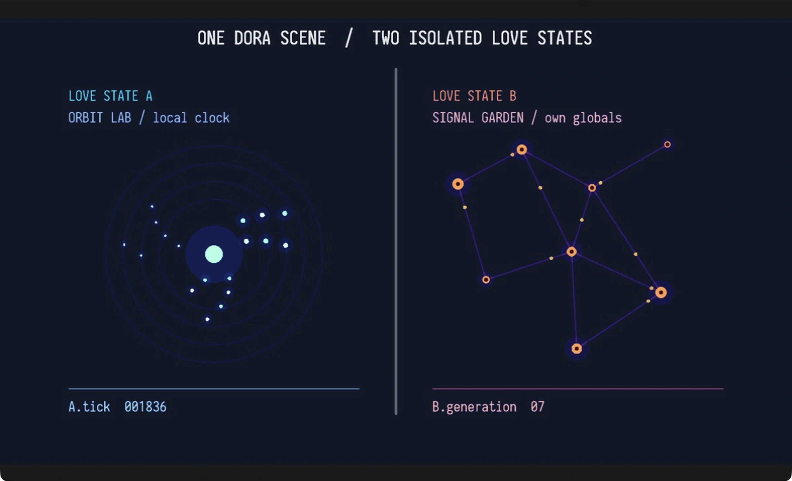
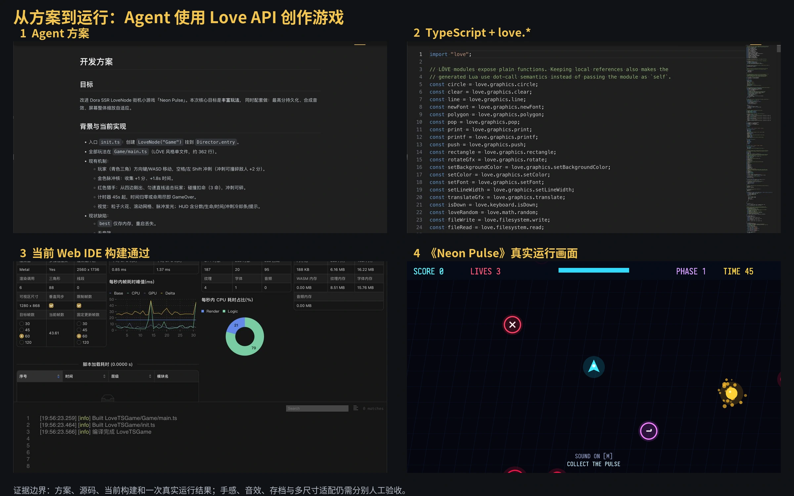
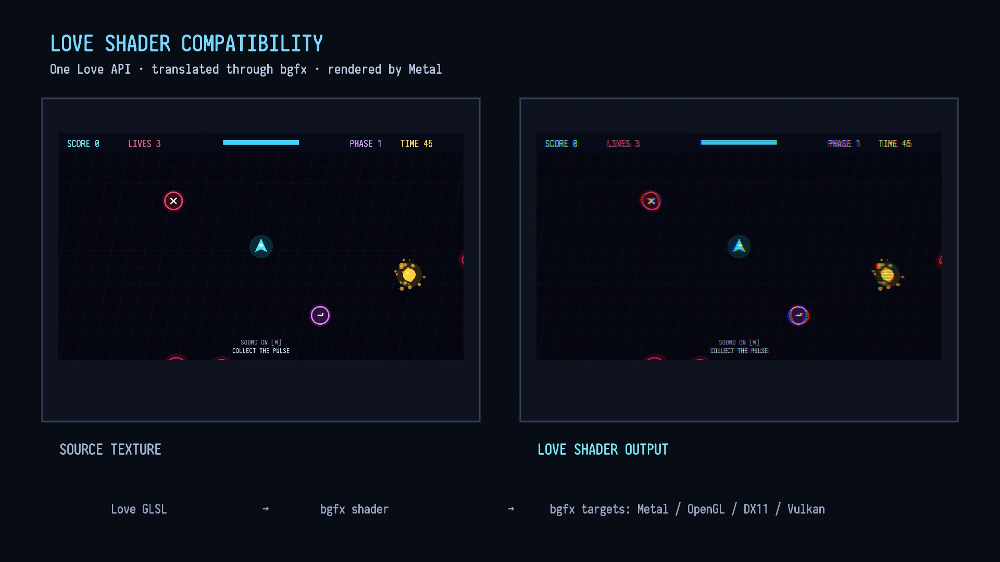
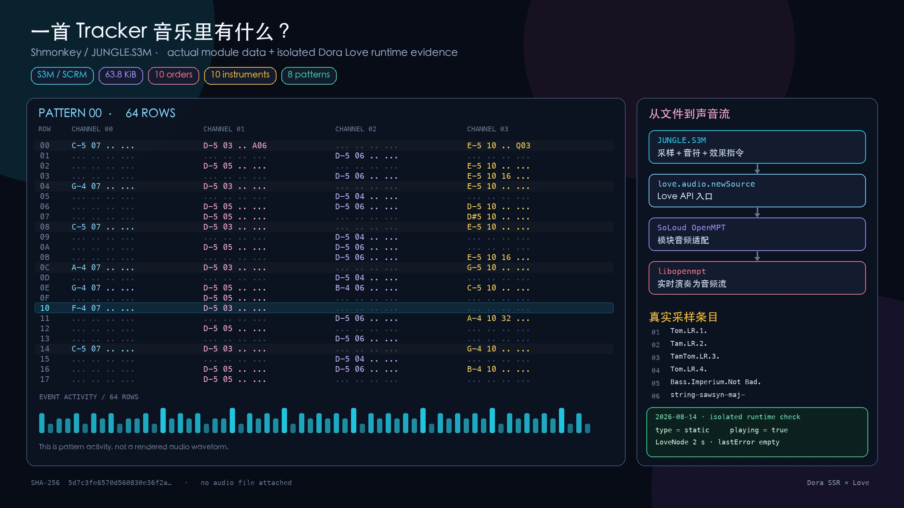

# 当 Dora 学会 Love

大模型熟悉 Love，却可能对小众的 Dora API 产生幻觉。让 Dora 兼容 Love，不是塞进第二套引擎，而是让同一套底层说出一门人和模型都更熟悉的游戏语言。

<!-- truncate -->

大模型写错代码并不稀奇。真正让人头疼的，它对自己不懂的东西真的只能靠“幻觉”瞎猜。

我让 Agent 帮我开发 Dora SSR 游戏时，经常会看到一些煞有介事的调用：类名听起来很合理，属性也像是游戏引擎应该有的，甚至连参数顺序都写得一脸笃定。只有真正去查文档或运行代码，才会发现 Dora 根本没有这个接口。

这并不完全是模型不会编程。恰恰相反，它通常很会写“某种游戏引擎的程序”。只是 Dora 是一款比较新的小众开源引擎，公开代码和讨论远少于那些存在多年的技术栈。模型遇到自己不熟悉的部分，就会拿过去见过的模式补全空白。

我们当然可以继续补文档、做检索工具、整理 Skill，再一遍遍教它 Dora 的场景树和 API。这些工作也确实有效。但我心里一直有另一个问题：每次都从头教大模型一门小众游戏引擎的用法，是不是唯一的路？

## 另一边，已经有很多人说了很多年的话

我在 itch.io 上浏览游戏时，经常能看到 Love 的作品。

截至 2026 年 8 月 12 日，itch.io 的 LÖVE 标签页显示约 3,300 个结果；另一个“made with LÖVE”的免费游戏筛选也有 2,990 个结果。两个数字的统计口径并不相同，也不能代表全部 Love 作品，但它们足以说明：这不是几份孤零零的示例代码，而是一套被使用了很多年的创作生态。

在 YueScript 社区，Love 也一直是被高频推荐的搭档。很多人喜欢用 YueScript 写 Love 游戏：一边保留 Lua 生态轻巧直接的感觉，一边使用更顺手的语言表达。

Love 历史很长，用户作品多，教程、讨论和开源代码也多。我们无法知道某个大模型具体训练过哪些项目，但从实际使用体验看，它对 Love 的接口名字和常见代码模式，往往比对 Dora 熟悉得多。

于是问题突然可以反过来问：

> 除了不断教大模型认识 Dora，我们能不能也让 Dora 学会一套大模型已经熟悉的游戏框架？

这就是 Dora 整合 Love 的起点。

## 不是在引擎里再塞一台引擎

“让 Dora 运行 Love 游戏”很容易让人想象成一层套娃：先启动 Dora，再在里面塞进一套完整 Love，引擎里住着另一台引擎。

实际做法不是这样。

Love 游戏仍然可以书写熟悉的 `love.graphics`、`love.audio`、`love.filesystem` 和各种回调，但它们背后使用的是 Dora 的渲染、音频、输入、文件系统和跨平台设施。应用的主循环仍然只有 Dora 的一套，最后的画面也仍然由 Dora 合成。

更准确地说，是同一套引擎底层向创作者提供了两种 API 语言：一种是 Dora 自己的节点和组件接口，另一种是 Love 社区熟悉的 `love.*`。

这件事听上去只是换了一套函数名，实际并不轻松。游戏框架的接口不只是“有哪些函数”，还包含一整套默认行为：坐标从哪里开始，窗口尺寸代表什么，文件路径怎样解析，输入发给谁，资源何时释放，着色器中的变量是什么含义。只有这些习惯也能对上，旧代码才不只是通过语法检查，而是真的跑起来。

## 为什么它最后成为了一个节点

Dora 没有增加一个需要单独切换进去的“Love 模式”，而是做了 `LoveNode`。

节点是 Dora 场景中的基本对象。一个 Love 游戏成为节点以后，就能像其他画面对象一样被放进场景：移动到某个位置，调整显示层级，跟 Dora 的界面或其他节点组合，必要时同时放入两个游戏。

每个 LoveNode 又拥有自己独立的 Lua 运行状态、虚拟窗口、事件队列和资源生命周期。两个节点即使加载同一份游戏，也不会共用游戏里的全局变量。一个节点报错、退出或重新启动，不应该顺手把另一个节点也带走。

还有第三层价值对我很重要：它没有抛弃 Dora 已经建立的创作工坊。

Love 项目不只可以写 Lua，也可以继续在 Dora Web IDE 中使用 TypeScript、YueScript 或 Teal。代码由 Dora 的工具链转成 Lua 5.5，再进入 LoveNode。编辑、诊断、构建、运行和 Agent 仍然在同一个工作流里。

所以 LoveNode 不是一个孤立的兼容播放器。它让 Love 的成熟表达方式进入了 Dora 的场景和工具系统。

## Agent 开始用熟悉的方式做游戏

为了确认这条路对 AI Coding 是否真的有价值，我让 Dora Agent 开发了一款 Love 风格的街机小游戏《Neon Pulse》。

它的游戏部分使用 TypeScript 编写，调用的是 Love API；Dora 将 TypeScript 编译成 Lua，再由 LoveNode 加载运行。宿主入口则把这个节点放进 Dora 场景，并负责屏幕适配。

我没有只让 Agent 一次性吐出一份代码。按照平时做长程任务的习惯，我先让它整理开发方案和进度表，再逐步扩展游戏。后来它为游戏加入了连击倍率、三种新敌人、四类道具和阶段化难度，还补了最高分存档与程序合成的短音效。

现有记录证明 TypeScript 构建能够完成，真实游戏入口也能持续运行。这还不能替代一次完整的人工试玩：音效是否好听、道具手感如何、最高分能否跨重启保存、不同屏幕比例下是否都舒服，仍然需要分别验收。

但最重要的闭环已经出现了：Agent 不需要先被我重新教授整套陌生的 Dora 游戏 API，就能沿着自己更熟悉的 Love 模式规划、编写、构建并运行一个 Dora 项目。

这不是简单地让模型“少看几页文档”。熟悉的接口会影响它怎样拆分问题、怎样搜索记忆中的代码模式，以及出错后会从哪里开始修。对 AI Coding 来说，一套 API 也是一种思考路径。

## 接口表填满以后，兼容才刚刚开始

当然，让 Agent 写出一款新游戏，只能证明这条工作流能走通。真正检验兼容性的，还是那些并不是为 Dora 准备的旧项目。

于是我确定了方向和验收标准，让 Codex 固定20款许可证与版本明确的开源 Love 游戏，逐一放进当前引擎运行。它负责长时间调查、修复、重跑和记录，我则持续决定哪些行为应该兼容，哪些属于必须保留的边界。

这20款游戏很快证明，接口清单只是开始。

有些旧项目依赖 Lua 5.1 或 LuaJIT 时代常见的写法；有些对相对路径、目录末尾的斜杠或模块返回值有默认假设；还有游戏会在初始化时重复加载大量相同图片，把一个从未在小示例里出现过的资源问题直接推到眼前。

截至 2026 年 8 月 12 日，我们在 macOS Metal 的 Debug 引擎中，让每款游戏顺序运行120帧，结果仍是17项保持运行、3项初始化失败。这个数字不是“Love 生态兼容率”，只是一个固定条件下的抽样基线。

三个失败也不能简单归为一类。SNKRX 需要 Steamworks 的 `luasteam`；DoomCar 携带的序列化库依赖 LuaJIT FFI，这两项都超出了 Dora Lua 5.5 兼容层的边界。Flash Blip 原先缺少 LuaSocket；后来 Dora 接入 LuaSocket 和 HTTPS 后，它已经越过网络依赖，却继续在 `newImageData` 的构造语义上失败。

换句话说，增加一个依赖没有让问题神奇消失，只是让真实游戏继续往前走，并暴露出下一层差异。

## 一个 Shader 里藏着多少习惯

Tiny Boatball 带来的 Shader 问题尤其有代表性。

从表面看，Dora 已经有 `newShader`，着色器也能提交编译，似乎这项 API 已经“支持”。但真实项目会把阶段宏、屏幕尺寸、像素坐标、自定义顶点属性和局部变量组合在一起。任何一处语义只是看起来相似，最后的画面就可能完全不同。

这里还有一层很重要的变化。原版 Love 的跨平台渲染建立在 OpenGL 体系上；到了 Dora，Love Shader 不再只面向这一种图形接口。Dora 会先把 Love 的 Shader 写法翻译成 bgfx 能处理的 Shader，再由 bgfx 针对设备正在使用的渲染后端完成编译。于是同一段 Love Shader 可以继续保留熟悉的写法，底下却能走 OpenGL、Metal、Direct3D 11 或 Vulkan 等不同路径。

这不是简单地把一段 OpenGL Shader 换个地方运行，而是要把 Love 的变量、坐标和函数习惯，转换成多种图形后端都能理解的共同表达。兼容层里任何一次看似不起眼的误译，都可能只在某个系统或某块显卡上变成错误画面。

其中一个问题很小，却很说明情况：Shader 声明了名为 `time` 的 uniform，同时又有一个 `clock(float time)` 函数。早期转换规则如果只做文本替换，就会把函数参数里的 `time` 一起改掉。代码表面上仍像一段 Shader，含义却已经被破坏。

修复它不能靠再加一条字符串替换，而要理解局部参数会遮蔽外部 uniform。继续运行以后，项目又推动了 `love_ScreenSize`、`love_PixelCoord` 以及顶点分量补值等跨后端规则的处理。

这就是“函数存在”和“作品兼容”之间的距离。真正需要保留的不是一个 API 名字，而是创作者多年使用它时形成的语言习惯。

测试途中还有一个我很喜欢的小插曲。Shmonkey 使用了 S3M 格式的 Tracker 音乐。它不是 MP3 那样已经录好的完整波形，更像采样、乐谱和效果指令的组合。为了让这段老游戏音乐重新响起来，Dora 最终接入上游 SoLoud 的 OpenMPT 支持和 libopenmpt，让引擎能够把这些指令重新“演奏”成声音。

一款旧游戏留下的音乐，就这样反过来补全了一台新引擎。

## 真正开始动手的契机

在故事快要结束时，我还想补上一段幕后经过。

“让 Dora 学会大模型熟悉的 Love API”这个想法，其实在社区讨论以前就已经出现了。只是那时它还停留在我的思考里：方向似乎有道理，但什么时候做、应该从哪一层开始，都没有真正落到代码上。

后来，我在 Dora 社区里看到一位伙伴尝试用脚本模拟 Love 的接口。大家顺着这份实验聊了起来，我也逐渐看清，这件事或许没有想象中那么遥远。2026 年 7 月 21 日，我在群里抛出一句：“我们干脆把 Love 2D 源码移植进 Dora 怎么样？”

最终方案并没有照着这句话原样实现。我们没有把完整的 Love 引擎塞进 Dora，而是保留它的创作语言，用 Dora 的底层重新实现底层行为。但正是那次社区实验和讨论，让一个已经想了很久的问题，终于从“也许可以”走到了“现在就来试试”。

## 给人和 Agent 一套共同语言

有人可能会问：既然 Love 已经这么成熟，为什么不直接使用 Love？

我觉得这不是一个非此即彼的问题。

Love 提供了被大量开发者、作品和工具理解的创作语言。Dora 则希望在同一套底层上继续提供场景组合、Web IDE、多语言开发、Agent 和面向不同设备的工作流。把两者连接起来，不意味着一个项目吞掉另一个项目，也不是要宣布谁比谁更好。

对 Dora 这样的个人开源项目来说，这更像是主动学会与成熟生态交流。AI Coding 时代尤其如此：模型能力越来越强，但它能够多顺利地工作，仍然受到公开语料、接口文化和既有作品的影响。

小众工具当然可以继续完善自己的文档，让 Agent 一点点认识自己。它也可以选择再向前走一步，接入一套已经被人类和机器共同使用多年的语言。

Dora 学会 Love 以后，Love 游戏成为场景中的节点，旧作品成为兼容测试，新项目仍能使用 Dora 的工具链。更重要的是，Agent 终于不必每一次都站在一门完全陌生的语言门口。

如果你想验证这件事，不妨给 Dora Web IDE 里的 Agent 一个很小的任务：让它用 Love 做一款只有一个场景、一个操作和一个胜负条件的小游戏，然后请它完成编写、构建和运行。

看看当 Agent 使用一套熟悉的游戏语言时，它会把愿望实现成什么样子。

---

