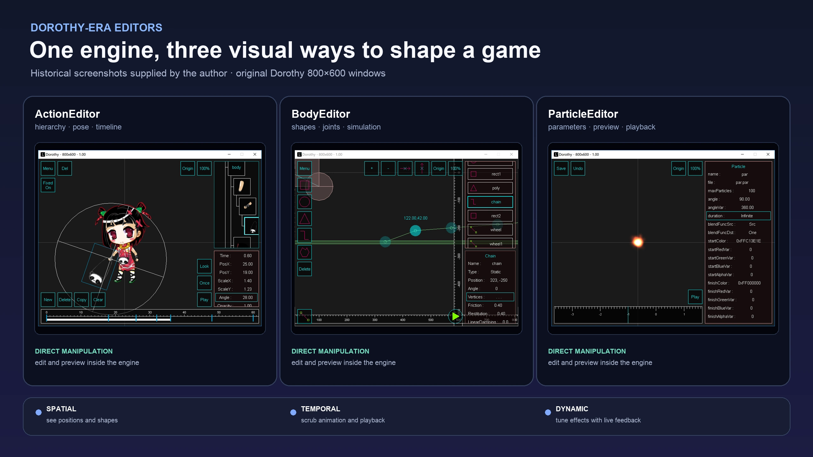
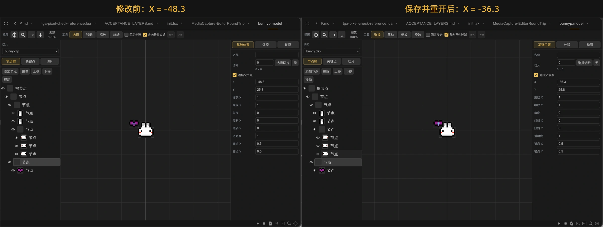
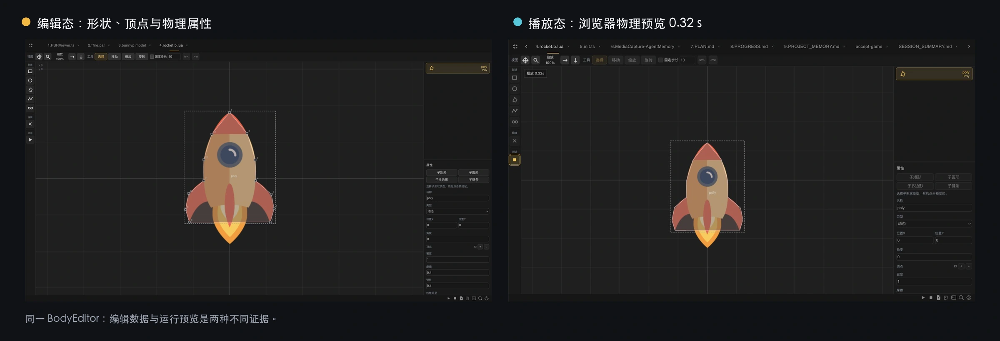
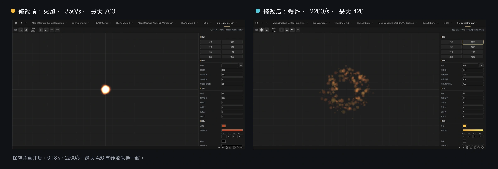

# 旧游戏编辑器重回浏览器

在 Dora SSR 之前，我还做过一个叫 Dorothy 的游戏引擎项目。它是 Dora SSR 的前身，今天引擎里的不少创作想法、资源格式和工具经验，都可以一路追溯到那里。

在 Dorothy 时期，我做过几件很像“工匠工具”的东西。

一件用来编辑角色的层级、外观和动作；一件用来摆放碰撞形状、连接物理关节；还有一件能把粒子的颜色、速度、寿命和重力，马上变成一团可以观察的火焰、雨水或烟雾。

它们后来有了名字：ActionEditor、BodyEditor 和 ParticleEditor。

<!-- truncate -->

这些工具也很特别：它们就是用 Dorothy 自己做出来的。我们有点像是在“用游戏引擎制作游戏编辑器”，刚刚摆好的动作、碰撞形状或粒子效果，可以立刻在眼前运行起来。

对创作者来说，这种即时反馈比参数表本身重要得多。

一个角色的手臂属于哪一层，关键帧移动半秒以后动作是否自然；两块刚体的关节到底接在什么位置；一组粒子参数组合起来像细雨，还是像迎面飞来的石子——这些事情当然都能写成数字，但只看数字很难获得创作的手感。

图形编辑器的价值，就是把抽象数据重新变成眼睛和手可以判断的东西。

## 新工坊里缺了几件老工具

后来，引擎继续往前走了。

Dora 有了新的运行环境，开发工具也逐渐搬进浏览器。代码、资源、项目运行、日志、Git 和 Agent 一件件住进 Web IDE，新的工坊越来越像样。

但是 Dorothy 时期的几件图形工具没有一起搬过来。

这些工具只能在过去的开发环境里使用，资源文件却一直留在 Dora 中。于是出现了一个有点尴尬的场面：新的工坊里已经能写代码、运行游戏、调用 Agent，打开一些老作品时，却找不到顺手的工具继续修改动作、碰撞形状和粒子效果。

把这些编辑器带进 Web IDE，也就成了一件迟早要完成的事。

我们最初也想过照着旧版重新做一遍。后来才发现，创作者真正关心的并不是按钮还在不在原来的位置，而是几个更朴素的问题：以前的资源还能不能打开？修改后能不能马上看见？保存以后，游戏还能不能继续使用？

于是这次迁移只守住一条原则：尽量不让创作者为了更换工具而重做已有内容。

## 让旧资源在浏览器里重新变得可读

ActionEditor 是最能说明这个问题的例子。

Dora 的角色动作保存在 `.model` 文件里。普通人直接打开它，只会看到一堆很难阅读的内容；放进 ActionEditor 后，角色的层级、外观、动作和关键帧才会重新变成可以观察和调整的画面。

编辑完成以后，工具仍然保存为 Dora 可以直接使用的 `.model`。用户不需要先转换旧资源，也不需要因为编辑器换到了浏览器，就把过去的角色和动画重做一遍。

当前的 ActionEditor 已经可以在 Web IDE 中新建和打开 `.model`，编辑角色层级、基础姿态、外观和动作。缺少对应图片图集时，它也会直接告诉用户缺了什么，而不是只留下一块原因不明的空白画布。

创作者不必知道编辑器内部怎样工作，但应该始终知道自己打开了什么、正在修改什么，以及为什么暂时看不到结果。

## “能够打开”还不能算迁移完成

这里有一个很容易被忽略的技术问题：旧文件能够出现在新编辑器里，只能说明迁移完成了第一步。

一份资源从旧工具进入新工具，大致要走过四道关：

第一道是**读取**。编辑器能认出文件中的角色、动作、形状或粒子参数，而不是一遇到旧写法就报错。

第二道是**编辑**。用户修改一个关键帧或碰撞形状时，变化发生在正确的对象上，其他没有动过的内容也不能悄悄丢失。

第三道是**写回**。保存后的文件要继续符合原来的资源格式。把文件成功写到硬盘上，并不等于里面的内容仍然完整。

第四道是**重新加载**。保存后的资源不仅要能再次被编辑器打开，还要能被 Dora 真正加载和运行。编辑器中的预览画面正确，也不能自动证明游戏运行时一定得到相同结果。

工程中常把这样一次“打开—修改—保存—重开”的过程叫作 round-trip，也就是往返验证。它关心的不是文件有没有走完一圈，而是内容经过新工具以后，有没有保持原来的含义。

因此，我们会把“文件能解析”“保存前后内容不丢失”“浏览器预览正确”和“引擎能够加载”分别检查。只有这几件事都成立，一件旧资源才算真正穿过了时间，来到新的工具里。

## 动作、物理和粒子，需要不同的创作手感

ActionEditor 的办法不能机械地复制给另外两个工具。

BodyEditor 处理的是物理体。矩形、圆形、多边形和关节不仅要能被选中和拖动，还需要通过播放观察它们怎样碰撞和运动。

在当前 Web IDE 中，BodyEditor 可以打开已有的物理体资源，显示形状和关节，也可以直接播放一次碰撞效果。创作者很快就能判断：这个形状是不是放错了，关节是不是接到了意料之外的位置。

ParticleEditor 又是另一种手感。

粒子效果由许多参数共同决定。单独看“发射率”“寿命”或“重力”都很抽象，只有让它们一起运行，人才知道眼前得到的是雨、火花、烟雾还是魔法。

所以 ParticleEditor 把参数和动态画面放在一起。我们在当前 Web IDE 中新建了一份粒子资源，切换为“下雨”效果，保存并关闭；重新打开以后，雨仍然按刚才的设置落下来。

这三个编辑器没有必要长得完全一样。它们共同保留的是一条创作闭环：打开已有资源，看见它，修改它，保存，再确认结果仍然成立。

## 迁移也意味着放下一些旧习惯

保留旧资源，并不意味着旧时代的每条规矩都要继续保留。

旧工具曾经要求素材放进特定目录，也留下了一些只有旧环境才需要的操作规矩。如果把它们原样搬进 Web IDE，今天的项目反而要迁就过去。

所以我们保留旧资源，却没有要求新工具处处模仿旧工具。迁移不是保存一件软件标本，而是让多年以前做出的内容，在今天仍然容易打开、修改和使用。

## 图形编辑器之后，也许还会有 DSL

这次迁移能够推进，Agent 确实降低了不少成本。它可以长时间阅读旧代码，把工作拆开，再反复检查新旧文件之间有没有丢掉含义。

但 Agent 能帮助重建图形工具，不代表人不再需要图形工具。

空间、时间和动态效果依然需要人通过视觉与手感判断。但在图形编辑器之外，我还期待增加一种更适合程序和大模型使用的入口：DSL。

DSL（Domain Specific Language） 可以理解为一种专门描述某类创作内容的小编程语言。它不必像通用编程语言那样处理所有问题，只需要说清楚一个角色怎样运动、碰撞形状怎样连接，或者一场雨该怎样落下来。写下的描述再由程序转换成 Dora 能够使用的动作、物理体或粒子资源。

这也会给大模型一个更可靠的创作接口。以后，我们也许可以直接告诉 Agent：“做一阵逐渐变大的雨”“让角色先蓄力，再向前挥剑”，由它编写 DSL，生成一份能够运行的初稿。

生成并不是终点。人仍然可以把结果放进图形编辑器里播放、观察、拖动和精修；如果效果不对，再修改 DSL 或继续与 Agent 沟通。这样，大模型不必直接猜测复杂的资源文件，人也不必放弃用眼睛和手进行创作。

这仍然只是未来构想，并不是 Dora 当前已经提供的功能。但它代表了一种我很期待的分工：DSL 负责连接创作意图和引擎资源，大模型负责快速生成与修改，人继续负责观察、判断和最后的表达。

把旧编辑器搬进浏览器，最终不是为了保存一张旧界面的照片。

真正值得留下的，是创作者已经投入到资源里的内容，是修改以后马上看见结果的能力，也是工具对“打开、编辑、保存和预览”这些行为给出的稳定承诺。界面可以重画，实现可以重写；只要这些东西还在，旧工具就不是被复刻了一遍，而是在新的工坊里重新活了过来。

如果你手里还保留着 Dorothy 或早期 Dora 的 `.model`、`.b.lua`、`.par` 资源，可以尝试完成一次“打开—修改—保存—重新加载—预览”。如果其中某一步出现差异，请把资源来源、复现步骤和发生问题的阶段告诉我们。旧工具真正完成迁移，也需要这些来自真实创作历史的样本。

---

