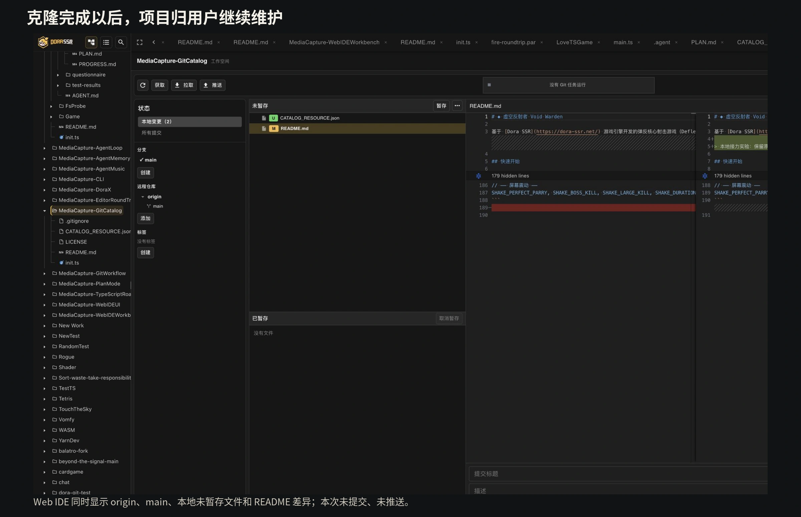
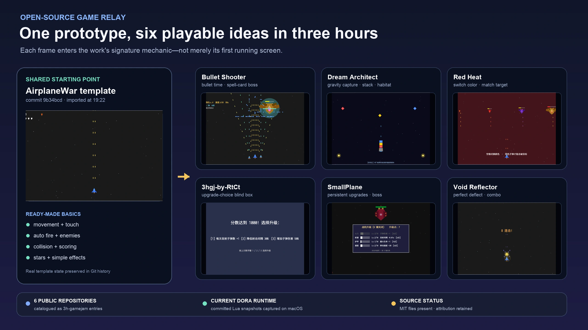

# 让开源游戏接力创作

我一直有一个关于开源游戏的梦想。

<!-- truncate -->

不是把游戏的源码压缩起来，放到某个下载页面，也不只是让人能够点开仓库，看一看别人是怎样写的。我更希望一款游戏完成以后，能够成为下一位创作者真正拿得起来的东西：下载，运行，改掉一个角色，重写一段玩法，再把自己的版本继续做下去。

这样的事情在程序世界里并不陌生。我们每天使用的许多库和工具，本来就是从别人的工作上继续生长出来的。但以我这些年寻找开源软件的感受来看，完整游戏软件项目能够被人顺利接手，仍然不是一件很常见的事。

我在 Game Jam 社区里也经常看到类似的画面。大家用很短的时间做出各有想法的作品，但每一轮开始时，又会重新搭输入、场景、角色状态、菜单和类型化玩法的基础框架。重复搭建本身当然也是练习的一部分，只是我总会想：上一位创作者已经做过的东西，能不能也成为下一次创作的起点？一款停更的作品，能不能被另一个人接过去？

所以 Dora 很早就有了一个朴素的目标：通过 `git clone` 直接取得开源游戏项目。

这句话写出来只有几个字，真正实现却绕了很久。

## 想要的是 clone，得到的却是 ZIP

Git 在开发者电脑上很常见，但 Dora 不只运行在开发者电脑上。它还要进入手机、掌机和其它设备，不能假设每个平台都已经安装了系统 Git，也不能要求用户先配置一套命令行环境，才能从引擎里下载一个项目。

另一条路是把 Git 库直接嵌入引擎。这里又会遇到跨平台构建、依赖体积和开源许可证等问题。一个只在 macOS 上能用的方案没有意义；一个会让引擎整体许可证关系变得难以处理的库，也不能因为功能方便就贸然接入。

在这些问题解决以前，Dora 的 ResourceDownloader 先走了一条折中的路。

我们维护一个固定的 HTTP 服务。服务端去同步原始 Git 仓库，再把项目重新打成 ZIP；客户端取得资源列表和预览图，下载 ZIP，解压到本地目录。对用户来说，它确实像一个可以浏览和安装游戏资源的小工具。

但它交付的是一包文件，不是一个仍然活着的项目。

ZIP 里没有 Git 历史，不知道这份内容对应仓库里的哪一次变化，也没有原来的远端地址。用户修改了文件以后，下载器无法分辨哪些属于上游、哪些属于本地创作，更不可能安全地替用户更新。与此同时，我们还要维护仓库同步、ZIP 生成、存储、预览图和下载服务。社区资源越多，中间这座仓库就越重。

最初想做的是让开源游戏被接力，最后却又多维护了一台替大家搬压缩包的服务器。

## go-git 让最初的路线重新变得可行

转折来自 go-git。

它是一套纯 Go 实现的 Git 库，采用 Apache-2.0 许可证。对 Dora 来说，这两点都很重要：它不要求在每个平台上另外准备系统 Git，也避开了此前一些原生 Git 方案带来的许可证顾虑，还可以跟随 Dora 已有的 Go/Wa 源码工具链一起构建。

当然，把 go-git 放进工程，不等于资源下载功能立即完成。

Dora 先把底层能力整理成统一的异步接口 `Git.run`。业务代码只需要提出 clone、status 或 fetch 之类的任务，再接收进度、结果、取消和错误，而不直接依赖 go-git 的内部对象。后来又逐步补上 Git LFS、超时、固定版本校验、失败清理等能力。

到了这一步，ResourceDownloader 才终于可以回到最初的目标：不再请服务器替用户下载仓库，而是让 Dora 自己把仓库完整交给用户。

## 目录是一张地图，不是一间素材仓库

新的 Dora-Catalog 很容易被叫成“素材商店”，但它的职责其实更接近一张地图。

目录里不保存每个游戏的完整内容。每个条目只记录项目叫什么、怎样介绍、许可证是什么状态、可以从哪些 Git 地址取得，以及第一次安装应该对应哪个完整 commit。预览图可以随目录维护，但真正的游戏内容仍然留在作者自己的仓库或经过确认的镜像中。

这里的 commit，可以理解成一次不会含糊的内容快照。

默认分支会继续向前移动。今天的 `main` 和下个月的 `main` 可能已经不是同一份游戏。如果目录只记录一个仓库地址，用户每次下载都有可能拿到不同内容。记录完整 commit，才能让下载器核对：“我现在取得的，确实是目录所说的这一版。”

来源和版本也因此成为两件不同的事。GitHub 暂时访问不了，可以尝试国内镜像；原始地址失效，也可以为同一 commit 增加新的来源。传输位置可以替换，但内容身份不能悄悄改变。

目录还会记录许可证状态。仓库能够公开访问，不代表作者已经允许别人复制、修改和重新发布。截至 2026 年 8 月 11 日，我们核对到两个公开目录地址指向同一个 commit，共有 73 个条目，但许可证状态仍全部是 `pending`。

这不是一个适合藏起来的事实。目录可以先帮助社区整理和联系作者，却不能因为项目公开，就擅自替作者宣布一种许可证。`pending` 的意思就是：你可以看见这份记录，但在继续传播或发布衍生作品以前，仍需取得清晰许可。

## 下载完成以后，项目归谁维护？

这次重做里，我最看重的答案是：归用户。

Dora 第一次安装资源时，会根据目录提供的来源，将仓库浅克隆到一个临时目录。它会核对实际 HEAD 是否等于目标 commit，检查入口文件，并拒绝可能越过安装目录的符号链接和未经允许的 submodule。所有检查通过后，候选目录才会被移动到 `Download/<id>`；中途失败或取消，只清理本次候选，不触碰已经存在的项目。

安装完成后，下载器的职责也随之结束。

项目中的 `.git` 会被保留，remote 仍然指向实际取得内容的仓库。用户可以修改、提交、建立分支、更换远端、合并上游，或者从此离线维护。目录以后出现新版本时，下载器可以提醒，却不会擅自 pull、reset 或覆盖本地文件。

这条边界看起来有些保守，却是“资源属于用户”真正成立的地方。只要下载器还认为自己有权随时把目录恢复成官方版本，用户的创作就始终寄存在工具里；当它完成首次交付便放手，项目才真正成为用户自己的工作树。

## 我们实际做过接力赛

Dora 社区其实做过一次很小的“开源游戏接力”试验。

我们组织了一次极简 Game Jam。活动没有让每位参与者从空目录开始，而是先提供一个游戏原型的 Git 源码仓库。大家取得同一个可以运行的起点，再在它上面改变玩法、表现和主题。

为了让时间真正花在创意上，我们还向社区伙伴赠送了免费的大模型 API 和 token，让大家直接在 Dora 内置 Agent 中使用。活动发布以后，三小时截止提交。

三小时原本短得像一次功能测试。结果却超出了大家的预料。

参与者没有把大部分时间耗在重新搭建同一种基础框架上，而是很快把同一份原型推向不同的创意方向，做出了我们没有预料到的成果。相同的起点没有让作品变得相似，反而让大家更早开始处理真正属于自己的那部分创作。

目前在 Dora-Catalog 中，仍能找到六个标记为 `3h-gamejam` 的公开项目记录：《虚空反射者》、SmallPlane、《星际梦境建筑师》《红温小游戏之气到变色》《子弹射射射射》和 `3hgj-by-RtCt`。这些都是被挑选后争得作者同意的公开作品。

这次活动让我更确定了一件事：复用并不会减少创作。它只是把时间从“大家再次做一遍相同的底座”，转移到“每个人准备怎样让它变得不同”。大模型提供了额外的实现速度，而 Git 原型给了所有人一个可以共同出发、又能各自分叉的起点。

这也是资源目录真正想保存的可能性。一份项目被下载以后，不应该只剩下可以运行的文件；它还应该保留从哪里来、现在是哪一版，以及怎样继续变成另一个作品。

当然，技术上能够接力，不等于法律上已经允许传播衍生作品。当前目录中的许可证状态仍需逐项确认。未来公开展示活动源码、修改成果或邀请更多人继续创作时，许可证和作者授权同样是这根接力棒的一部分。

## 让开源不只停在“可以看”

Dora-Catalog 目前还远远不是一份完成的开源游戏地图。许可证需要逐项确认，失效来源需要维护，更多项目也需要作者和社区共同整理。

但 go-git 跨过的那道门槛，让我们终于不用再把开源游戏压成失去历史的文件包。目录负责帮助人发现，Git 负责保留项目身份，Dora 负责把第一次交付安全地完成；从那以后，创作权和维护权交给用户。

我希望开源游戏有一天也能像我们熟悉的开源工具一样，被人接住、改造，再传给下一位创作者。Game Jam 中反复出现的基础框架，可以慢慢积累；停止维护的作品，也可能拥有新的分支和新的生命。

如果你也想加入这场接力，可以先从一件很小的事开始：确认一个项目的许可证，克隆、运行，然后做一处属于你的修改。如果你维护着版本和许可证都足够清晰的 Dora 游戏，也欢迎把它作为一个 Dora-Catalog 条目提交进来。

开源不只意味着别人能够看见你做过什么，也意味着在边界清晰的时候，下一双手可以从这里继续。

---

---

