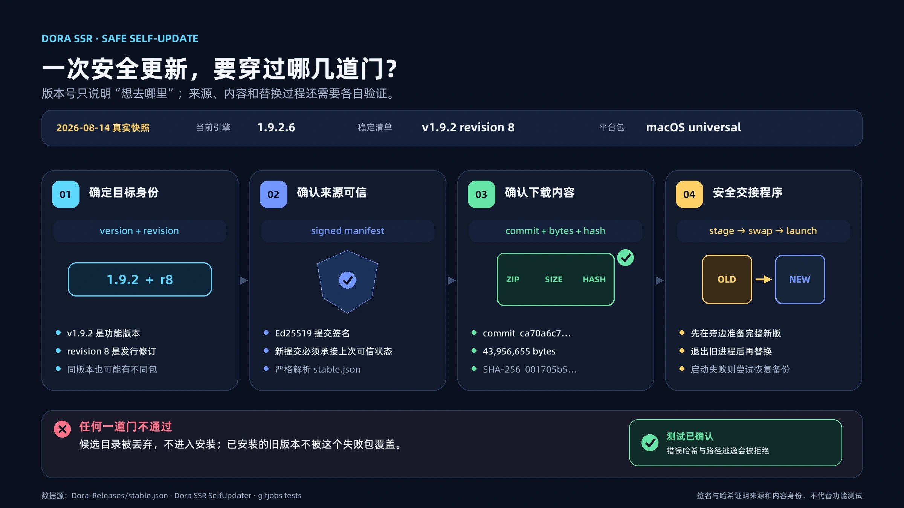

# Dora 自更新器怎样避免装错版本？

自更新很容易被理解成三个动作：比较版本号、下载压缩包、覆盖旧文件。

真正实现时，版本号却只能回答“准备更新到哪一版”，不能证明下载来源可信、文件内容正确，也不能保证更新失败后原来的程序还能运行。Dora SSR 因此把自更新拆成了几层可以分别核对的步骤。

<!-- truncate -->

## 用 revision 和哈希确定具体安装包

同一个基础版本发布以后，有时需要修正打包或重新生成某个平台的安装包。程序功能版本没有变化，交付的文件却已经不同，只比较 `v1.9.2` 就无法区分它们。

Dora 为此增加了 `revision`。截至 2026 年 8 月 14 日，本次核对的公开稳定清单记录的是 `v1.9.2 revision 8`。每个平台还会对应一个固定 Git tag、一个完整 commit，以及安装包的精确大小和 SHA-256。

它们分别回答不同问题：

- version：属于哪个功能版本；
- revision：是这个版本的第几次发行修订；
- tag 与 commit：平台内容对应哪一份固定快照；
- 大小与 SHA-256：实际下载的文件是否就是清单指定的文件。

同名压缩包不一定有相同内容，版本号相同也不一定代表安装包没有更新。只有这些信息共同吻合，客户端才继续安装。

## 两种来源采用不同的验证方式

Dora 当前可以从 GitHub Release 或 Dora-Releases 签名仓库检查更新。

GitHub 模式会核对 Release 中的平台附件、下载地址、文件大小和 digest，下载后再在本地检查大小与 SHA-256。由于 GitHub Release 的 tag 主要表达基础版本，当远端版本号相同时，界面仍允许用户重新下载可能发生过修订的安装包。

签名仓库模式则从一份经过 Ed25519 签名的更新清单开始。客户端用引擎内置的公钥确认清单来自受信任的发布密钥，再依次检查：

1. 当前平台的 tag 是否符合清单记录；
2. tag 指向的 commit 是否完全一致，并通过签名验证；
3. 下载文件的大小和 SHA-256 是否吻合。

这形成了一条简短的验证链：

**签名清单 → 固定平台版本 → 指定 commit → 指定安装包。**

其中任何一环不一致，更新都会停止，而不是尝试安装一份“可能差不多”的文件。

## 记住上一次已经验证的状态

一份旧发行也可能拥有合法签名。只验证签名，并不能阻止服务器把客户端悄悄带回过去的版本。

Dora 会保存 last-known-good，也就是上一次已经验证通过的仓库状态。新的更新清单必须建立在它之后，不能无声地退回旧提交。网络失败时，客户端可以继续读取以前验证过的缓存，但不会把本次无法验证的新内容当成可信更新。

## 校验通过以后再替换程序

文件下载正确，也不代表更新已经完成。运行中的程序直接覆盖自己，或在解压中途被打断，都可能留下新旧文件混合的目录。

Dora 会先在临时位置准备新版本，校验通过后再退出旧进程并完成替换。以 macOS 为例，新应用会先暂存在当前应用旁边；替换后如果启动交接失败，更新流程还会尝试恢复备份。Android、Windows 和 macOS 的最后安装方式并不相同，Linux 则继续通过 PPA/APT 更新。

这些检查证明的是发布来源和文件身份，不能证明程序没有漏洞，也不能代替真机启动与功能测试。它们的作用，是把“拿错包、内容被改、版本倒退、替换到一半”等问题挡在实际安装之前。

对自更新器来说，可靠并不意味着永远不会失败，而是每一步都知道自己在验证什么；一旦验证失败，能够及时停止，并尽量保住原来可以运行的版本。

---

