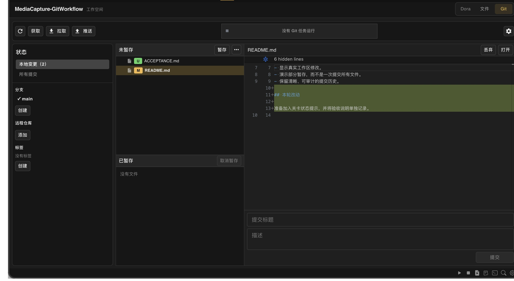

# Web IDE 的轻量 Git 面板

Dora Web IDE 里现在有一个 Git 面板。

这是一项有意控制范围的功能。

它的目标并不是在浏览器里重新造一套完整 Git，也不是让熟悉命令行的人从此放弃终端。它只想解决一个更具体的问题：当项目已经在 Web IDE 中打开时，查看修改、选择提交内容、写下一次提交，再与远端同步，这些最常见的动作能不能留在同一个工作区里完成？

<!-- truncate -->

## 一条日常工作链

对于还不是 Git 仓库的项目，面板提供初始化和克隆入口。进入仓库以后，主要区域会把本地修改分成未暂存和已暂存两组。

暂存区可以简单理解为“下一次提交准备带走的内容”。你可以先查看文件差异，把确认过的文件加入暂存区，填写提交说明，再创建 commit。需要撤销未提交修改时，界面会先显示确认对话框，避免把破坏性操作藏在一个不起眼的按钮后面。

面板也可以读取提交历史。历史列表先显示提交概要，只有选中某次提交并查看变更时，才继续读取文件列表和具体 diff。这样做不是增加功能，而是避免为了显示一列提交标题，就提前计算和传输所有文件差异。

围绕这条主流程，当前界面还提供分支、标签和远程管理，以及 fetch、pull 和 push。凭据不足、没有远程或当前不在普通分支上时，界面需要先让用户补充选择，而不是猜一个目标直接执行。

## 浏览器没有直接运行 Git 命令

Git 面板显示在浏览器里，真正的仓库操作却发生在 Dora 引擎一侧。

Dora 已经内置了由 Go Git 运行时支撑的 `Git.run` 能力。浏览器调用 `/git/summary`、`/git/history`、`/git/run` 等结构化接口，WebServer 再把经过约束的请求交给引擎。前端不会把任意 shell 文本直接送进系统终端，也不依赖用户机器是否另外安装了 Git 命令行。

耗时操作会返回一个 job id。面板随后查询这个任务是排队、运行、完成、失败还是已经取消，并显示进度和消息。任务状态保存在独立的 Git job store 中，不只挂在当前 React 组件的局部状态里。因此切换到其他面板再回来时，界面仍能重新接上正在运行的任务或读取最终结果。

这套模型对 clone、fetch、pull、push 等远端操作尤其重要。网络慢时，界面不应该假装浏览器已经卡死；用户也应能看见当前命令，并在允许的阶段发出取消请求。

## 凭据为什么不放在浏览器里

Git 托管平台可能使用 token，也可能使用用户名和密码。Dora 按 host 保存凭据记录，例如同一个域名下可以有个人和工作两组账号。

已经保存的 secret 留在引擎数据库中。浏览器重新读取列表时，只得到 host、标签、类型、用户名和最近使用时间等元数据，不会从接口取回完整 token，也不会把它写进浏览器 `localStorage`。

这个边界减少了 secret 在前端存储和界面中暴露的机会，但不能被夸大成系统级密码保险箱。当前实现没有证据表明这些记录由操作系统钥匙串或独立加密层保护，因此仍应把运行 Dora 的设备视为凭据安全边界，并只授予 token 必要的仓库权限。

## 故意留下的缺口

Git 最棘手的部分并不是提交按钮，而是分支已经分叉、文件出现冲突以后该怎么办。

当前 Git 面板没有试图提供完整的 merge、rebase、stash 和冲突解决界面，也不支持把一个文件中的部分代码块单独加入暂存区。复杂历史整理和冲突处理仍然适合交给用户熟悉的命令行或桌面 Git 工具。

这不是“以后一定要补齐”的功能清单，也是第一版有意保留的产品边界。一个放在游戏开发工作区里的 Git 面板，首先应该把高频、容易确认的流程做清楚；如果为了追求按钮数量，把危险操作和冲突状态藏进看似简单的界面，反而更容易让用户失去对仓库的判断。

因此，Dora Web IDE 的 Git 面板更像一张日常工作台，而不是一间完整的 Git 修理厂。你可以在一个最小 Dora 项目里试着完成“查看修改—暂存—提交—读取历史”的本地闭环；遇到复杂分支手术时，再回到更适合它的工具。

---

