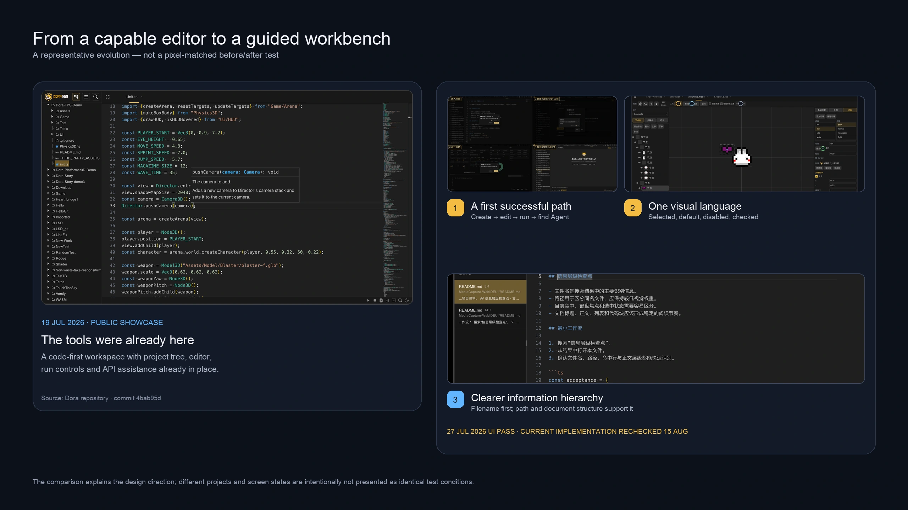
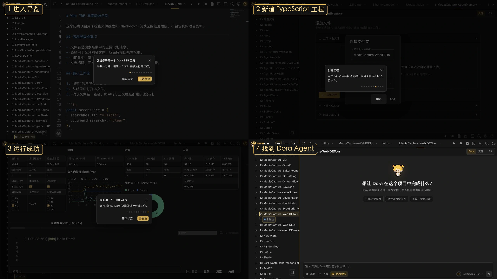
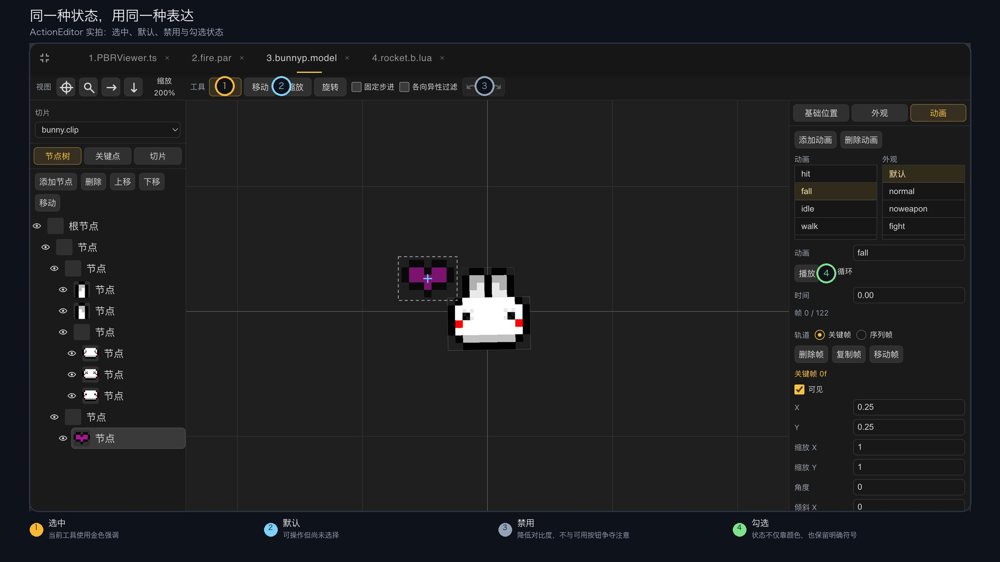
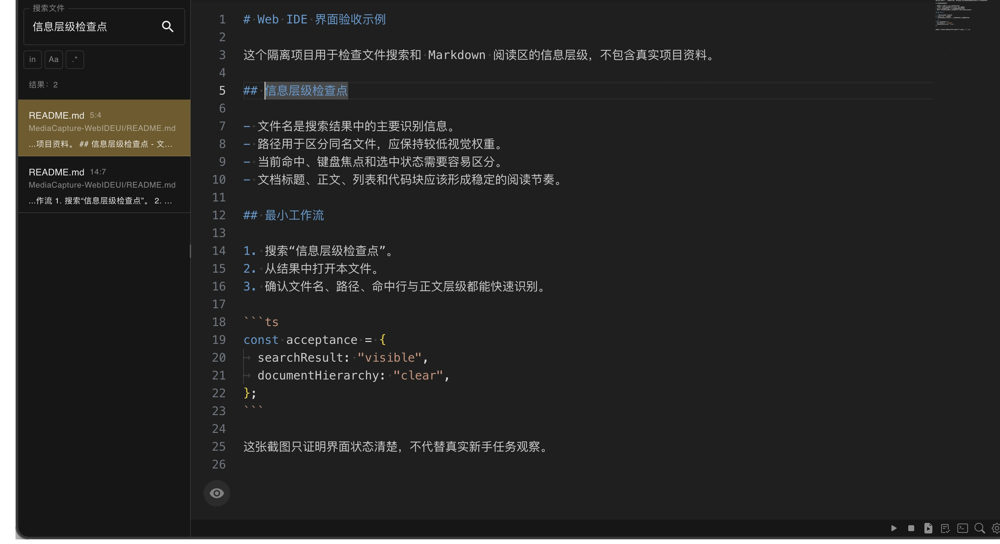

# 重整 Dora Web IDE

这次 Web IDE UI 整理没有追求换皮，而是重新安排新手入口、状态反馈、文件导航和信息层级，让已经丰富的功能更容易被找到和理解。

<!-- truncate -->

2026 年 7 月，我们对 Dora Web IDE 做了一轮 UI 整理，主要涉及首次工程引导、可视化编辑器样式、文件导航和文档阅读界面。

这次调整的目标不是简单更换配色，而是解决三个问题：第一次进入 Web IDE 时从哪里开始，操作过程中怎样识别当前状态，以及信息较多时应该先看哪里。




## 用完整任务设计新手引导

过去的新用户打开 Web IDE，会同时看到资源树、代码编辑器、运行工具、日志和 Agent 等功能，但缺少一条明确的首次操作路径。

新增的首次工程引导以“创建并运行一个最小项目”为目标。用户需要依次完成：

1. 在工作空间中新建目录。
2. 将目录创建为 TypeScript 项目。
3. 打开自动生成的 `init.ts`。
4. 写入或插入示例代码。
5. 运行项目。
6. 选择是否继续进入该项目的 Dora Agent。

```ts
print("Hello Dora!");
```

引导步骤绑定真实界面和操作条件。用户完成当前动作后，流程才进入下一步。因此它不只是介绍按钮的位置，也让用户实际走通“创建—编辑—运行”的基本闭环。

导览可以跳过，完成状态会被保存，也可以从菜单重新打开。它只负责建立第一条操作路径，不能代替完整文档和后续学习。



## 统一可视化编辑器的状态表达

Dora Web IDE 包含代码编辑器，以及动作、刚体、粒子等可视化编辑器。这些工具形成于不同阶段，原先在按钮、输入框、工具栏和选中状态上存在一些表达差异。

本轮调整为它们补充了一套共同的视觉规则：

- 深色表面用于承载主要内容，以边界区分工具栏、面板和编辑区域。
- 金黄色作为强调色，主要表示当前选择、键盘焦点和需要注意的操作。
- 悬停、选中、聚焦和禁用状态采用不同反馈，避免用户混淆“鼠标经过”和“功能已经启用”。
- 复选框、单选框、输入框、树节点和工具按钮使用相近的间距、圆角与状态变化。

这里的统一不是让所有编辑器拥有完全相同的布局，而是让相同状态使用相同表达。用户在一种编辑器中形成的操作经验，可以继续用于其他编辑器。



## 调整文件导航与阅读层级

文件搜索需要同时显示文件名和路径。文件名用于快速识别目标，路径用于区分同名文件。如果两者使用相同的视觉权重，较长的路径容易降低扫描效率。

调整后的搜索结果突出文件名，弱化并限制路径的显示空间，同时明确当前高亮、键盘焦点和选中状态。搜索列表还会根据可用视口限制高度，并约束内部滚动，减少滚动列表时带动外层界面的情况。

Web IDE 中的 Markdown 文档阅读区也重新调整了标题、正文、链接、引用、代码块、图片和表格的间距与样式。内容本身没有改变，但章节结构和不同内容类型更容易区分。



## 如何验证 UI 调整

代码和提交记录只能证明功能与样式已经实现，不能直接证明新用户更容易使用。

这类调整至少需要两类补充验证：

- 使用历史原始画面和当前真实操作帧说明界面演变，并明确它不是同项目、同状态下的像素级 A/B 测试。
- 让没有使用过该流程的人完成“创建—编辑—运行”任务，记录他在哪一步停顿，以及能否识别运行结果和 Agent 入口。

因此，目前可以确认的是 Dora Web IDE 已完成上述引导和界面规则的工程调整；是否降低了新用户的理解成本，还需要通过实际任务观察验证。

如果你第一次使用 Dora Web IDE 时遇到不清楚的入口或状态，欢迎记录具体界面、操作步骤和预期结果。这类可复现的信息，会直接帮助我们继续改进界面。

---

---

<p align="center"></p>
