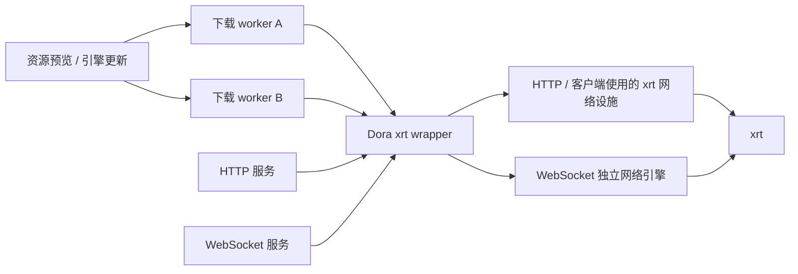

# 代码形式的共享 token

> 一个社区作者开发的网络库，怎样进入 Dora SSR

<!-- truncate -->

2026 年 5 月的一天，Dora 社区群里聊起了 AI Coding。

那段时间，大家已经不太满足于让大模型补几行代码了。有人让 Agent 连续工作几个小时，有人把一整轮重构交给它，还有人一边监工，一边看它犯错、修改、再犯错、再修改。token 像燃料一样消耗，代码则从另一头不断长出来。

叶子在群里说了一句话：

> 我们现在的合作模式是 token 共享，每个人烧 token 跑出来的东西共享使用。

我第一次看到时，觉得这句话有点好玩，又很准确。

过去谈开源协作，我们习惯说“共享代码”。一个人实现功能，其他人读取、修改和继续维护。到了 AI Coding 时代，代码背后又多了一种成本：有人已经替我们向模型描述过问题，让它走过错误路线，再把它拉回来；有人安排了长时间任务，补上测试，最后亲自判断结果到底能不能用。

token 买到的从来不只是最后那些代码行。它还买下了方案探索、失败尝试和验证过程。

这些过程当然不能保证每次都得到好代码。可是当作者愿意继续监工、审查和维护，最后开放出来的成果，就像保存了一部分已经消耗过的 token。下一个人不必重新从空白提示词出发，而可以直接从一个可读、可编译、带许可证的项目继续向前。

当然，接过代码也不是按一下下载就能免费获得全部答案。后来者仍要阅读边界、核对许可证，并在自己的系统里重新验证。所谓“保存 token”，不是把前人的结论永远冻结，而是让大家不必一遍遍支付同一种探索成本，可以把新的 token 花在尚未解决的问题上。

## 当写软件越来越像许愿

AI Coding 以前，一份开源源码最直观的价值，是有人已经替我们完成了大量人工劳动。一个库可能需要几个月甚至几年才能重新实现，因此仅仅“能够看到和使用”就已经很珍贵。

Agent 的能力越来越强以后，这种稀缺性正在下降。过去需要四处寻找现成库的问题，现在也许只要描述需求、等待一段时间，就能得到一套看起来相当完整的实现。软件开发开始有些像许愿：我说出想要什么，Agent 便努力把它变成代码。

但许愿不等于愿望已经正确实现。

为什么采用这种架构？它在哪些平台真正运行过？哪些错误已经被发现？许可证是否清楚？作者是否愿意继续修复问题？这些信息不会因为代码生成得更快就自动出现。

因此，AI Coding 并没有让开源失去意义，只是在改变开源最珍贵的部分。源码作为稀缺劳动成果的价值可能正在下降；经过验证、可以被 Agent 和下一位作者继续工作的工程起点，反而更有价值。

以后我们接过一个开源项目，需要看的不只是“这里有多少代码”，还包括它解决过什么真实问题，作者做过哪些取舍，Agent 曾经走过哪些弯路，哪些测试和实际项目验证过它，以及谁愿意继续为结果负责。

当写代码越来越像许愿，开源项目分享的就不该只是一份愿望的结果，还应该包括这个愿望如何被验证的证据。

后来，这句“token 共享”在 Dora 里有了一个很具体的名字：xrt。

## 这份产物叫 xrt

叶子 Elbold Dadunur，也是 xrt 的作者 xLeaves / xywhsoft。

我们并没有为这件事开一次正式选型会。大家平时就在社区群里聊各自做的项目、遇到的坑和最近又烧了多少 token。xrt 也是这样自然进入视野的。

它是一套使用 MIT 许可证、以 C 实现的跨平台基础库。Dora 采用的版本可以用一个单头文件嵌入：在一个 C 文件里启用实现，其余地方只使用声明，不需要再链接一整套独立 xrt 库。

“单头文件”听起来只是打包方式，但对跨平台引擎很实际。Dora 要同时面对 Android、Windows、macOS、iOS 和 Linux。每增加一套大型预编译依赖，就会多出一组平台构建、许可证交付和版本维护问题。

我愿意把 xrt 接进 Dora，不只是因为它小。

第一，它提供的网络能力对 Dora 已经够用。第二，我认识作者，知道叶子不只是让 Agent 生成一堆代码就宣布完成。他自己有很强的传统编程能力，会看实现、抓问题，也会继续补测试。第三，xrt 确实在经历高强度的 AI Coding：叶子后来提到，一次任务连续运行了十多个小时，生成了 150 多个 xlang 复杂用例。Agent 会犯错，但在继续推理后也能修正；真正决定结果是否可用的人仍然在场。

2026 年 5 月 21 日，Dora 首先用 xrt 替换了原来的 HTTPS 客户端实现，并从部分平台工程中移除了随仓库交付的 OpenSSL 预编译静态库。到 8 月，Dora 又继续把 HTTP 服务后端、WebSocket 和下载路径整理到 xrt 之上。

这里需要说清楚：这不是一个改动完成了全部事情，也不是 xrt 专门为 Dora 定制了一套网络系统。xrt 和 Dora 一直是两个独立演进的项目。叶子会为了 xlang 等项目重构 xrt；Dora 则根据游戏引擎和 Web IDE 的实际需要，选择自己的接入边界。

真正的开源复用，本来就不需要把两位作者绑在同一张路线图上。

## 小巧只是开始，边界还要自己整理

xrt 进入 Dora 后，我们首先感受到的是“够轻”。

过去使用其他网络组件时，同样的能力可能带来更大的二进制和仓库负担。换用 xrt 后，我在 Dora 的实际使用中观察到体积明显下降，HTTP 服务的表现也比此前更合适。不过，这些仍然是特定版本和设备上的工程观察；在形成严格的同机基准以前，我不会把它写成适用于所有平台的固定数字。

更重要的工作发生在“怎么使用”上。

例如下载。Dora 会下载引擎更新，也会为资源预览取得远端内容。以前所有下载共用一条工作线程，很像车站只有一个办理窗口：第一位旅客还在处理，后面的人即使拿着完全不同的车票，也只能继续排队。

这并不表示 Web IDE 曾经因为某次下载就全面断网，但它留下了一个不合理的限制：底层替所有调用者做了串行决定。只要前一个下载迟迟不结束，后面的下载就无法真正同时推进。

后来的实现让每个下载拥有独立的工作单元。谁要同时下载几个文件，由上层场景自己决定；底层负责为每个请求保存取消状态，任务完成后回收线程，引擎停止时再统一通知仍在工作的任务退出。

白话一点说：我们不是承诺窗口可以无限增加，而是把“应该开几个窗口”的决定还给真正了解现场的人。

## 不同的网络服务，也不要挤在同一个房间

另一层问题发生在 HTTP 与 WebSocket 之间。

HTTP 更像一次次递交表格：发出请求，收到响应，事情结束。WebSocket 则像一条长期保持的电话线，浏览器和引擎会持续通过它传递日志与状态。它们都使用网络，但生命周期并不相同。

如果两个服务共享一份会被停止、重启或销毁的运行状态，修改其中一个就可能意外影响另一个。Dora 后来让 WebSocket 服务拥有自己的网络引擎。关闭 WebSocket 时，它会连同自己的引擎一起退出，不必借用 HTTP 服务正在使用的房间。

下载隔离和服务隔离可以画成两层：

第一层解决“多个下载不要只排一条队”；第二层解决“用途不同的长期服务不要共享容易互相牵连的生命周期”。它们相关，却不是同一个问题。

Dora 还增加了一层自己的 C wrapper，把 xrt 的具体类型和实现集中在少数文件里。上层 `HttpServer` 只认识 Dora 定义的接口。为防止以后不小心把第三方细节重新散落出去，项目还加入了结构测试：检查服务器代码没有直接包含 xrt，确认实现只在约定的 C 文件中启用，并分别用 C 和 C++ 编译器验证边界。

这些工作不华丽，却决定了一份社区代码能不能长期住进引擎底层。

## AI 写得越多，人的判断越重要

“共享 token”很容易被误解成共享模型账号、API Key，或者把生成的代码不加检查地扔给别人。叶子说的合作并不是这样。

烧 token 已经可以完成很多工作，却不能保证每个人得到相同质量和性价比的结果。有人能够为 Agent 选择更短的路线，在关键位置纠正错误，并用真实测试判断任务何时完成；也有人可能消耗更多 token，最后只得到一套看起来完整、实际上无人能够负责的代码。

同样的模型和 token，仍会因为人的需求理解、架构选择和验收能力产生不同结果。AI 降低了执行成本，却没有平均分配判断力、责任感和信用。

因此，AI 写得越多，人与人之间的信任反而越重要。当大量代码同时出现，我们需要知道作者是否理解它，是否验证过它，出了问题是否愿意继续修复。真正稀缺的也许不再只是写代码的时间，而是定义问题、判断结果，以及愿意为 Agent 工作成果负责的人。

这也是 xrt 能够进入 Dora 的原因。摆在我面前的不只是一份 AI 参与编写的网络库。我了解叶子的工程能力，知道他会亲自监工、测试和维护；随后 Dora 又在真实使用场景中完成了自己的验证。代码、作者信用和使用方证据连成了一条合作链。

过去，一个人开源代码，我们会说他分享了自己的时间。现在，这份时间里还包含模型成本、失败路线、重新验证，以及作者愿意为结果负责的承诺。代码于是成了一种能够保存、检查并继续传递的 token 产物。

如果你也有一份经过 AI Coding、由自己认真验证，并且愿意开放给别人继续使用的成果，欢迎把它带到 Dora 社区。我们想看看，下一棒还能从哪里开始。

---

