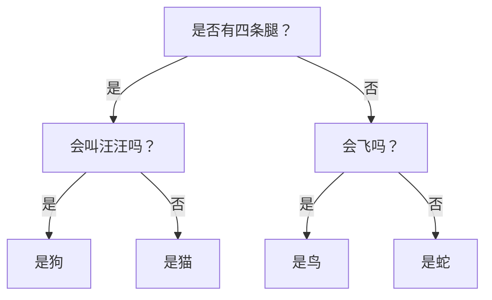
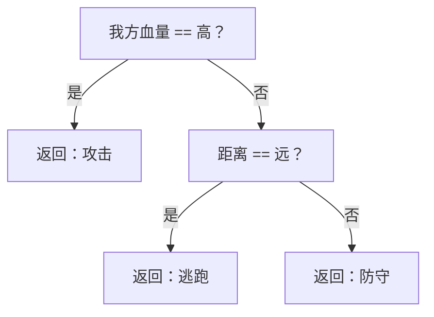

import "@site/src/languages/highlight";
import Tabs from '@theme/Tabs';
import TabItem from '@theme/TabItem';

# 使用决策树实现智能游戏 AI

## 1. 简介

&emsp;&emsp;在游戏开发中，**人工智能（AI）** 扮演着至关重要的角色。本教程将介绍如何利用 Dora SSR 引擎提供的 **C4.5 决策树** 算法来创建智能的游戏 AI。我们将通过一个简单的示例，逐步学习这一过程。

### 1.1 什么是决策树？

&emsp;&emsp;决策树是一种类似于流程图的结构，用于辅助决策。想象一下我们在玩“猜动物”的游戏：



&emsp;&emsp;这就是一个简单的决策树示例。在游戏 AI 中，我们可以使用类似的结构来做出智能决策。

## 2. 准备工作

&emsp;&emsp;首先，我们需要准备训练数据。假设我们正在开发一个简单的格斗游戏 AI，需要决定何时**攻击**、**防守**或**逃跑**。

### 2.1 准备训练数据（CSV 格式）

&emsp;&emsp;训练数据的格式说明：

- **第一行**：包含所有特征的名称，例如“距离”、“敌人血量”等。
- **第二行**：定义每个特征的数据类型，其中：
	- `C` 表示**分类**（Categorical）数据，如“近”、“远”等离散值。
	- `N` 表示**数值**（Numerical）数据，如具体的血量数值。
- **第三行开始**：实际的训练数据，每行代表一个训练样本。
- **最后一列**：决策结果，即 AI 应采取的行动，这是决策树要学习预测的目标值，可以是分类值或数值。

```csv
距离,敌人血量,我方血量,行为
C,C,C,C
近,高,高,攻击
近,低,高,攻击
远,高,低,逃跑
中,中,低,防守
远,低,高,攻击
```

## 3. 基础代码实现

&emsp;&emsp;让我们通过这组训练数据训练并生成一个决策树，以实现简单的战斗 AI：

<Tabs groupId="language-select">
<TabItem value="lua" label="Lua">

```lua
local thread <const> = require("thread")
local ML <const> = require("ML")

-- 准备训练数据
local trainingData = [[
距离,敌人血量,我方血量,行为
C,C,C,C
近,高,高,攻击
近,低,高,攻击
远,高,低,逃跑
中,中,低,防守
远,低,高,攻击
]]

-- 构建决策树
function buildDecisionTreeAsync()
	local trainingResult = {}

	-- 最大深度设置为 3
	local accuracy, err = ML.BuildDecisionTreeAsync(trainingData, 3, function(depth, name, op, value)
		-- 根据深度添加缩进
		local line = string.rep("\t", depth + 1)

		-- 处理叶子节点（结果节点）
		if op == "return" then
			line = line .. 'return "' .. value .. '"'
		else
			-- 构建条件语句
			local valueStr = (op == '==' and '"' .. value .. '"' or value)
			line = line .. "if " .. name .. " " .. op .. " " .. valueStr
		end
		table.insert(trainingResult, line)
	end)

	if err then
		print("构建决策树时出错:", err)
		return
	end

	print("决策树准确度：", accuracy)
	print("决策树结构：\n" .. table.concat(trainingResult, "\n"))

	return trainingResult
end

-- 用下面的代码测试异步构建决策树
thread(buildDecisionTreeAsync)
```

</TabItem>
<TabItem value="tl" label="Teal">

```tl
local thread <const> = require("thread")
local ML <const> = require("ML")

-- 准备训练数据
local trainingData = [[
距离,敌人血量,我方血量,行为
C,C,C,C
近,高,高,攻击
近,低,高,攻击
远,高,低,逃跑
中,中,低,防守
远,低,高,攻击
]]

-- 构建决策树
local function buildDecisionTreeAsync(): {string}
	local trainingResult: {string} = {}

	-- 最大深度设置为 3
	local accuracy, err = ML.BuildDecisionTreeAsync(trainingData, 3, function(depth: integer, name: string, op: ML.Operator, value: string)
		-- 根据深度添加缩进
		local line = string.rep("\t", depth + 1)

		-- 处理叶子节点（结果节点）
		if op == "return" then
			line = line .. 'return "' .. value .. '"'
		else
			-- 构建条件语句
			local valueStr = (op == '==' and '"' .. value .. '"' or value)
			line = line .. "if " .. name .. " " .. op .. " " .. valueStr
		end
		table.insert(trainingResult, line)
	end)

	if err then
		print("构建决策树时出错:", err)
		return
	end

	print("决策树准确度：", accuracy)
	print("决策树结构：\n" .. table.concat(trainingResult, "\n"))

	return trainingResult
end

-- 用下面的代码测试异步构建决策树
thread(buildDecisionTreeAsync)
```

</TabItem>
<TabItem value="ts" label="TypeScript">

```ts
import { ML, thread } from "Dora";

// 准备训练数据
const trainingData = `
距离,敌人血量,我方血量,行为
C,C,C,C
近,高,高,攻击
近,低,高,攻击
远,高,低,逃跑
中,中,低,防守
远,低,高,攻击
`;

// 构建决策树
const buildDecisionTreeAsync = () => {
	const trainingResult: string[] = [];

	// 最大深度设置为 3
	const [accuracy, err] = ML.BuildDecisionTreeAsync(trainingData, 3, (depth, name, op, value) => {
		// 根据深度添加缩进
		let line = "\t".repeat(depth + 1);

		// 处理叶子节点（结果节点）
		if (op === "return") {
			line += `return "${value}"`;
		} else {
			// 构建条件语句
			const valueStr = (op === "==" ? `"${value}"` : value);
			line += `if ${name} ${op} ${valueStr}`;
		}
		trainingResult.push(line);
	});

	if (err) {
		print("构建决策树时出错:", err);
		return trainingResult;
	}

	print("决策树准确度:", accuracy);
	print("决策树结构:\n" + trainingResult.join("\n"));

	return trainingResult;
};

// 用下面的代码测试异步构建决策树
thread(buildDecisionTreeAsync);
```

</TabItem>
<TabItem value="yue" label="YueScript">

```yue
_ENV = Dora

-- 准备训练数据
trainingData = [[
距离,敌人血量,我方血量,行为
C,C,C,C
近,高,高,攻击
近,低,高,攻击
远,高,低,逃跑
中,中,低,防守
远,低,高,攻击
]]

-- 构建决策树
buildDecisionTreeAsync = ->
	trainingResult = []

	-- 最大深度设置为 3
	accuracy, err = ML.BuildDecisionTreeAsync trainingData, 3, (depth, name, op, value) ->
		-- 根据深度添加缩进
		line = string.rep "\t", depth + 1

		-- 处理叶子节点（结果节点）
		if op == "return"
			line ..= "return \"#{value}\""
		else
			-- 构建条件语句
			valueStr = (op == "==" and "\"#{value}\"" or value)
			line ..= "if #{name} #{op} #{valueStr}"

		table.insert trainingResult, line

	if err
		print "构建决策树时出错: #{err}"
		return

	print "决策树准确度: #{accuracy}"
	print "决策树结构:\n" .. table.concat trainingResult, "\n"

	trainingResult

-- 用下面的代码测试异步构建决策树
thread buildDecisionTreeAsync
```

</TabItem>
</Tabs>

### 3.1 可视化生成的决策树

&emsp;&emsp;生成的决策树结构如下：



## 4. 在游戏中使用

&emsp;&emsp;下面是一个简单的续写示例，展示如何在游戏角色中应用这个 AI 决策树：

<Tabs groupId="language-select">
<TabItem value="lua" label="Lua">

```lua
local yue <const> = require("yue")
local Vec2 <const> = require("Vec2")

thread(function()
	-- 构建决策树
	local trainingResult = buildDecisionTreeAsync()

	-- 加载决策树为一个 YueScript 函数
	local decisionFunction = yue.loadstring(
		"(data)->\n" ..
		"\t:距离, :敌人血量, :我方血量 = data\n" ..
		table.concat(trainingResult, "\n")
	)()

	-- 定义角色类
	local Character = {}
	function Character:new()
		local char = {
			position = Vec2.zero,
			health = 100,
			maxHealth = 100
		}
		setmetatable(char, {__index = Character})
		return char
	end

	-- 根据血量百分比返回状态
	function Character:getHealthState()
		local healthPercent = self.health / self.maxHealth
		if healthPercent > 0.7 then return "高"
		elseif healthPercent > 0.3 then return "中"
		else return "低" end
	end

	-- 根据实际距离返回状态
	function Character:calculateDistance(enemy)
		local distance = self.position:distance(enemy.position)
		if distance < 50 then return "近"
		elseif distance < 150 then return "中"
		else return "远" end
	end

	-- 决定行动
	function Character:decideAction(enemy)
		return decisionFunction{
			["距离"] = self:calculateDistance(enemy),
			["敌人血量"] = enemy:getHealthState(),
			["我方血量"] = self:getHealthState()
		}
	end

	-- 更新角色状态并采取行动
	function Character:update(enemy)
		local action = self:decideAction(enemy)
		-- 执行对应的行为
		print("执行动作：" .. action)
	end

	-- 创建角色实例
	local character = Character:new()
	local enemy = Character:new()

	-- 设置敌人的位置
	enemy.position = Vec2(100, 100)
	-- 当前角色应执行“攻击”
	character:update(enemy)

	-- 更新角色血量
	character.health = 10
	-- 当前角色应执行“防守”
	character:update(enemy)
end)
```

</TabItem>
<TabItem value="tl" label="Teal">

```tl
local yue <const> = require("yue")
local Vec2 <const> = require("Vec2")

thread(function()
	-- 构建决策树
	local trainingResult = buildDecisionTreeAsync()

	-- 加载决策树为一个 YueScript 函数
	local result = yue.loadstring(
		"(data)->\n" ..
		"\t:距离, :敌人血量, :我方血量 = data\n" ..
		table.concat(trainingResult, "\n")
	)

	if result is nil then
		return
	end

	local record Feature
		["距离"]: string
		["敌人血量"]: string
		["我方血量"]: string
	end

	local decisionFunction = result() as function(Feature): string

	-- 定义角色类
	local record Character
		position: Vec2.Type
		health: number
		maxHealth: number
	end

	function Character:new(): Character
		local char = {
			position = Vec2.zero,
			health = 100,
			maxHealth = 100
		}
		setmetatable(char, {__index = Character})
		return char
	end

	-- 根据血量百分比返回状态
	function Character:getHealthState(): string
		local healthPercent = self.health / self.maxHealth
		if healthPercent > 0.7 then return "高"
		elseif healthPercent > 0.3 then return "中"
		else return "低" end
	end

	-- 根据实际距离返回状态
	function Character:calculateDistance(enemy: Character): string
		local distance = self.position:distance(enemy.position)
		if distance < 50 then return "近"
		elseif distance < 150 then return "中"
		else return "远" end
	end

	-- 决定行动
	function Character:decideAction(enemy: Character): string
		return decisionFunction{
			["距离"] = self:calculateDistance(enemy),
			["敌人血量"] = enemy:getHealthState(),
			["我方血量"] = self:getHealthState()
		}
	end

	-- 更新角色状态并采取行动
	function Character:update(enemy: Character)
		local action = self:decideAction(enemy)
		-- 执行对应的行为
		print("执行动作：" .. action)
	end

	-- 创建角色实例
	local character = Character:new()
	local enemy = Character:new()

	-- 设置敌人的位置
	enemy.position = Vec2(100, 100)
	-- 当前角色应执行“攻击”
	character:update(enemy)

	-- 更新角色血量
	character.health = 10
	-- 当前角色应执行“防守”
	character:update(enemy)
end)
```

</TabItem>
<TabItem value="ts" label="TypeScript">

```ts
import { Vec2 } from "Dora";
const yue = require("yue")

thread(() => {
	// 构建决策树
	const trainingResult = buildDecisionTreeAsync();

	// 加载决策树为一个 YueScript 函数
	const decisionFunction = yue.loadstring(
		"(data)->\n" +
		"\t:距离, :敌人血量, :我方血量 = data\n" +
		trainingResult.join("\n")
	)() as (data: {}) => string;

	// 定义角色类
	class Character {
		position: Vec2.Type
		health: number
		maxHealth: number

		constructor() {
			this.position = Vec2.zero;
			this.health = 100;
			this.maxHealth = 100;
		}

		// 根据血量百分比返回状态
		getHealthState() {
			const healthPercent = this.health / this.maxHealth;
			if (healthPercent > 0.7) return "高";
			else if (healthPercent > 0.3) return "中";
			else return "低";
		}

		// 根据实际距离返回状态
		calculateDistance(enemy: Character) {
			const distance = this.position.distance(enemy.position);
			if (distance < 50) return "近";
			else if (distance < 150) return "中";
			else return "远";
		}

		// 决定行动
		decideAction(enemy: Character) {
			return decisionFunction({
				"距离": this.calculateDistance(enemy),
				"敌人血量": enemy.getHealthState(),
				"我方血量": this.getHealthState()
			});
		}

		// 更新角色状态并采取行动
		update(enemy: Character) {
			const action = this.decideAction(enemy);
			// 执行对应的行为
			print(`执行动作：${action}`);
		}
	};

	// 创建角色实例
	const character = new Character();
	const enemy = new Character();

	// 设置敌人的位置
	enemy.position = Vec2(100, 100);
	// 当前角色应执行“攻击”
	character.update(enemy);

	// 更新角色血量
	character.health = 10;
	// 当前角色应执行“防守”
	character.update(enemy);
});
```

</TabItem>
<TabItem value="yue" label="YueScript">

```yue
import "yue"

thread ->
	-- 构建决策树
	trainingResult = buildDecisionTreeAsync!

	-- 加载决策树为一个 YueScript 函数
	decisionFunction = yue.loadstring(
		"(data)->\n" ..
		"\t:距离, :敌人血量, :我方血量 = data\n" ..
		table.concat(trainingResult, "\n")
	)!

	-- 定义角色类
	class Character
		new: =>
			@position = Vec2.zero
			@health = 100
			@maxHealth = 100

		-- 根据血量百分比返回状态
		getHealthState: =>
			healthPercent = @health / @maxHealth
			if healthPercent > 0.7 then return "高"
			elseif healthPercent > 0.3 then return "中"
			else return "低"

		-- 根据实际距离返回状态
		calculateDistance: (enemy) =>
			distance = self.position\distance enemy.position
			if distance < 50 then return "近"
			elseif distance < 150 then return "中"
			else return "远"

		-- 决定行动
		decideAction: (enemy) =>
			return decisionFunction
				["距离"]: @calculateDistance enemy
				["敌人血量"]: enemy\getHealthState!
				["我方血量"]: @getHealthState!

		-- 更新角色状态并采取行动
		update: (enemy) =>
			action = @decideAction enemy
			-- 执行对应的行为
			print "执行动作：#{action}"

	-- 创建角色实例
	character = Character!
	enemy = Character!

	-- 设置敌人的位置
	enemy.position = Vec2 100, 100
	-- 当前角色应执行“攻击”
	character\update enemy

	-- 更新角色血量
	character.health = 10
	-- 当前角色应执行“防守”
	character\update enemy
```

</TabItem>
</Tabs>

## 5. 实际运用说明

### 5.1 决策树的优势

&emsp;&emsp;**决策树**作为一种机器学习算法，在游戏 AI 开发中具有以下优势：

- **易于理解和实现**：决策树的结构直观，类似于人类的决策过程，便于开发者理解和实现复杂的决策逻辑。
- **透明的决策过程**：每个决策步骤都是清晰可见的，方便调试和优化 AI 的行为。
- **灵活性强**：可以根据游戏需求，随时调整决策树的结构和参数，使 AI 行为更符合设计目标。
- **高效性**：决策树在运行时仅需简单的条件判断，计算开销小，适合实时性要求高的游戏场景。

### 5.2 使用注意事项

&emsp;&emsp;在使用决策树构建游戏 AI 时，需要注意以下几点：

- **训练数据的代表性**：确保训练数据覆盖各种可能的游戏情景，使 AI 能够应对不同的状态。建议使用真实玩家的数据作为训练样本。
- **避免过拟合**：决策树深度不宜过大，过深的树可能过度拟合训练数据，降低对新数据的泛化能力。可以从较小的深度开始，根据效果逐步调整。
- **持续优化**：在游戏运行过程中，持续收集新的数据，定期重新训练模型，使 AI 能够适应玩家的策略变化。

## 6. 进阶优化建议

- **添加更多特征**：例如：
	- 技能冷却时间
	- 可用道具数量
	- 周围地形信息

- **动态调整 AI 行为**：

	&emsp;&emsp;在游戏过程中，可以根据玩家的行为数据，动态更新训练数据，重新训练决策树，使 AI 更贴近玩家的风格。

	<Tabs groupId="language-select">
	<TabItem value="lua" label="Lua">

	```lua
	function Character:updateAI(enemy, battleAction)
		-- 记录新的战斗数据
		local newTrainingData = string.format("%s,%s,%s,%s\n",
			self:calculateDistance(enemy),
			enemy:getHealthState(),
			self:getHealthState(),
			battleAction
		)
		trainingData = trainingData .. newTrainingData
		-- 定期重新训练 AI
		thread(function()
			buildDecisionTreeAsync()
			-- ... 其他处理逻辑
		end)
	end
	```

	</TabItem>
	<TabItem value="tl" label="Teal">

	```tl
	function Character:updateAI(enemy: Character, battleAction: string)
		-- 记录新的战斗数据
		local newTrainingData = string.format("%s,%s,%s,%s\n",
			self:calculateDistance(enemy),
			enemy:getHealthState(),
			self:getHealthState(),
			battleAction
		)
		trainingData = trainingData .. newTrainingData
		-- 定期重新训练 AI
		thread(function()
			buildDecisionTreeAsync()
			-- ... 其他处理逻辑
		end)
	end
	```

	</TabItem>
	<TabItem value="ts" label="TypeScript">

	```ts
	updateAI(enemy: Character, battleAction: string) {
		// 记录新的战斗数据
		const newTrainingData =
		`${this.calculateDistance(enemy)
		},${enemy.getHealthState()
		},${this.getHealthState()
		},${battleAction}\n`;
		trainingData = trainingData + newTrainingData;
		// 定期重新训练 AI
		thread(() => {
			buildDecisionTreeAsync();
			// ... 其他处理逻辑
		});
	}
	```

	</TabItem>
	<TabItem value="yue" label="YueScript">

	```yue
	updateAI: (enemy: Character, battleAction: string) =>
		-- 记录新的战斗数据
		newTrainingData = string.format(
			"%s,%s,%s,%s\n"
			@calculateDistance enemy
			enemy\getHealthState!
			@getHealthState!
			battleAction
		)
		trainingData ..= newTrainingData
		-- 定期重新训练 AI
		thread ->
			buildDecisionTreeAsync!
			-- ... 其他处理逻辑
	```

	</TabItem>
	</Tabs>

## 7. 常见问题解答

- **Q: 决策树的深度应该设定为多少？**

	**A**: 建议初始深度设置为 3 或 4。深度过大可能导致过拟合，深度过小可能无法捕捉复杂的决策逻辑。

- **Q: 如何改进 AI 的表现？**

	**A**: 可以通过以下方式改进：
	- 增加训练数据的数量和多样性
	- 调整决策树的深度和参数
	- 添加更多有意义的特征（如环境因素、敌人类型等）

- **Q: 需要多少训练数据才够？**

	**A**: 起初可以使用 50-100 条数据，根据游戏复杂度和测试结果，逐步增加数据量以提升 AI 的准确性。

## 8. 总结

&emsp;&emsp;通过本教程，我们学习了：

- **决策树的基本概念**：理解了决策树如何辅助决策，以及其在游戏 AI 中的应用。
- **如何准备训练数据**：掌握了构建有效训练数据集的方法，为模型训练打下基础。
- **使用 Dora SSR 的 ML 模块构建决策树**：学会了如何利用引擎提供的工具，快速构建决策树模型。
- **在游戏中实际应用决策树**：了解了如何将训练好的模型整合到游戏逻辑中，实现智能决策。
- **优化和改进 AI 系统的方法**：认识到持续优化的重要性，以及如何通过调整模型和数据来提升 AI 的表现。

&emsp;&emsp;记住，一个优秀的游戏 AI 不仅要有复杂的算法，更要能提升玩家的游戏体验。通过不断地调整和优化，你可以创造出既有趣又具有挑战性的游戏 AI。
