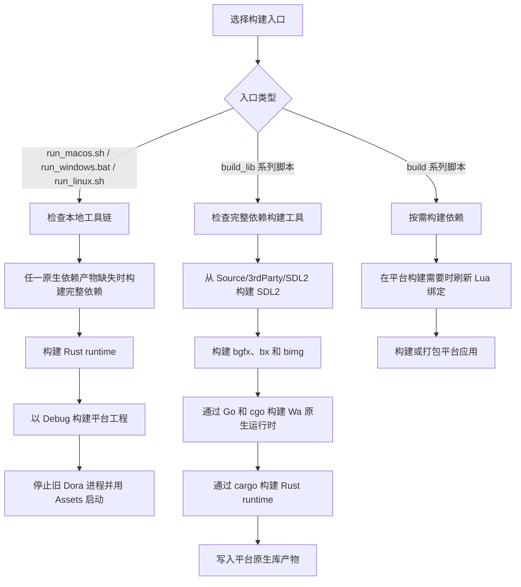

import Tabs from '@theme/Tabs';
import TabItem from '@theme/TabItem';

# 如何构建 Dora SSR 引擎

## 1. 获取项目源码

<Tabs groupId="git-select">
<TabItem value="github" label="GitHub">

```sh
git clone https://github.com/ippclub/Dora-SSR.git
```

</TabItem>
<TabItem value="gitee" label="Gitee">

```sh
git clone https://gitee.com/ippclub/Dora-SSR.git
```

</TabItem>
<TabItem value="gitcode" label="GitCode">

```sh
git clone https://gitcode.com/ippclub/Dora-SSR.git
```

</TabItem>
</Tabs>

## 2. 构建游戏引擎运行时

&emsp;&emsp;请选择你想要构建的目标平台。

本地桌面开发优先使用已有的 `run_*` 脚本，它们是最短的启动路径，并会检查必要的原生依赖产物；如果发现依赖缺失，会自动先构建完整依赖。`Tools/build-scripts` 下的平台依赖脚本会构建引擎需要的原生依赖，包括 SDL2、bgfx、Rust runtime 和 Wa 原生运行时。通常不需要再手动进入 `Source/3rdParty/bgfx` 单独构建 bgfx。

<Tabs groupId="platform-select">
<TabItem value="windows" label="Windows">

1. 安装 [Go 1.24 或更高版本](https://go.dev/dl/)、[Rust](https://www.rust-lang.org/tools/install)、[xmake](https://xmake.io/#/guide/installation)，以及带有 MSBuild 工具的 [Visual Studio Community 2026](https://visualstudio.microsoft.com/vs/community/)，与 Windows GitHub Actions 构建环境保持一致。

2. 安装 [MSYS2](https://www.msys2.org/) 和用于 Go cgo 构建 Wa 运行时 DLL 的 32 位 [MinGW-w64](https://www.mingw-w64.org/) 工具链。CI 使用 MSYS2 MINGW32；请在 MSYS2 MINGW32 shell 中执行：
	```sh
	pacman -S --needed mingw-w64-i686-gcc
	```

	请确保 MINGW32 的 `gcc.exe` 在其它 MinGW 工具链之前被找到。默认 MSYS2 安装路径下可以这样设置：
	```bat
	set PATH=C:\msys64\mingw32\bin;%PATH%
	set CC=C:\msys64\mingw32\bin\gcc.exe
	```

3. 构建并运行本地 Debug 运行时。
	```bat
	Tools\build-scripts\run_windows.bat
	```

4. 如果需要本地调试，可在 Visual Studio 中打开 **Projects/Windows/Dora.sln**，运行 `Debug` 配置。

</TabItem>
<TabItem value="macos" label="macOS">

1. 安装 [Go 1.24 或更高版本](https://go.dev/dl/)、[Rust](https://www.rust-lang.org/tools/install)、[xmake](https://xmake.io/#/guide/installation) 和最新版 [Xcode](https://developer.apple.com/xcode/)。

2. 构建并运行本地 Debug 运行时。
	```sh
	Tools/build-scripts/run_macos.sh
	```

3. 如果需要 IDE 调试，可在 Xcode 中打开 **Projects/macOS/Dora.xcodeproj**，运行 `Dora` target。

</TabItem>
<TabItem value="ios" label="iOS">

1. 安装 [Go 1.24 或更高版本](https://go.dev/dl/)、[Rust](https://www.rust-lang.org/tools/install)、[xmake](https://xmake.io/#/guide/installation) 和最新版 [Xcode](https://developer.apple.com/xcode/)。

2. 构建 iOS 原生依赖库。
	```sh
	Tools/build-scripts/build_lib_ios.sh debug
	```

3. 构建模拟器目标。
	```sh
	xcodebuild ARCHS=arm64 ONLY_ACTIVE_ARCH=NO -project Projects/iOS/Dora.xcodeproj -configuration Debug -target Simulator -sdk iphonesimulator
	```

4. 如果需要 IDE 调试，可在 Xcode 中打开 **Projects/iOS/Dora.xcodeproj**，运行 `Simulator` target。

</TabItem>
<TabItem value="android" label="Android">

:::tip
Android 本地构建除了 [Android Studio](https://developer.android.com/studio) 外，还需要 [JDK 17](https://adoptium.net/temurin/releases/?version=17)。Wa Android AAR 会通过 Go 和 gomobile 构建；如果本机缺少 gomobile，构建脚本会自动安装固定版本。
:::

1. 安装 [Go 1.24 或更高版本](https://go.dev/dl/)、[Rust](https://www.rust-lang.org/tools/install)、[xmake](https://xmake.io/#/guide/installation) 和最新版 Android Studio。

2. 构建 Android 原生依赖库。
	```sh
	Tools/build-scripts/build_lib_android.sh debug
	```

3. 本地构建 Android 应用。
	```sh
	cd Projects/Android/Dora
	./gradlew assembleDebug
	```

4. 如果需要 IDE 调试，可在 Android Studio 中打开 **Projects/Android/Dora**，运行 `app` 模块。

</TabItem>
<TabItem value="linux" label="Linux">

:::tip
Linux 本地构建会使用仓库内置的 SDL2 源码，并交给 SDL 原版 CMake 自动检测可用后端。需要按发行版安装你希望启用的开发包，例如 X11、Wayland、ALSA、PulseAudio、PipeWire、DBus、udev 和 KMSDRM。
:::

1. 安装 [Go 1.24 或更高版本](https://go.dev/dl/)、[Rust](https://www.rust-lang.org/tools/install) 和 [xmake](https://xmake.io/#/guide/installation)。

<Tabs groupId="linux-distribution-select">
<TabItem value="ubuntu" label="Ubuntu/Debian">

3. 安装依赖包。
	```sh
	sudo apt-get update
	sudo apt-get install -y cmake pkg-config lua5.1 luarocks \
	  libgl1-mesa-dev libssl-dev libdbus-1-dev \
	  libasound2-dev libjack-jackd2-dev libpulse-dev libpipewire-0.3-dev libsamplerate0-dev libsndio-dev \
	  libibus-1.0-dev libudev-dev libusb-1.0-0-dev \
	  libx11-dev libxext-dev libxcursor-dev libxi-dev libxfixes-dev libxrandr-dev libxrender-dev libxss-dev \
	  libdrm-dev libgbm-dev libegl1-mesa-dev libwayland-dev libwayland-bin wayland-protocols \
	  libxkbcommon-dev libdecor-0-dev
	```

4. 手动生成 Lua 绑定。
	```sh
	sudo luarocks install luafilesystem
	cd Tools/tolua++
	lua tolua++.lua
	```

</TabItem>
<TabItem value="arch-linux" label="Arch Linux">

3. 安装依赖包。
	```sh
	sudo pacman -S lua51 luarocks openssl gcc make cmake pkgconf \
	  mesa libx11 libxext libxcursor libxi libxfixes libxrandr libxrender libxss \
	  wayland wayland-protocols libxkbcommon libdecor alsa-lib libpulse pipewire libusb libdrm --needed
	# 因为lua的版本必须是5.1,你需要使用lua5.1而不是最新的lua
	# 最简单的方法是用ln创建一个软链接
	sudo ln -s /usr/bin/lua5.1 /usr/local/bin/lua
	```

4. 手动生成 Lua 绑定。
	```sh
	sudo luarocks --lua-version 5.1 install luafilesystem
	cd Tools/tolua++
	lua5.1 tolua++.lua
	```

</TabItem>
</Tabs>

2. 构建并运行本地 Debug 运行时。它会检查当前架构的 SDL2、bgfx 和 Wa 原生产物，缺失时自动构建依赖，然后重新构建 Rust runtime 和 Linux 应用。

	```sh
	Tools/build-scripts/run_linux.sh
	```

3. 如果只需要构建而不启动运行时，可使用平台构建脚本。
	```sh
	Tools/build-scripts/build_linux.sh debug
	```

</TabItem>
</Tabs>

## 3. 构建 Web IDE

1. 编译并运行 Dora SSR 引擎。
2. 安装最新版的 [Node.js](https://nodejs.org/) 和 [pnpm](https://pnpm.io/installation)。
3. 初始化 Dora Dora 编辑器。使用 `pnpm start` 进入开发模式。

	当需要让引擎运行时加载更新后的 Web IDE 时，再执行 `pnpm build`。它会生成生产版 Web IDE 静态文件，并同步到 `Assets/www`，引擎运行时会从这里提供 Web IDE 页面。

	请选择你的平台。

<Tabs groupId="platform-select">
<TabItem value="macos" label="macOS">

	```sh
	cd Tools/dora-dora && pnpm install
	pnpm start
	```

	```sh
	cd Tools/dora-dora
	pnpm build
	```

</TabItem>
<TabItem value="linux" label="Linux">

	```sh
	cd Tools/dora-dora && pnpm install
	pnpm start
	```

	```sh
	cd Tools/dora-dora
	pnpm build
	```

</TabItem>
<TabItem value="windows" label="Windows">

	```sh
	cd Tools\dora-dora && pnpm install
	pnpm start
	```

	```sh
	cd Tools\dora-dora
	pnpm build
	```
</TabItem>
</Tabs>

## 4. 引擎运行时和依赖构建流程



`run_macos.sh`、`run_windows.bat` 和 `run_linux.sh` 是本地桌面开发的最短路径：它们会检查必要工具，确认 SDL2、bgfx 和 Wa 原生产物是否存在；如果任一必要产物缺失，会先构建完整依赖，然后重新构建 Rust runtime 和平台工程，停止已有 Dora 进程，并使用仓库里的 `Assets` 目录启动 Debug 运行时。

`build_lib_*` 脚本负责依赖构建。原生库缺失、过期，或者 CI 和发布流程需要重新准备依赖时，会使用这类脚本构建 SDL2、bgfx/bx/bimg、Wa 原生运行时和 Rust runtime。

平台 `build_*` 脚本是更高层的构建封装。它们会在合适的时候调用依赖构建步骤，在平台构建需要时刷新 Lua 绑定，然后通过 MSBuild、Xcode、Make 或 Gradle 等原生构建系统构建平台应用。
