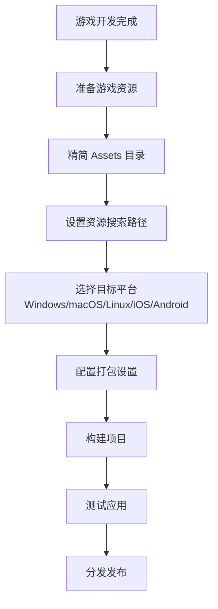

import Tabs from '@theme/Tabs';
import TabItem from '@theme/TabItem';

# 如何打包游戏为独立的应用

&emsp;&emsp;本教程将指导您如何使用 Dora SSR 游戏引擎将游戏项目打包为独立运行的软件包，使其不依赖于 Dora SSR 的开发辅助工具界面及 Web IDE 功能。

## 打包流程概览



## 1. 准备游戏资源

&emsp;&emsp;在打包之前，首先确保所有游戏资源都已经正确放置在游戏项目的 `Assets` 目录下。

### 1.1 标准项目结构

```
Assets/
├── Script/
│   ├── init.lua          # 游戏入口脚本
│   ├── main.lua          # 主游戏逻辑
│   └── Lib/              # 引擎库文件（必须保留）
├── Image/
│   ├── player.png        # 角色图片
│   └── background.png    # 背景图片
├── Audio/
│   ├── bgm.mp3          # 背景音乐
│   └── sfx.wav          # 音效
└── Font/
    └── game-font.ttf    # 游戏字体
```

### 1.2 必需资源类型

- **美术资源**：如图像、动画、UI 素材等
- **音频文件**：包括背景音乐和音效
- **字体文件**：游戏中使用的所有字体
- **程序脚本**：包括 Lua（原生或是编译自其他语言的代码文件）或 WASM 二进制程序文件

> **重要提示**：这些资源是游戏运行的必要组成部分，必须被包含在最终的应用包中。

## 2. 精简 Assets 目录

&emsp;&emsp;为了减小最终应用包的大小，需要清理不必要的开发文件。

### 2.1 必须保留的文件

```
Assets/
├── Script/Lib/              # 游戏引擎运行时库
│   ├── UI/                  # UI 组件库
│   └── [其他引擎库文件]       # 必须保留
└── gamecontrollerdb.txt     # 游戏手柄配置文件
```

### 2.2 可以删除的文件

```
Assets/
├── Script/Dev/              # 开发程序（可删除）
├── Script/Tools/            # 开发辅助工具（可删除）
├── Script/Lib/Dora/         # 引擎 API 定义文件（可删除）
├── Doc/                     # 文档（可删除）
├── www/                     # Web IDE 文件（可删除）
└── [其他开发相关文件]          # 可删除
```

> **优化建议**：删除不必要的文件可以显著减小应用包大小，通常可以减少发布应用的体积。

## 3. 设置资源搜索路径

&emsp;&emsp;确保独立打包的游戏与 Web IDE 环境下的资源加载行为保持一致。

### 3.1 默认搜索路径

Dora SSR Web IDE 默认的资源搜索路径：

1. **游戏项目根目录/Script**
2. **引擎内置资源根目录/Script/Lib**
3. **游戏项目根目录**

### 3.2 配置示例

在游戏入口脚本（通常是 `init.lua`）的开头添加以下代码：

```lua title="Assets/Script/init.lua"
local Path <const> = require("Path")
local Content <const> = require("Content")

-- 获取当前脚本路径
local currentScriptPath = Path:getScriptPath(...)

-- 设置资源搜索路径
Content.searchPaths = {
	Path(currentScriptPath, "Script"),        -- 游戏脚本目录
	Path(Content.assetPath, "Script", "Lib"), -- 引擎库目录
	Path(currentScriptPath),                  -- 游戏根目录
}

-- 游戏主逻辑
local function main()
    -- 你的游戏代码从这里开始
    print("游戏启动成功！")
end

main()
```

## 4. 平台打包指南

### 4.1 平台对比表

| 平台 | 开发工具 | 输出格式 | 签名要求 | 发布渠道 |
|------|----------|----------|----------|----------|
| Windows | Visual Studio | .exe | 可选 | Steam、官网、其他平台 |
| macOS | Xcode | .app | 必需 | App Store、官网 |
| Linux | CMake | 二进制 | 可选 | Steam、官网 |
| iOS | Xcode | .ipa | 必需 | App Store |
| Android | Android Studio | .apk/.aab | 必需 | Google Play、其他商店 |

### 4.2 不同平台的打包操作

<Tabs groupId="platform-select">
<TabItem value="windows" label="Windows">

#### 步骤 1：配置项目
1. 打开 `Projects/Windows/Dora.sln`
2. 在 Visual Studio 中配置项目属性：
   - 应用名称
   - 版本号
   - 图标文件
   - 目标平台（x86/x64）

#### 步骤 2：构建项目
```bash
# 通过 Visual Studio 图形界面或是使用下面的命令构建
msbuild Projects/Windows/Dora.sln /p:Configuration=Release /p:Platform=x64
```

#### 步骤 3：打包应用
构建完成后，在 `Projects/Windows/Release/` 目录下会生成可执行文件和相关资源。

</TabItem>
<TabItem value="macos" label="macOS">

#### 步骤 1：配置项目
1. 打开 `Projects/macOS/Dora.xcodeproj`
2. 在 Xcode 中设置：
   - Bundle Identifier
   - 应用名称
   - 版本号
   - 开发者证书

#### 步骤 2：构建项目
```bash
# 通过 Xcode 图形界面或是使用下面命令构建
xcodebuild -project Projects/macOS/Dora.xcodeproj -scheme Dora -configuration Release
```

</TabItem>
<TabItem value="ios" label="iOS">

#### 步骤 1：配置项目
1. 打开 `Projects/iOS/Dora.xcodeproj`
2. 设置 Bundle Identifier 和开发者证书
3. 配置应用图标和启动画面

#### 步骤 2：构建和打包
```bash
# 通过 Xcode 图形界面或是使用下面命令构建
xcodebuild -project Projects/iOS/Dora.xcodeproj -scheme Dora -configuration Release -destination generic/platform=iOS
```

</TabItem>
<TabItem value="android" label="Android">

#### 步骤 1：配置项目
1. 打开 `Projects/Android/` 目录
2. 修改 `app/build.gradle` 中的配置：
   ```gradle
   android {
       defaultConfig {
           applicationId "com.yourcompany.yourgame"
           versionCode 1
           versionName "1.0"
       }
   }
   ```

#### 步骤 2：构建 APK
```bash
# 通过 Android Studio 图形界面或是使用下面命令构建
./gradlew assembleRelease
```

</TabItem>
</Tabs>

## 5. 实践示例：简单游戏打包

### 5.1 示例游戏项目

让我们以一个简单的"点击方块"游戏为例，展示完整的打包流程。

#### 游戏代码示例

```lua title="Assets/Script/init.lua"
local Path <const> = require("Path")
local Content <const> = require("Content")
local Node <const> = require("Node")
local Sprite <const> = require("Sprite")
local Label <const> = require("Label")

-- 设置资源搜索路径
local currentScriptPath = Path:getScriptPath(...)
Content.searchPaths = {
	Path(currentScriptPath, "Script"),
	Path(Content.assetPath, "Script", "Lib"),
	Path(currentScriptPath),
}

-- 游戏主场景
local function createGameScene()
	local scene = Node()

	-- 创建背景
	local bg = Sprite("Image/background.png")
	bg:addTo(scene)

	-- 创建可点击的方块
	local block = Sprite("Image/block.png")
	block:addTo(scene)
	block.position = Vec2(400, 300)

	-- 创建分数显示
	local scoreLabel = Label("Font/game-font.ttf", 32)
	scoreLabel:addTo(scene)
	scoreLabel.position = Vec2(400, 500)

	local score = 0

	-- 点击事件
	block:onTapBegan(function()
		score = score + 1
		scoreLabel:setString("分数: " .. score)
		block.scaleX = 0.9
		block.scaleY = 0.9
	end)

	block:onTapEnded(function()
		block.scaleX = 1.0
		block.scaleY = 1.0
	end)

	return scene
end

-- 启动游戏
local gameScene = createGameScene()
gameScene:addTo(Director:getCurrentScene())
```

### 5.2 打包步骤

1. **准备资源文件**
   - 将 `background.png` 和 `block.png` 放入 `Assets/Image/`
   - 将字体文件放入 `Assets/Font/`

2. **精简目录**
   - 删除 `Assets/Script/Dev/` 目录
   - 删除 `Assets/Doc/` 目录

3. **选择平台打包**
   - 按照上述平台指南进行配置和构建

## 6. 测试和发布

### 6.1 测试清单

- [ ] 游戏正常启动
- [ ] 所有资源正确加载
- [ ] 音效和音乐播放正常
- [ ] 在不同设备上测试
- [ ] 性能表现良好

### 6.2 常见问题解决

#### 问题 1：资源加载失败
**解决方案**：检查资源搜索路径配置和文件路径是否正确

#### 问题 2：应用包过大
**解决方案**：删除不必要的开发文件，压缩图片资源

#### 问题 3：签名错误
**解决方案**：确保使用正确的开发者证书和 Bundle Identifier

### 6.3 发布渠道

- **Steam**：适合 PC 游戏
- **App Store**：iOS 和 macOS 应用
- **Google Play**：Android 应用
- **官网下载**：直接分发
- **itch.io**：独立游戏平台

## 总结

&emsp;&emsp;通过遵循本教程的步骤，您可以成功将 Dora SSR 游戏项目打包为独立的应用程序。关键要点包括：

1. **正确组织项目结构**，确保所有必要资源都在 `Assets` 目录下
2. **精简开发文件**，减小最终应用包大小
3. **配置正确的资源搜索路径**，确保资源加载正常
4. **选择合适的平台工具**，按照平台要求进行配置和构建
5. **充分测试**，确保应用在各种环境下都能正常运行

&emsp;&emsp;打包完成后，您的游戏就可以脱离 Dora SSR 的开发环境，作为独立的应用程序分发给玩家了！

## 相关文档

- **[开发配置教程](/docs/tutorial/dev-configuration)** - 开发环境配置指南
