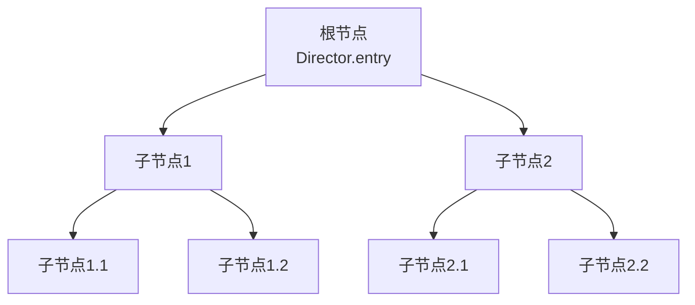

import Tabs from '@theme/Tabs';
import TabItem from '@theme/TabItem';

# 如何创建游戏场景

&emsp;&emsp;在 Dora SSR 引擎中，游戏场景是由节点（Node）组成的树形结构。节点是游戏场景中的基本元素，可以包含其他节点，形成一个层次结构。在这个教程中，我们将介绍如何使用节点来创建游戏场景。

&emsp;&emsp;下面是一个简单的游戏场景的示例，父节点的几何变换，颜色和透明度等属性会传递影响到子节点，设置子节点的相关属性时，实际上设置的是在父节点上的相对值。



## 1. 创建一个节点

&emsp;&emsp;要在 Dora SSR 引擎中创建一个节点，您需要创建一个 Node 类的实例，并用于后续构建游戏场景树的层次结构。

&emsp;&emsp;以下是如何在脚本代码中创建一个新的 Node 实例的示例：

<Tabs groupId="language-select">
<TabItem value="lua" label="Lua">

```lua
-- 创建一个新的节点实例，它将会自动挂载到游戏场景的根节点
local node = Node()

-- 或者您可以手动将其挂载到游戏场景的根节点上
-- Director.entry:addChild(node)
```

</TabItem>
<TabItem value="tl" label="Teal">

```teal
-- 导入 Node 模块
local Node <const> = require("Node")

-- 创建一个新的节点实例，它将会自动挂载到游戏场景的根节点
local node = Node()

-- 或者您可以手动将其挂载到游戏场景的根节点上
-- Director.entry:addChild(node)
```

</TabItem>
<TabItem value="ts" label="TypeScript">

```ts
// 导入 Node 模块
import { Node } from "Dora";

// 创建一个新的节点实例，它将会自动挂载到游戏场景的根节点
const node = Node();

// 或者您可以手动将其挂载到游戏场景的根节点上
// Director.entry.addChild(node);
```

</TabItem>
<TabItem value="yue" label="YueScript">

```yue
-- 导入 Dora 模块
_ENV = Dora

-- 创建一个新的节点实例，它将会自动挂载到游戏场景的根节点
node = Node!

-- 或者您可以手动将其挂载到游戏场景的根节点上
-- Director.entry\addChild node
```

</TabItem>
</Tabs>

## 2. 设置节点属性

&emsp;&emsp;Node类有许多成员变量可供设置，如`x`, `y`, `z`（节点的位置），`width`, `height`（节点的大小），`angle`, `angleX`, `angleY`（节点的旋转角度），`scaleX`, `scaleY`（节点的缩放系数），以及`visible`（节点是否可见）等。

&emsp;&emsp;以下是如何在Lua中设置这些属性的示例：

<Tabs groupId="language-select">
<TabItem value="lua" label="Lua">

```lua
node.x = 100
node.y = 200
node.width = 50
node.height = 50
node.visible = true
```

</TabItem>
<TabItem value="tl" label="Teal">

```teal
node.x = 100
node.y = 200
node.width = 50
node.height = 50
node.visible = true
```

</TabItem>
<TabItem value="ts" label="TypeScript">

```ts
node.x = 100;
node.y = 200;
node.width = 50;
node.height = 50;
node.visible = true;
```

</TabItem>
<TabItem value="yue" label="YueScript">

```yue
with node
	.x = 100
	.y = 200
	.width = 50
	.height = 50
	.visible = true
```

</TabItem>
</Tabs>

## 3. 添加子节点

&emsp;&emsp;在Node类中，可以通过`addChild`方法添加子节点。以下是在代码中如何添加子节点的示例：

<Tabs groupId="language-select">
<TabItem value="lua" label="Lua">

```lua
local childNode = Node()
node:addChild(childNode)
```

</TabItem>
<TabItem value="tl" label="Teal">

```teal
local childNode = Node()
node:addChild(childNode)
```

</TabItem>
<TabItem value="ts" label="TypeScript">

```ts
const childNode = Node();
node.addChild(childNode);
```

</TabItem>
<TabItem value="yue" label="YueScript">

```yue
childNode = Node!
node\addChild childNode
```

</TabItem>
</Tabs>

&emsp;&emsp;在这个例子中，`childNode`被添加到`node`作为其子节点。

## 4. 检查节点属性

&emsp;&emsp;Node类有一些只读成员变量，如`hasChildren`（是否有子节点），`children`（子节点的列表），`parent`（节点的父节点），以及`boundingBox`（节点的包围盒）等。

&emsp;&emsp;以下是在Lua中如何检查这些属性的示例：

<Tabs groupId="language-select">
<TabItem value="lua" label="Lua">

```lua
print(node.hasChildren) -- 打印是否有子节点
print(node.children) -- 打印子节点的列表
print(node.parent) -- 打印节点的父节点
```

</TabItem>
<TabItem value="tl" label="Teal">

```teal
print(node.hasChildren) -- 打印是否有子节点
print(node.children) -- 打印子节点的列表
print(node.parent) -- 打印节点的父节点
```

</TabItem>
<TabItem value="ts" label="TypeScript">

```ts
print(node.hasChildren); // 打印是否有子节点
print(node.children); // 打印子节点的列表
print(node.parent); // 打印节点的父节点
```

</TabItem>
<TabItem value="yue" label="YueScript">

```yue
with node
	print .hasChildren -- 打印是否有子节点
	print .children -- 打印子节点的列表
	print .parent -- 打印节点的父节点
```

</TabItem>
</Tabs>

## 5. 节点的事件系统

&emsp;&emsp;首先，场景节点类的事件系统支持多种事件类型，如动作结束. 点击开始. 点击结束. 点击移动. 滚动鼠标滚轮等。每种事件类型都有一个特定的回调函数，当该事件发生时，这个回调函数会被触发。

&emsp;&emsp;注册和处理事件的基本步骤如下：

1. **注册事件**：你可以通过在节点上注册事件来监听引擎内置功能触发的事件，比如屏幕触摸，鼠标. 键盘和游戏手柄输入等。可以使用下面的代码编写模式通过节点来注册和监听事件，节点上的事件触发是支持多播的，即可以重复注册多个回调函数来监听同一个事件。示例代码如下：

<Tabs groupId="language-select">
<TabItem value="lua" label="Lua">

```lua
node:slot("事件的名称", function(...)
	-- 在这里添加你的代码
end)
```

</TabItem>
<TabItem value="tl" label="Teal">

```teal
node:slot("事件的名称", function(...)
	-- 在这里添加你的代码
end)
```

</TabItem>
<TabItem value="ts" label="TypeScript">

```ts
node.slot("事件的名称", (...: any[]) => {
	// 在这里添加你的代码
});
```

</TabItem>
<TabItem value="yue" label="YueScript">

```yue
node\slot "事件的名称", (...) ->
	-- 在这里添加你的代码
```

</TabItem>
</Tabs>

2. **处理事件**：当注册的事件被触发时，你可以在回调函数中添加处理事件的代码，并获取事件相关的参数。例如，你可以在节点动作执行结束事件的回调函数中添加代码来处理动作结束事件：

<Tabs groupId="language-select">
<TabItem value="lua" label="Lua">

```lua
node:slot("ActionEnd", function(action, target)
	print("Action completed: " .. tostring(action) .. " Target node: " .. tostring(target))
end)
```

</TabItem>
<TabItem value="tl" label="Teal">

```teal
node:slot("ActionEnd", function(action: Action.Type, target: Node.Type)
	print("Action completed: " .. tostring(action) .. " Target node: " .. tostring(target))
end)
```

</TabItem>
<TabItem value="ts" label="TypeScript">

```ts
node.slot(Slot.ActionEnd, (action, target) => {
	print(`Action completed: ${action} Target node: ${target}`);
});
```

</TabItem>
<TabItem value="yue" label="YueScript">

```yue
node\slot "ActionEnd", (action, target) ->
	print "完成动作：#{action} 目标节点：#{target}"
```

</TabItem>
</Tabs>

3. **移除事件**：当你不再需要监听某个事件时，你可以通过下面几种方法来移除事件的监听。示例代码如下：

<Tabs groupId="language-select">
<TabItem value="lua" label="Lua">

```lua
local function callback(...)
	-- 在这里添加你的处理代码
end

-- 注册事件
node:slot("事件的名称", callback)

-- 移除事件
node:slot("事件的名称"):remove(callback)

-- 移除所有注册的事件
node:slot("事件的名称", nil)
```

</TabItem>
<TabItem value="tl" label="Teal">

```teal
local function callback(...)
	-- 在这里添加你的处理代码
end

-- 注册事件
node:slot("事件的名称", callback)

-- 移除事件
node:slot("事件的名称"):remove(callback)

-- 移除所有注册的事件
node:slot("事件的名称", nil)
```

</TabItem>
<TabItem value="ts" label="TypeScript">

```ts
const callback = (...: any[]) => {
	// 在这里添加你的处理代码
};

// 注册事件
node.slot("事件的名称", callback);

// 移除事件
node.slot("事件的名称").remove(callback);

// 移除所有注册的事件
node.slot("事件的名称").clear();
```

</TabItem>
<TabItem value="yue" label="YueScript">

```yue
callback = (...) ->
	-- 在这里添加你的处理代码

-- 注册事件
node\slot "事件的名称", callback

-- 移除事件
node\slot("事件的名称")\remove callback

-- 移除所有注册的事件
node\slot "事件的名称", nil
```

</TabItem>
</Tabs>

&emsp;&emsp;常用的游戏交互相关的节点事件类型和对应的回调函数签名如下，在使用这些事件之前还需要打开节点接收点击事件的开关：

```lua
node.touchEnabled = true
```

- **点击过滤（TapFilter）**：在点击开始之前触发，可以用于过滤某些点击事件。回调函数签名：`function(touch: Touch)`
- **点击开始（TapBegan）**：在检测到点击时触发。回调函数签名：`function(touch: Touch)`
- **点击结束（TapEnded）**：在点击结束时触发。回调函数签名：`function(touch: Touch)`
- **点击成功（Tapped）**：在检测到并结束点击时触发。回调函数签名：`function(touch: Touch)`
- **点击移动（TapMoved）**：在点击移动时触发。回调函数签名：`function(touch: Touch)`
- **滚动鼠标滚轮（MouseWheel）**：在滚动鼠标滚轮时触发。回调函数签名：`function(delta: Vec2)`

&emsp;&emsp;通过注册和处理这些事件，你可以轻松地为你的游戏节点添加复杂的交互功能。其它可以监听的节点事件详见[这里](../api/Node%20Event/Node)。

&emsp;&emsp;为了简化对事件的处理，我们还提供了一些内置的事件注册函数，如`onTapBegan`. `onTapEnded`. `onTapped`. `onTapMoved`. `onMouseWheel`等。你可以通过在节点上调用这些函数来注册和处理事件。

&emsp;&emsp;例如，你可以通过以下代码来注册和处理点击开始事件：

<Tabs groupId="language-select">
<TabItem value="lua" label="Lua">

```lua
node:onTapBegan(function(touch)
	print("点击开始")
end)

-- 等同于代码
--[[
node.touchEnabled = true
node:slot("TapBegan", function(touch)
	print("点击开始")
end)
]]
```

</TabItem>
<TabItem value="tl" label="Teal">

```teal
node:onTapBegan(function(touch: Touch)
	print("点击开始")
end)

-- 等同于代码
--[[
node.touchEnabled = true
node:slot("TapBegan", function(touch: Touch)
	print("点击开始")
end)
]]
```

</TabItem>
<TabItem value="ts" label="TypeScript">

```ts
node.onTapBegan(touch => {
	print("点击开始");
});

// 等同于代码
// node.touchEnabled = true;
// node.slot(Slot.TapBegan, touch => {
// 	print("点击开始");
// });
```

</TabItem>
<TabItem value="yue" label="YueScript">

```yue
node\onTapBegan (touch) -> print "点击开始"

-- 等同于代码
-- node.touchEnabled = true
-- node\slot "TapBegan", (touch) -> print "点击开始"
```

</TabItem>
</Tabs>

## 6. 节点动作

&emsp;&emsp;下面将展示如何使用节点动作系统来创建各种动画效果。

1. **移动动作（Move）**：

<Tabs groupId="language-select">
<TabItem value="lua" label="Lua">

```lua
local moveAction = Move(duration, startPosition, stopPosition)
node:perform(moveAction)
```

</TabItem>
<TabItem value="tl" label="Teal">

```teal
local moveAction = Move(duration, startPosition, stopPosition)
node:perform(moveAction)
```

</TabItem>
<TabItem value="ts" label="TypeScript">

```ts
const moveAction = Move(duration, startPosition, stopPosition);
node.perform(moveAction);
```

</TabItem>
<TabItem value="yue" label="YueScript">

```yue
moveAction = Move duration, startPosition, stopPosition
node\perform moveAction
```

</TabItem>
</Tabs>

&emsp;&emsp;在上述代码中，`duration`表示移动的持续时间，`startPosition`是移动的开始位置，`stopPosition`是移动的目标位置。

2. **缩放动作（Scale）**：

<Tabs groupId="language-select">
<TabItem value="lua" label="Lua">

```lua
local scaleAction = Scale(duration, startScale, stopScale)
node:perform(scaleAction)
```

</TabItem>
<TabItem value="tl" label="Teal">

```teal
local scaleAction = Scale(duration, startScale, stopScale)
node:perform(scaleAction)
```

</TabItem>
<TabItem value="ts" label="TypeScript">

```ts
const scaleAction = Scale(duration, startScale, stopScale);
node.perform(scaleAction);
```

</TabItem>
<TabItem value="yue" label="YueScript">

```yue
scaleAction = Scale duration, startScale, stopScale
node\perform scaleAction
```

</TabItem>
</Tabs>

&emsp;&emsp;在上述代码中，`duration`表示缩放的持续时间，`startScale`是起始的缩放值，`stopScale`是目标缩放值。

3. **旋转动作（Angle）**：

<Tabs groupId="language-select">
<TabItem value="lua" label="Lua">

```lua
local rotateAction = Angle(duration, startAngle, stopAngle)
node:perform(rotateAction)
```

</TabItem>
<TabItem value="tl" label="Teal">

```teal
local rotateAction = Angle(duration, startAngle, stopAngle)
node:perform(rotateAction)
```

</TabItem>
<TabItem value="ts" label="TypeScript">

```ts
const rotateAction = Angle(duration, startAngle, stopAngle);
node.perform(rotateAction);
```

</TabItem>
<TabItem value="yue" label="YueScript">

```yue
rotateAction = Angle duration, startAngle, stopAngle
node\perform rotateAction
```

</TabItem>
</Tabs>

&emsp;&emsp;在上述代码中，`duration`表示旋转的持续时间，`startAngle`是起始的旋转角度`stopAngle`是目标旋转角度。

&emsp;&emsp;你还可以组合多个动作以创建更复杂的动画效果。

4. **按顺序执行动作（Sequence）**：

<Tabs groupId="language-select">
<TabItem value="lua" label="Lua">

```lua
node:perform(Sequence(
	Move(duration, startPosition, stopPosition),
	Angle(duration, startAngle, stopAngle)
))
```

</TabItem>
<TabItem value="tl" label="Teal">

```teal
node:perform(Sequence(
	Move(duration, startPosition, stopPosition),
	Angle(duration, startAngle, stopAngle)
))
```

</TabItem>
<TabItem value="ts" label="TypeScript">

```ts
node.perform(Sequence(
	Move(duration, startPosition, stopPosition),
	Angle(duration, startAngle, stopAngle)
));
```

</TabItem>
<TabItem value="yue" label="YueScript">

```yue
node\perform Sequence(
	Move duration, startPosition, stopPosition
	Angle duration, startAngle, stopAngle
)
```

</TabItem>
</Tabs>

&emsp;&emsp;在上述代码中，`Move`和`Angle`会按照它们在序列中的顺序依次执行。

5. **同时执行动作（Spawn）**：

<Tabs groupId="language-select">
<TabItem value="lua" label="Lua">

```lua
node:perform(Spawn(
	Move(duration, startPosition, stopPosition),
	Scale(duration, startScale, stopScale)
))
```

</TabItem>
<TabItem value="tl" label="Teal">

```teal
node:perform(Spawn(
	Move(duration, startPosition, stopPosition),
	Scale(duration, startScale, stopScale)
))
```

</TabItem>
<TabItem value="ts" label="TypeScript">

```ts
node.perform(Spawn(
	Move(duration, startPosition, stopPosition),
	Scale(duration, startScale, stopScale)
));
```

</TabItem>
<TabItem value="yue" label="YueScript">

```yue
node\perform Spawn(
	Move duration, startPosition, stopPosition
	Scale duration, startScale, stopScale
)
```

</TabItem>
</Tabs>

&emsp;&emsp;在上述代码中，`Move`和`Scale`会同时执行。

&emsp;&emsp;除了以上示例中的动作类型，我们的动作系统还支持其他一些动作，如缩放（ScaleX. ScaleY）. 旋转（AngleX. AngleY. Roll）. 扭曲（SkewX. SkewY）. 延迟（Delay）. 事件（Event）. 显示（Show）. 隐藏（Hide）以及锚点（AnchorX. AnchorY）等。

&emsp;&emsp;通过组合和调整这些动作，你可以创造出丰富多样的动画效果来增强你的游戏体验。

6. **缓动函数（Ease）**：

&emsp;&emsp;缓动函数可以为动作添加流畅的过渡效果，使动画看起来更加自然。在我们的动作系统中，你可以使用枚举参数来指定不同的缓动函数。下面是一些常用的缓动函数及其对应的枚举参数：

- **线性缓动（Ease.Linear）**：这是默认的缓动函数，动作会按照匀速执行。
- **缓入缓出（Ease.InOutQuad）**：动作会在开始和结束时缓慢加速和减速，呈现平滑的过渡效果。
- **加速缓动（Ease.InQuad）**：动作会逐渐加速。
- **减速缓动（Ease.OutQuad）**：动作会逐渐减速。
- **弹性缓动（Ease.OutElastic）**：动作会像弹簧一样来回弹动。
- **弹跳缓动（Ease.OutBounce）**：动作会像球一样弹跳。

&emsp;&emsp;在创建动作实例时，你可以将缓动函数作为最后一个参数传递给相应的创建函数。例如：

<Tabs groupId="language-select">
<TabItem value="lua" label="Lua">

```lua
local moveAction = Move(
	duration,
	startPosition,
	stopPosition,
	Ease.InOutQuad
)
node:perform(moveAction)
```

</TabItem>
<TabItem value="tl" label="Teal">

```teal
local moveAction = Move(
	duration,
	startPosition,
	stopPosition,
	Ease.InOutQuad
)
node:perform(moveAction)
```

</TabItem>
<TabItem value="ts" label="TypeScript">

```ts
const moveAction = Move(
	duration,
	startPosition,
	stopPosition,
	Ease.InOutQuad
);
node.perform(moveAction);
```

</TabItem>
<TabItem value="yue" label="YueScript">

```yue
moveAction = Move(
	duration
	startPosition
	stopPosition
	Ease.InOutQuad
)
node\perform moveAction
```

</TabItem>
</Tabs>

&emsp;&emsp;在上述示例中，`Ease.InOutQuad`指定了缓动函数为缓入缓出效果。

&emsp;&emsp;你可以根据需要选择适合的缓动函数，为你的动作增添更多动感和细节。记得尝试不同的缓动函数来获得你想要的动画效果。所有可用的缓动函数见[这里](../api/Class/Ease)。
