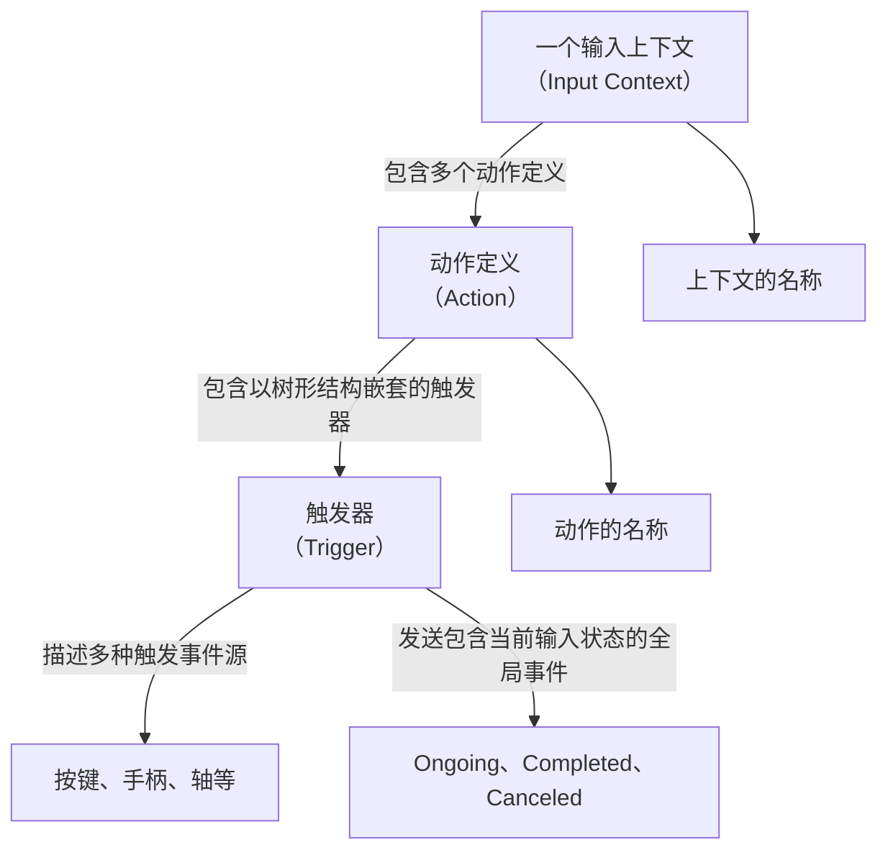
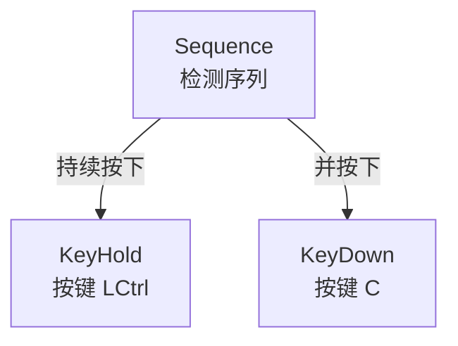
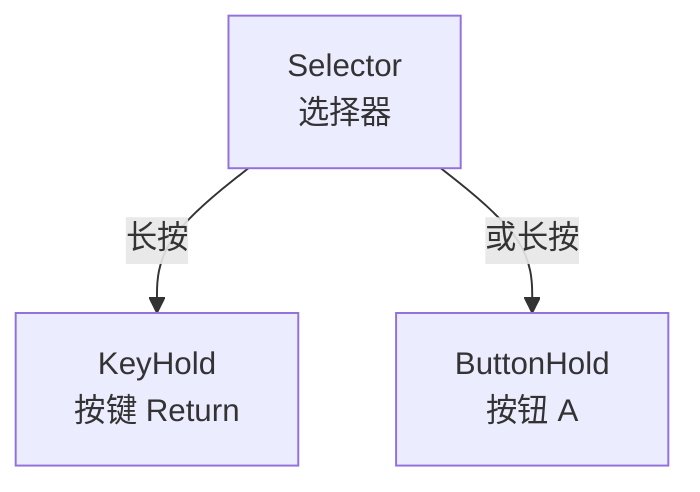

import "@site/src/languages/highlight";
import Tabs from '@theme/Tabs';
import TabItem from '@theme/TabItem';

# 使用增强输入系统

&emsp;&emsp;在游戏开发中，处理用户输入是一个关键部分，尤其是当需要处理复杂的输入序列或快速反应事件（Quick Time Events，简称 QTE）时。Dora SSR 提供了一个增强的输入系统，使开发者能够更加高效、灵活地管理各类输入事件。本教程将引导您了解如何设置和使用这个输入系统，并详细解释涉及的新概念。

## 1. 涉及的新概念

&emsp;&emsp;Dora SSR 的增强输入系统允许您创建复杂的输入逻辑，例如多阶段的 QTE、组合按键等。通过使用输入上下文、动作和触发器，您可以精确地控制游戏在不同状态下如何响应玩家的输入。

### 1.1 动作（Action）

&emsp;&emsp;动作是输入系统中的基本单元，定义了在特定条件下触发行为的一组定义。例如，按下确认键进行确认、按下移动键移动角色等。

### 1.2 输入上下文（Input Context）

&emsp;&emsp;输入上下文是包含一组动作的集合，允许您根据游戏场景激活或停用一组输入动作。例如，在游戏菜单的场景中，您可能只需要处理导航和选择的输入。在游戏内场景中，您可能需要处理另外一组不同的输入，如移动、攻击等。

### 1.3 触发器（Trigger）

&emsp;&emsp;触发器定义了动作被激活的条件，可以是简单的按键，也可以是复杂的输入序列。Dora SSR 提供了多种类型的触发器，包括：

- **KeyDown**：当所有指定的键被按下时触发。
- **KeyUp**：当所有指定的键被按下并且其中任何一个被释放时触发。
- **KeyPressed**：当所有指定的键正在被按下时触发。
- **KeyHold**：当特定键被按下并且保持按下指定的持续时间时触发。
- **KeyTimed**：当特定键在指定的时间窗口内被按下时触发。
- **KeyDoubleDown**：当特定键被双击时触发。
- **AnyKeyPressed**：当任何键被持续按下时触发。
- **ButtonDown**：当所有指定的游戏手柄按钮被按下时触发。
- **ButtonUp**：当所有指定的游戏手柄按钮被按下并且其中任何一个被释放时触发。
- **ButtonPressed**：当所有指定的游戏手柄按钮正在被按下时触发。
- **ButtonHold**：当特定的游戏手柄按钮被按下并且保持按下指定的持续时间后触发。
- **ButtonTimed**：当特定的游戏手柄按钮在指定的时间窗口内被按下时触发。
- **ButtonDoubleDown**：当特定的游戏手柄按钮被双击时触发。
- **AnyButtonPressed**：当任何游戏手柄按钮被持续按下时触发。
- **JoyStick**：当特定的游戏手柄轴被移动时触发。
- **JoyStickThreshold**：当操纵杆移动超过指定阈值时触发。
- **JoyStickDirectional**：当操纵杆在容忍的偏差角度内朝特定方向移动时触发。
- **JoyStickRange**：当操纵杆在指定范围内时触发。
- **Sequence**：要求触发器按特定顺序检测发生。
- **Selector**：只要有一个触发器激活，动作就会被触发。
- **Block**：阻止其他触发器的激活。

### 1.4 触发器状态（Trigger State）

&emsp;&emsp;当触发器被激活时，它会触发一个对应的引擎的全局事件，该事件包含触发器的当前状态。触发器状态有三种：

- **Ongoing**：触发器条件正在进行中。
- **Completed**：触发器条件已完成。
- **Canceled**：触发器条件被取消。

### 1.5 上下文、动作、触发器和触发器状态的关系

&emsp;&emsp;一组输入上下文包含多个动作，每个动作包含一个树形结构组织的触发器，触发器提供了多种触发事件源，并提供了当前的输入状态。



### 1.6 触发器的嵌套

&emsp;&emsp;下面是一个树形嵌套的触发器定义示例，用于描述一个同时按下键盘的 `Ctrl` 键和 `C` 键的触发器：



&emsp;&emsp;对应的触发器代码定义：

<Tabs groupId="language-select">
<TabItem value="lua" label="Lua">

```lua
Trigger.Sequence({
	Trigger.KeyPressed("LCtrl"),
	Trigger.KeyDown("C")
})
```

</TabItem>
<TabItem value="tl" label="Teal">

```lua
Trigger.Sequence({
	Trigger.KeyPressed("LCtrl"),
	Trigger.KeyDown("C")
})
```

</TabItem>
<TabItem value="ts" label="TypeScript">

```ts
Trigger.Sequence([
	Trigger.KeyPressed(KeyName.LCtrl),
	Trigger.KeyDown(KeyName.C)
])
```

</TabItem>
<TabItem value="yue" label="YueScript">

```yue
Trigger.Sequence [
	Trigger.KeyPressed "LCtrl"
	Trigger.KeyDown "C"
]
```

</TabItem>
</Tabs>

&emsp;&emsp;下面是定义一个任意长按键盘 `回车键` 或是游戏控制器 `A` 按钮，并保持 1 秒后触发确认行为的触发器：



&emsp;&emsp;对应的触发器代码定义：

<Tabs groupId="language-select">
<TabItem value="lua" label="Lua">

```lua
Trigger.Selector({
	Trigger.KeyHold("Return", 1),
	Trigger.ButtonHold("a", 1)
})
```

</TabItem>
<TabItem value="tl" label="Teal">

```lua
Trigger.Selector({
	Trigger.KeyHold("Return", 1),
	Trigger.ButtonHold("a", 1)
})
```

</TabItem>
<TabItem value="ts" label="TypeScript">

```ts
Trigger.Selector([
	Trigger.KeyHold(KeyName.Return, 1),
	Trigger.ButtonHold(ButtonName.A, 1)
])
```

</TabItem>
<TabItem value="yue" label="YueScript">

```yue
Trigger.Selector [
	Trigger.KeyHold "Return", 1
	Trigger.ButtonHold "a", 1
]
```

</TabItem>
</Tabs>

## 2. 创建输入系统

### 2.1 简单的输入系统一

&emsp;&emsp;下面是创建一个输入系统的简单代码示例：

<Tabs groupId="language-select">
<TabItem value="lua" label="Lua">

```lua
-- 引入模块
local InputManager <const> = require("InputManager")
local Trigger <const> = InputManager.Trigger
local Node <const> = require("Node")

-- 创建输入管理器，包含一个上下文和一个动作
local input = InputManager.CreateManager({{
	name = "testContext",
	actions = {{
		name = "Ctrl+C",
		trigger = Trigger.Sequence({
			Trigger.KeyPressed("LCtrl"),
			Trigger.KeyDown("C")
		})
	}}
}})

-- 创建一个节点，用于接收和处理输入事件
local node = Node()

-- 连接全局的事件信号，注意这里的 "Input." 后面的字符串是对应动作的名称
node:gslot("Input.Ctrl+C", function(state, progress, value)
	if state == "Completed" then
		print("Ctrl+C 触发完成")
		-- 移除当前生效的上下文，按下 Ctrl+C 便不再触发
		input:popContext()
	end
end)

-- 激活上下文 testContext，使得包含的输入触发器生效
input:pushContext("testContext")
```

</TabItem>
<TabItem value="tl" label="Teal">

```tl
-- 引入模块
local InputManager <const> = require("InputManager")
local Trigger <const> = InputManager.Trigger
local Node <const> = require("Node")
local type Vec2 = require("Vec2")

-- 创建输入管理器，包含一个上下文和一个动作
local input = InputManager.CreateManager({{
	name = "testContext",
	actions = {{
		name = "Ctrl+C",
		trigger = Trigger.Sequence({
			Trigger.KeyPressed("LCtrl"),
			Trigger.KeyDown("C")
		})
	}}
}})

-- 创建一个节点，用于接收和处理输入事件
local node = Node()

-- 连接全局的事件信号，注意这里的 "Input." 后面的字符串是对应动作的名称
node:gslot("Input.Ctrl+C", function(state: InputManager.TriggerState, progress: number, value: number | boolean | Vec2.Type)
	if state == "Completed" then
		print("Ctrl+C 触发完成")
		-- 移除当前生效的上下文，按下 Ctrl+C 便不再触发
		input:popContext()
	end
end)

-- 激活上下文 testContext，使得包含的输入触发器生效
input:pushContext("testContext")
```

</TabItem>
<TabItem value="ts" label="TypeScript">

```ts
import { Node, KeyName, Vec2 } from "Dora";
import { CreateManager, Trigger, TriggerState } from "InputManager";

// 创建输入管理器，包含一个上下文和一个动作
const inputManager = CreateManager([{
	name: "testContext",
	actions: [{
		name: "Ctrl+C",
		trigger: Trigger.Sequence([
			Trigger.KeyPressed(KeyName.LCtrl),
			Trigger.KeyDown(KeyName.C)
		])
	}]
}]);

// 创建一个节点，用于接收和处理输入事件
const node = Node();

// 连接全局的事件信号，注意这里的 "Input." 后面的字符串是对应动作的名称
node.gslot("Input.Ctrl+C", (state: TriggerState, progress: number, value: number | boolean | Vec2.Type) => {
	if (state === TriggerState.Completed) {
		print("Ctrl+C 触发完成");
		// 移除当前生效的上下文，按下 Ctrl+C 便不再触发
		inputManager.popContext();
	}
});

// 激活上下文 testContext，使得包含的输入触发器生效
inputManager.pushContext("testContext");
```

</TabItem>
<TabItem value="yue" label="YueScript">

```yue
_ENV = Dora
import "InputManager" as :CreateManager, :Trigger

-- 创建输入管理器，包含一个上下文和一个动作
inputManager = CreateManager [
	{
		name: "testContext"
		actions: [
			{
				name: "Ctrl+C",
				trigger: Trigger.Sequence [
					Trigger.KeyPressed "LCtrl"
					Trigger.KeyDown "C"
				]
			},
		]
	},
]

-- 创建一个节点，用于接收和处理输入事件
with Node!
	-- 连接全局的事件信号，注意这里的 "Input." 后面的字符串是对应动作的名称
	\gslot "Input.Ctrl+C", (state, progress, value) ->
		if state == "Completed"
			print "Ctrl+C 触发完成"
			-- 移除当前生效的上下文，按下 Ctrl+C 便不再触发
			inputManager\popContext!

-- 激活上下文 testContext，使得包含的输入触发器生效
inputManager\pushContext "testContext"
```

</TabItem>
</Tabs>

&emsp;&emsp;在这个示例中，我们创建了一个输入管理器，定义了一个输入上下文和一个动作。动作 `Ctrl+C` 触发器定义了按下键盘的 `Ctrl` 键和 `C` 键的触发条件。我们将这个上下文推入输入管理器进行激活。然后创建一个场景节点，用于接收和处理输入事件。最后，我们连接了对应的全局的事件信号，当动作 `Ctrl+C` 完成时，打印一条消息并移除当前生效的上下文。

:::tip 提示
&emsp;&emsp;在注册处理输入事件的全局事件信号时，需要使用 `Input.` 前缀加上动作的名称，例如 `Input.Confirm`。注意在全局事件的回调函数中，我们可以获取到触发器的状态（`state`），以及触发器的进度（`progress`）和值（`value`）。在这个示例中，我们只处理了动作完成的状态。当使用的触发器是和时间相关（Hold 或是 Timed）时，我们可以通过值为 0 到 1 的进度参数（`progress`）来获取触发器的当前进度。当使用的触发器提供变化的输入值（例如 JoyStick 的轴输入）时，我们可以通过值参数（`value`）来获取触发器的当前输入值。
:::

### 2.2 简单的输入系统二

&emsp;&emsp;下面是另一个简单的输入系统示例，包含一个长按进行确认的 UI 交互上下文，以及一个控制角色进行移动的游戏场景上下文：

<Tabs groupId="language-select">
<TabItem value="lua" label="Lua">

```lua
local InputManager <const> = require("InputManager")
local Trigger <const> = InputManager.Trigger
local Node <const> = require("Node")

-- 创建输入管理器，包含两个上下文和包含的动作
local inputManager = InputManager.CreateManager({
	{
		name = "UI",
		actions = {{
			name = "Confirm",
			trigger = Trigger.Selector({
				Trigger.KeyHold("Return", 1),
				Trigger.ButtonHold("a", 1)
			})
		}}
	},
	{
		name = "Game",
		actions = {{
			name = "MoveLeft",
			trigger = Trigger.Selector({
				Trigger.KeyPressed("Left"),
				Trigger.ButtonPressed("dpleft")
			})
		}, {
			name = "MoveRight",
			trigger = Trigger.Selector({
				Trigger.KeyPressed("Right"),
				Trigger.ButtonPressed("dpright")
			})
		}}
	}
})

-- 创建一个节点，用于接收和处理输入事件
local node = Node()

-- 连接全局的事件信号，处理 UI 上下文的确认动作
node:gslot("Input.Confirm", function(state, progress)
	if state == "Ongoing" then
		print(string.format("确认中，进度：%d", progress * 100))
	elseif state == "Completed" then
		print("确认完成")
	end
end)

-- 连接全局的事件信号，处理 Game 上下文的移动动作
node:gslot("Input.MoveLeft", function(state)
	if state == "Completed" then
		print("向左移动")
	end
end)

node:gslot("Input.MoveRight", function(state)
	if state == "Completed" then
		print("向右移动")
	end
end)
```

</TabItem>
<TabItem value="tl" label="Teal">

```tl
local InputManager <const> = require("InputManager")
local Trigger <const> = InputManager.Trigger
local Node <const> = require("Node")

-- 创建输入管理器，包含两个上下文和包含的动作
local inputManager = InputManager.CreateManager({
	{
		name = "UI",
		actions = {{
			name = "Confirm",
			trigger = Trigger.Selector({
				Trigger.KeyHold("Return", 1),
				Trigger.ButtonHold("a", 1)
			})
		}}
	},
	{
		name = "Game",
		actions = {{
			name = "MoveLeft",
			trigger = Trigger.Selector({
				Trigger.KeyPressed("Left"),
				Trigger.ButtonPressed("dpleft")
			})
		}, {
			name = "MoveRight",
			trigger = Trigger.Selector({
				Trigger.KeyPressed("Right"),
				Trigger.ButtonPressed("dpright")
			})
		}}
	}
})

-- 创建一个节点，用于接收和处理输入事件
local node = Node()

-- 连接全局的事件信号，处理 UI 上下文的确认动作
node:gslot("Input.Confirm", function(state: InputManager.TriggerState, progress: number)
	if state == "Ongoing" then
		print(string.format("确认中，进度：%d", progress * 100))
	elseif state == "Completed" then
		print("确认完成")
	end
end)

-- 连接全局的事件信号，处理 Game 上下文的移动动作
node:gslot("Input.MoveLeft", function(state: InputManager.TriggerState)
	if state == "Completed" then
		print("向左移动")
	end
end)

node:gslot("Input.MoveRight", function(state: InputManager.TriggerState)
	if state == "Completed" then
		print("向右移动")
	end
end)
```

</TabItem>
<TabItem value="ts" label="TypeScript">

```ts
import { Node, KeyName, ButtonName } from "Dora";
import { CreateManager, Trigger, TriggerState } from "InputManager";

// 创建输入管理器，包含两个上下文和包含的动作
const inputManager = CreateManager([
	{
		name: "UI",
		actions: [{
			name: "Confirm",
			trigger: Trigger.Selector([
				Trigger.KeyHold(KeyName.Return, 1),
				Trigger.ButtonHold(ButtonName.A, 1)
			])
		}]
	},
	{
		name: "Game",
		actions: [{
			name: "MoveLeft",
			trigger: Trigger.Selector([
				Trigger.KeyPressed(KeyName.Left),
				Trigger.ButtonPressed(ButtonName.Left)
			])
		}, {
			name: "MoveRight",
			trigger: Trigger.Selector([
				Trigger.KeyPressed(KeyName.Right),
				Trigger.ButtonPressed(ButtonName.Right)
			])
		}]
	}
]);

// 创建一个节点，用于接收和处理输入事件
const node = Node();

// 连接全局的事件信号，处理 UI 上下文的确认动作
node.gslot("Input.Confirm", (state: TriggerState, progress: number) => {
	if (state === TriggerState.Ongoing) {
		print(`确认中，进度：${progress * 100}`);
	} else if (state === TriggerState.Completed) {
		print("确认完成");
	}
});

// 连接全局的事件信号，处理 Game 上下文的移动动作
node.gslot("Input.MoveLeft", (state: TriggerState) => {
	if (state === TriggerState.Completed) {
		print("向左移动");
	}
});

node.gslot("Input.MoveRight", (state: TriggerState) => {
	if (state === TriggerState.Completed) {
		print("向右移动");
	}
});
```

</TabItem>
<TabItem value="yue" label="YueScript">

```yue
_ENV = Dora
import "InputManager" as :CreateManager, :Trigger

-- 创建输入管理器，包含两个上下文和包含的动作
inputManager = CreateManager [
	{
		name: "UI"
		actions: [
			{
				name: "Confirm"
				trigger: Trigger.Selector [
					Trigger.KeyHold "Return", 1
					Trigger.ButtonHold "a", 1
				]
			}
		]
	},
	{
		name: "Game"
		actions: [
			{
				name: "MoveLeft"
				trigger: Trigger.Selector [
					Trigger.KeyPressed "Left"
					Trigger.ButtonPressed "dpleft"
				]
			},
			{
				name: "MoveRight"
				trigger: Trigger.Selector [
					Trigger.KeyPressed "Right"
					Trigger.ButtonPressed "dpright"
				]
			}
		]
	}
]

-- 创建一个节点，用于接收和处理输入事件
with Node!
	-- 连接全局的事件信号，处理 UI 上下文的确认动作
	\gslot "Input.Confirm", (state, progress) ->
		if state == "Ongoing"
			print "确认中，进度：" + progress * 100
		elseif state == "Completed"
			print "确认完成"

	-- 连接全局的事件信号，处理 Game 上下文的移动动作
	\gslot "Input.MoveLeft", (state) ->
		if state == "Completed"
			print "向左移动"

	\gslot "Input.MoveRight", (state) ->
		if state == "Completed"
			print "向右移动"
```

</TabItem>
</Tabs>


&emsp;&emsp;在这个示例中，我们创建了一个输入管理器，包含了两个上下文：`UI` 和 `Game`。`UI` 上下文包含了一个长按确认的动作 `Confirm`，`Game` 上下文包含了两个移动动作 `MoveLeft` 和 `MoveRight`。我们创建了一个节点，用于接收和处理输入事件。然后连接了全局的事件信号，处理 UI 上下文的确认动作和 Game 上下文的移动动作。

&emsp;&emsp;在处理 UI 上下文的确认动作时，我们还可以获取到当前的触发器状态，以及长按的进度。在处理 Game 上下文的移动动作时，我们只需要处理动作完成的状态。

&emsp;&emsp;在实际的游戏中，我们可以根据当前的游戏状态，动态地激活或停用不同的输入上下文，以实现不同的输入逻辑。当需要激活或停用某个上下文时，只需要调用 `pushContext` 或 `popContext` 方法即可。

<Tabs groupId="language-select">
<TabItem value="lua" label="Lua">

```lua
-- 假设当前正处于一个游戏操作的场景中
-- 激活 Game 上下文，开始处理角色的移动操作
inputManager:pushContext("Game")

-- 假设当前需要打开一个 UI 界面进行确认操作
-- 激活 UI 上下文，同时 Game 上下文会被自动停用
inputManager:pushContext("UI")

-- 假设这时以及关闭了 UI 界面
-- 停用 UI 上下文，然后仍留在栈顶的 Game 上下文会被重新激活
inputManager:popContext()

-- 假设你需要同时激活 Game 和 UI 两个上下文，接受两种输入
inputManager:pushContext({"UI", "Game"})

-- 这时从栈顶弹出上下文
-- 就会同时停用刚激活的一组两个上下文
inputManager:popContext()
```

</TabItem>
<TabItem value="tl" label="Teal">

```tl
-- 假设当前正处于一个游戏操作的场景中
-- 激活 Game 上下文，开始处理角色的移动操作
inputManager:pushContext("Game")

-- 假设当前需要打开一个 UI 界面进行确认操作
-- 激活 UI 上下文，同时 Game 上下文会被自动停用
inputManager:pushContext("UI")

-- 假设这时以及关闭了 UI 界面
-- 停用 UI 上下文，然后仍留在栈顶的 Game 上下文会被重新激活
inputManager:popContext()

-- 假设你需要同时激活 Game 和 UI 两个上下文，接受两种输入
inputManager:pushContext({"UI", "Game"})

-- 这时从栈顶弹出上下文
-- 就会同时停用刚激活的一组两个上下文
inputManager:popContext()
```

</TabItem>
<TabItem value="ts" label="TypeScript">

```ts
// 假设当前正处于一个游戏操作的场景中
// 激活 Game 上下文，开始处理角色的移动操作
inputManager.pushContext("Game");

// 假设当前需要打开一个 UI 界面进行确认操作
// 激活 UI 上下文，同时 Game 上下文会被自动停用
inputManager.pushContext("UI");

// 假设这时以及关闭了 UI 界面
// 停用 UI 上下文，然后仍留在栈顶的 Game 上下文会被重新激活
inputManager.popContext();

// 假设你需要同时激活 Game 和 UI 两个上下文，接受两种输入
inputManager.pushContext(["UI", "Game"]);

// 这时从栈顶弹出上下文
// 就会同时停用刚激活的一组两个上下文
inputManager.popContext();
```

</TabItem>
<TabItem value="yue" label="YueScript">

```yue
-- 假设当前正处于一个游戏操作的场景中
-- 激活 Game 上下文，开始处理角色的移动操作
inputManager\pushContext "Game"

-- 假设当前需要打开一个 UI 界面进行确认操作
-- 激活 UI 上下文，同时 Game 上下文会被自动停用
inputManager\pushContext "UI"

-- 假设这时以及关闭了 UI 界面
-- 停用 UI 上下文，然后仍留在栈顶的 Game 上下文会被重新激活
inputManager\popContext!

-- 假设你需要同时激活 Game 和 UI 两个上下文，接受两种输入
inputManager\pushContext ["UI", "Game"]

-- 这时从栈顶弹出上下文
-- 就会同时停用刚激活的一组两个上下文
inputManager\popContext!
```

</TabItem>
</Tabs>

&emsp;&emsp;在这个示例中，我们演示了如何动态地激活或停用不同的输入上下文，以切换不同的输入逻辑。

:::tip 提示
&emsp;&emsp;只有处于输入管理器堆栈的栈顶的上下文才会生效，而不在栈顶的上下文会被自动停用。这个机制可以帮助你记录历史的输入上下文，以便在需要时重新激活。
:::

## 3. 实现复杂的输入逻辑

&emsp;&emsp;在前面的示例中，我们创建了一个简单的输入系统，包含一个上下文和一个动作。现在，我们将深入探讨如何使用触发器来实现更复杂的输入逻辑，例如多阶段的快速反应事件（QTE）。

### 3.1 定义 QTE 上下文

&emsp;&emsp;为了实现多阶段的 QTE，我们可以创建一个函数，用于生成每个阶段的输入上下文。每个阶段都有特定的按键或按钮，以及对应的时间窗口。

<Tabs groupId="language-select">
<TabItem value="lua" label="Lua">

```lua
local InputManager <const> = require("InputManager")
local Trigger <const> = InputManager.Trigger

-- 用于定义一个同时支持键盘和游戏手柄按键的 QTE 挑战的输入上下文
local function QTEContext(contextName, keyName, buttonName, timeWindow)
	return {
		name = contextName,
		actions = {{
			name = "QTE",
			trigger = Trigger.Sequence({
				Trigger.Selector({
					-- 用于过滤特定键盘按键的触发器
					-- 在按错键时触发失败
					Trigger.Selector({
						Trigger.KeyPressed(keyName),
						Trigger.Block(Trigger.AnyKeyPressed())
					}),
					-- 用于过滤特定游戏手柄按钮的触发器
					-- 在按错按钮时触发失败
					Trigger.Selector({
						Trigger.ButtonPressed(buttonName),
						Trigger.Block(Trigger.AnyButtonPressed())
					})
				}),
				-- 用于检测在指定时间窗口内按下指定键或按钮
				Trigger.Selector({
					Trigger.KeyTimed(keyName, timeWindow),
					Trigger.ButtonTimed(buttonName, timeWindow)
				})
			})
		}}
	}
end
```

</TabItem>
<TabItem value="tl" label="Teal">

```tl
local InputManager <const> = require("InputManager")
local type Keyboard = require("Keyboard")
local type Controller = require("Controller")
local Trigger <const> = InputManager.Trigger

-- 用于定义一个同时支持键盘和游戏手柄按键的 QTE 挑战的输入上下文
local function QTEContext(contextName: string, keyName: Keyboard.KeyName, buttonName: Controller.ButtonName, timeWindow: number): InputManager.InputContext
	return {
		name = contextName,
		actions = {{
			name = "QTE",
			trigger = Trigger.Sequence({
				Trigger.Selector({
					-- 用于过滤特定键盘按键的触发器
					-- 在按错键时触发失败
					Trigger.Selector({
						Trigger.KeyPressed(keyName),
						Trigger.Block(Trigger.AnyKeyPressed())
					}),
					-- 用于过滤特定游戏手柄按钮的触发器
					-- 在按错按钮时触发失败
					Trigger.Selector({
						Trigger.ButtonPressed(buttonName),
						Trigger.Block(Trigger.AnyButtonPressed())
					})
				}),
				-- 用于检测在指定时间窗口内按下指定键或按钮
				Trigger.Selector({
					Trigger.KeyTimed(keyName, timeWindow),
					Trigger.ButtonTimed(buttonName, timeWindow)
				})
			})
		}}
	}
end
```

</TabItem>
<TabItem value="ts" label="TypeScript">

```ts
import { KeyName, ButtonName } from "Dora";
import { CreateManager, Trigger, InputContext } from "InputManager";

// 用于定义一个同时支持键盘和游戏手柄按键的 QTE 挑战的输入上下文
function QTEContext(contextName: string, keyName: KeyName, buttonName: ButtonName, timeWindow: number): InputContext {
	return {
		name: contextName,
		actions: [{
			name: "QTE",
			trigger: Trigger.Sequence([
				Trigger.Selector([
					// 用于过滤特定键盘按键的触发器
					// 在按错键时触发失败
					Trigger.Selector([
						Trigger.KeyPressed(keyName),
						Trigger.Block(Trigger.AnyKeyPressed())
					]),
					// 用于过滤特定游戏手柄按钮的触发器
					// 在按错按钮时触发失败
					Trigger.Selector([
						Trigger.ButtonPressed(buttonName),
						Trigger.Block(Trigger.AnyButtonPressed())
					])
				]),
				// 用于检测在指定时间窗口内按下指定键或按钮
				Trigger.Selector([
					Trigger.KeyTimed(keyName, timeWindow),
					Trigger.ButtonTimed(buttonName, timeWindow)
				])
			])
		}]
	};
}
```

</TabItem>
<TabItem value="yue" label="YueScript">

```yue
_ENV = Dora
import "InputManager" as :Trigger

-- 用于定义一个同时支持键盘和游戏手柄按键的 QTE 挑战的输入上下文
QTEContext = (contextName, keyName, buttonName, timeWindow) -> return
	name: contextName
	actions: [
		{
			name: "QTE"
			trigger: Trigger.Sequence [
				Trigger.Selector [
					-- 用于过滤特定键盘按键的触发器
					-- 在按错键时触发失败
					Trigger.Selector [
						Trigger.KeyPressed keyName
						Trigger.Block Trigger.AnyKeyPressed!
					]
					-- 用于过滤特定游戏手柄按钮的触发器
					-- 在按错按钮时触发失败
					Trigger.Selector [
						Trigger.ButtonPressed buttonName
						Trigger.Block Trigger.AnyButtonPressed!
					]
				]
				-- 用于检测在指定时间窗口内按下指定键或按钮
				Trigger.Selector [
					Trigger.KeyTimed keyName, timeWindow
					Trigger.ButtonTimed buttonName, timeWindow
				]
			]
		},
	]
```

</TabItem>
</Tabs>

&emsp;&emsp;在这个函数中：

- **contextName**：上下文的名称，用于标识当前的 QTE 阶段。
- **keyName**：指定的键盘按键的名称。
- **buttonName**：指定的游戏手柄按钮的名称。
- **timeWindow**：需要完成输入的时间窗口，单位为秒。

&emsp;&emsp;触发器使用了 **Trigger.Sequence** 进行触发器的组合，要求只能按下指定的键或按钮，否则触发失败。只要在指定的时间窗口内按下正确的键或按钮，就能触发成功。

### 3.2 创建输入管理器并添加 QTE 上下文

&emsp;&emsp;现在，我们创建输入管理器，并添加默认的上下文和多个 QTE 阶段的上下文。

<Tabs groupId="language-select">
<TabItem value="lua" label="Lua">

```lua
-- 创建输入管理器并添加上下文
local inputManager = InputManager.CreateManager({
	{
		name = "Default",
		actions = {{
			name = "StartQTE",
			-- 按下空格键或开始按钮来启动 QTE 挑战
			trigger = Trigger.Selector({
				Trigger.KeyDown("Space"),
				Trigger.ButtonDown("start")
			})
		}}
	},
	-- 添加 QTE 阶段的上下文
	QTEContext("Phase1", "J", "a", 3), -- 阶段1：3秒内，按下键盘 J 或按钮 A
	QTEContext("Phase2", "K", "b", 2), -- 阶段2：2秒内，按下键盘 K 或按钮 B
	QTEContext("Phase3", "L", "x", 1) -- 阶段3：1秒内，按下键盘 L 或按钮 X
})

-- 激活默认上下文
inputManager:pushContext("Default")
```

</TabItem>
<TabItem value="tl" label="Teal">

```tl
-- 创建输入管理器并添加上下文
local inputManager = InputManager.CreateManager({
	{
		name = "Default",
		actions = {{
			name = "StartQTE",
			-- 按下空格键或开始按钮来启动 QTE 挑战
			trigger = Trigger.Selector({
				Trigger.KeyDown("Space"),
				Trigger.ButtonDown("start")
			})
		}}
	},
	-- 添加 QTE 阶段的上下文
	QTEContext("Phase1", "J", "a", 3), -- 阶段1：3秒内，按下键盘 J 或按钮 A
	QTEContext("Phase2", "K", "b", 2), -- 阶段2：2秒内，按下键盘 K 或按钮 B
	QTEContext("Phase3", "L", "x", 1) -- 阶段3：1秒内，按下键盘 L 或按钮 X
})

-- 激活默认上下文
inputManager:pushContext("Default")
```

</TabItem>
<TabItem value="ts" label="TypeScript">

```ts
// 创建输入管理器并添加上下文
const inputManager = CreateManager([
	{
		name: "Default",
		actions: [{
			name: "StartQTE",
			// 按下空格键或开始按钮来启动 QTE 挑战
			trigger: Trigger.Selector([
				Trigger.KeyDown(KeyName.Space),
				Trigger.ButtonDown(ButtonName.Start)
			])
		}]
	},
	// 添加 QTE 阶段的上下文
	QTEContext("Phase1", KeyName.J, ButtonName.A, 3), // 阶段1：3秒内，按下键盘 J 或按钮 A
	QTEContext("Phase2", KeyName.K, ButtonName.B, 2), // 阶段2：2秒内，按下键盘 K 或按钮 B
	QTEContext("Phase3", KeyName.L, ButtonName.X, 1) // 阶段3：1秒内，按下键盘 L 或按钮 X
]);

// 激活默认上下文
inputManager.pushContext("Default");
```

</TabItem>
<TabItem value="yue" label="YueScript">

```yue
-- 创建输入管理器并添加上下文
inputManager = InputManager.CreateManager [
	{
		name: "Default"
		actions: [
			{
				name: "StartQTE"
				-- 按下空格键或开始按钮来启动 QTE 挑战
				trigger: Trigger.Selector [
					Trigger.KeyDown "Space"
					Trigger.ButtonDown "start"
				]
			},
		]
	}
	-- 添加 QTE 阶段的上下文
	QTEContext "Phase1", "J", "a", 3 -- 阶段1：3秒内，按下键盘 J 或按钮 A
	QTEContext "Phase2", "K", "b", 2 -- 阶段2：2秒内，按下键盘 K 或按钮 B
	QTEContext "Phase3", "L", "x", 1 -- 阶段3：1秒内，按下键盘 L 或按钮 X
]

-- 激活默认上下文
inputManager\pushContext "Default"
```

</TabItem>
</Tabs>

&emsp;&emsp;在这里，我们：

- 创建了一个默认上下文，包含启动 QTE 的动作 **StartQTE**。
- 使用 **QTEContext** 函数添加了三个 QTE 阶段的上下文，分别为 **Phase1**、**Phase2** 和 **Phase3**。

### 3.3 处理输入事件

&emsp;&emsp;接下来，我们需要处理输入事件，特别是 QTE 的逻辑。我们将创建一个节点，并连接相应的全局事件信号。

<Tabs groupId="language-select">
<TabItem value="lua" label="Lua">

```lua
local Node <const> = require("Node")

-- 创建节点
local node = Node()

-- 定义当前的 QTE 阶段
local phase = "None"
local contextCount = 1

-- 处理 QTE 进入下一个阶段的逻辑
local function nextPhase()
	-- 1 -> 2
	if phase == "Phase1" then
		phase = "Phase2"
		print("按下键盘 K 或按钮 B")
	-- 2 -> 3
	elseif phase == "Phase2" then
		phase = "Phase3"
		print("按下键盘 L 或按钮 X")
	-- 3 -> 结束
	elseif phase == "Phase3" then
		phase = "None"
		inputManager:popContext(contextCount)
		print("挑战成功！")
		return
	end

	-- 激活下一个阶段的上下文
	inputManager:pushContext(phase)
	contextCount = contextCount + 1
end

-- 处理启动 QTE 挑战的输入事件
node:gslot("Input.StartQTE", function(state)
	if state == "Completed" then
		phase = "Phase1"
		print("按下键盘 J 或按钮 A")
		inputManager:pushContext(phase)
		contextCount = contextCount + 1
	end
end)

-- 处理 QTE 的输入事件
node:gslot("Input.QTE", function(state, progress)
	if state == "Ongoing" then
		-- 处理 QTE 的倒计时进度，progress 为从 0 递增到 1 的值
		-- print(string.format("进度：%.2f", progress))
	elseif state == "Canceled" then
		if phase ~= "None" then
			phase = "None"
			inputManager:popContext(contextCount)
			print("挑战失败！")
		end
	elseif state == "Completed" then
		nextPhase()
	end
end)

print("按下空格键或开始按钮启动 QTE 挑战")
```

</TabItem>
<TabItem value="tl" label="Teal">

```tl
local Node <const> = require("Node")

-- 创建节点
local node = Node()

-- 定义当前的 QTE 阶段
local phase = "None"
local contextCount = 1

-- 处理 QTE 进入下一个阶段的逻辑
local function nextPhase()
	-- 1 -> 2
	if phase == "Phase1" then
		phase = "Phase2"
		print("按下键盘 K 或按钮 B")
	-- 2 -> 3
	elseif phase == "Phase2" then
		phase = "Phase3"
		print("按下键盘 L 或按钮 X")
	-- 3 -> 结束
	elseif phase == "Phase3" then
		phase = "None"
		inputManager:popContext(contextCount)
		print("挑战成功！")
		return
	end

	-- 激活下一个阶段的上下文
	inputManager:pushContext(phase)
	contextCount = contextCount + 1
end

-- 处理启动 QTE 挑战的输入事件
node:gslot("Input.StartQTE", function(state: InputManager.TriggerState)
	if state == "Completed" then
		phase = "Phase1"
		print("按下键盘 J 或按钮 A")
		inputManager:pushContext(phase)
		contextCount = contextCount + 1
	end
end)

-- 处理 QTE 的输入事件
node:gslot("Input.QTE", function(state: InputManager.TriggerState, progress: number)
	if state == "Ongoing" then
		-- 处理 QTE 的倒计时进度，progress 为从 0 递增到 1 的值
		-- print(string.format("进度：%.2f", progress))
	elseif state == "Canceled" then
		if phase ~= "None" then
			phase = "None"
			inputManager:popContext(contextCount)
			print("挑战失败！")
		end
	elseif state == "Completed" then
		nextPhase()
	end
end)

print("按下空格键或开始按钮启动 QTE 挑战")
```

</TabItem>
<TabItem value="ts" label="TypeScript">

```ts
import { Node } from "Dora";
import { TriggerState } from "InputManager";

// 创建节点
const node = Node();

// 定义当前的 QTE 阶段
let phase = "None";
let contextCount = 1;

// 处理 QTE 进入下一个阶段的逻辑
function nextPhase() {
	switch (phase) {
		// 1 -> 2
		case "Phase1":
			phase = "Phase2";
			print("按下键盘 K 或按钮 B");
			break;
		// 2 -> 3
		case "Phase2":
			phase = "Phase3";
			print("按下键盘 L 或按钮 X");
			break;
		// 3 -> 结束
		case "Phase3":
			phase = "None";
			inputManager.popContext(contextCount);
			print("挑战成功！");
			return;
	}

	// 激活下一个阶段的上下文
	inputManager.pushContext(phase);
	contextCount++;
}

// 处理启动 QTE 挑战的输入事件
node.gslot("Input.StartQTE", (state: TriggerState) => {
	if (state === "Completed") {
		phase = "Phase1";
		print("按下键盘 J 或按钮 A");
		inputManager.pushContext(phase);
		contextCount++;
	}
});

// 处理 QTE 的输入事件
node.gslot("Input.QTE", (state: TriggerState, progress: number) => {
	if (state === "Ongoing") {
		// 处理 QTE 的倒计时进度，progress 为从 0 递增到 1 的值
		// print(`进度：${progress.toFixed(2)}`);
	} else if (state === "Canceled") {
		if (phase !== "None") {
			phase = "None";
			inputManager.popContext(contextCount);
			print("挑战失败！");
		}
	} else if (state === "Completed") {
		nextPhase();
	}
});

print("按下空格键或开始按钮启动 QTE 挑战");
```

</TabItem>
<TabItem value="yue" label="YueScript">

```yue
-- 创建节点
node = Node!

-- 定义当前的 QTE 阶段
phase = "None"
contextCount = 1

-- 处理 QTE 进入下一个阶段的逻辑
nextPhase = ->
	-- 1 -> 2
	switch phase when "Phase1"
		phase = "Phase2"
		print "按下键盘 K 或按钮 B"
	-- 2 -> 3
	when "Phase2"
		phase = "Phase3"
		print "按下键盘 L 或按钮 X"
	-- 3 -> 结束
	when "Phase3"
		phase = "None"
		inputManager\popContext contextCount
		print "挑战成功！"
		return

	-- 激活下一个阶段的上下文
	inputManager\pushContext phase
	contextCount += 1

-- 处理启动 QTE 挑战的输入事件
node\gslot "Input.StartQTE", (state) ->
	if state == "Completed"
		phase = "Phase1"
		print "按下键盘 J 或按钮 A"
		inputManager\pushContext phase
		contextCount += 1

-- 处理 QTE 的输入事件
node\gslot "Input.QTE", (state, progress) ->
	switch state when "Ongoing"
		-- 处理 QTE 的倒计时进度，progress 为从 0 递增到 1 的值
		-- print "进度：" + progress.toFixed(2)
	when "Canceled"
		if phase ~= "None"
			phase = "None"
			inputManager\popContext contextCount
			print "挑战失败！"
	when "Completed"
		nextPhase!

print "按下空格键或开始按钮启动 QTE 挑战"
```

</TabItem>
</Tabs>

&emsp;&emsp;在这个代码中：

- 处理全局事件 **Input.StartQTE**：当启动 QTE 的动作完成时，进入 **Phase1** 阶段，并激活对应的上下文。
- 处理全局事件 **Input.QTE**：根据当前的阶段，处理 QTE 的逻辑。当触发器完成时，进入下一个阶段；当触发器被取消时，表示失败。

## 4. 总结

&emsp;&emsp;通过本教程，您已经学习了如何使用 Dora SSR 的增强输入系统来创建复杂的输入逻辑，包括多阶段的快速反应事件（QTE）。我们探讨了输入上下文、动作和触发器的概念，以及如何使用它们来精确控制游戏在不同状态下的响应方式。

&emsp;&emsp;接下来，您可以尝试在自己的项目中应用这些知识，创建更加丰富和互动的游戏体验。
