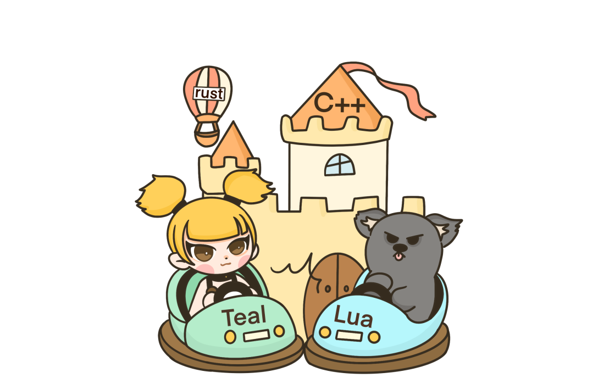
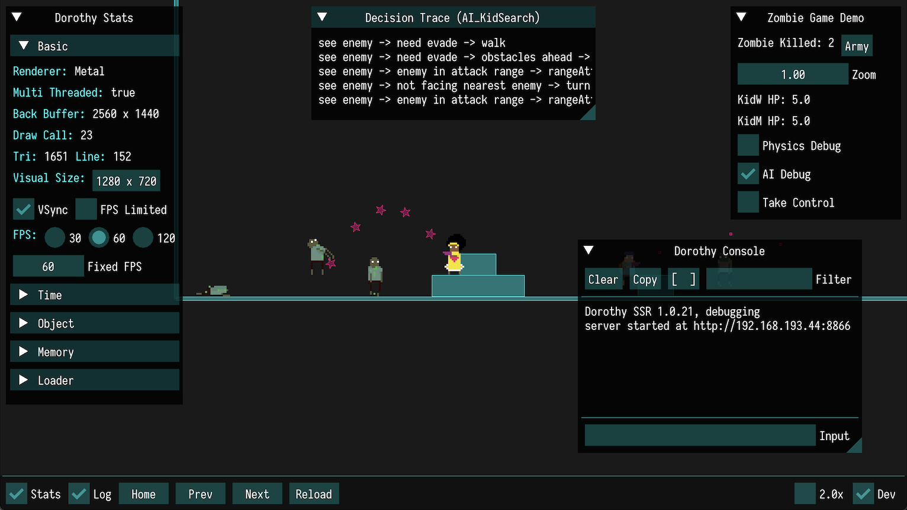
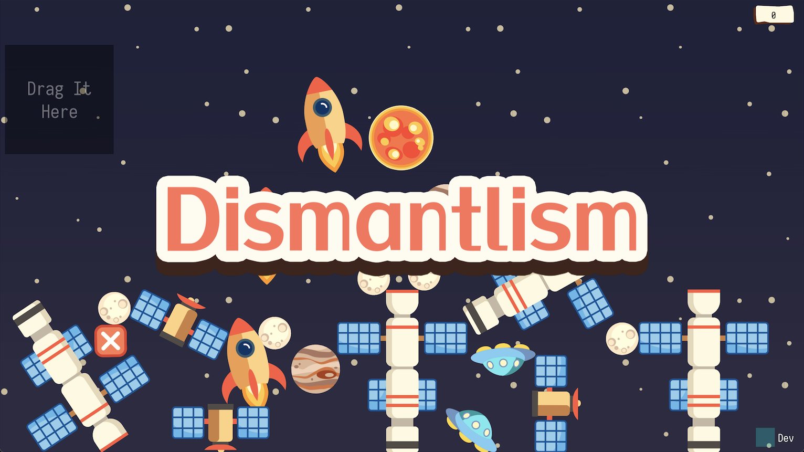
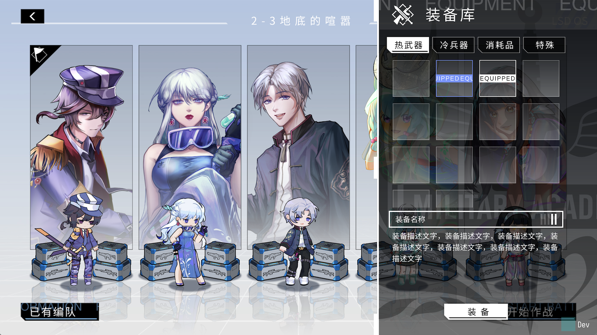

<p align="center">
  
</p>

# Dora SSR (多萝珍奇引擎)

#### English | [中文](README.zh-CN.md)

       
     

Dora SSR is a game engine for rapid development of 2D games on various devices. It has a built-in easy-to-use development tool chain that supports direct game development on mobile phones, open source handhelds and other devices.



## Dora SSR Joins the Open Atom Foundation

We are delighted to announce that the Dora SSR project has officially become a donation and incubation preparatory project under the Open Atom Foundation. This new stage of development signifies our steadfast commitment to building a more open and collaborative gaming development environment.

### About the Open Atom Foundation

The Open Atom Foundation is a non-profit organization dedicated to supporting and promoting the development of open-source technologies. Within this foundation's community, Dora SSR will utilize broader resources and community support to propel the project's development and innovation. For more information, please visit the [foundation's official website](https://openatom.org/).

## Key Features

- Manages game scenes based on tree node structure.

- Basic 2D platform game functions, including game logic and AI development framework.

- Easy-to-use ECS module for game entity management.

- Asynchronous processing of file read and write, resource loading and other operations.

- Upgraded Lua binding with support for inheriting and extending low-level C++ objects.

- Supports Yuescript language, strong expressive and concise Lua dialect.

- Supports for the Teal language, a statically typed dialect for Lua.

- Supports TypeScript, a statically typed superset of JavaScript that adds powerful type checking.

- Supports TSX, allows embedding XML/HTML-like text within scripts, used with TypeScript.

- Supports the Rust language, running on the built-in WASM runtime with Rust bindings.

- 2D skeletal animation and physics engine support.

- Built-in out-of-the-box Web IDE, providing file management, code inspection, completion, highlighting and definition jump.

- Supports asynchronous operation of SQLite for real-time query and managing large game configuration data.

- Supports reading Excel spreadsheet data and synchronizing it to SQLite tables.

- Supports the Yarn Spinner language, making it easy to write complex game story systems.

- Built-in machine learning algorithm framework for innovative gameplay.

- Provides vector graphics rendering API, which can directly render SVG format files without CSS.

- Built-in ImGui, easy to create debugging tools and UI interface.

- Supports FLAC, OGG, MP3 and WAV multi-format audio playback.

- Supports True Type font rendering and basic typesetting.

- Provides open art resources and game IPs that can be used to create your own games - ["Luv Sense Digital"](https://luv-sense-digital.readthedocs.io).

&emsp;&emsp;

<br>

## Installation

- Quick start

  - Android
     - 1. Download and install the [APK](https://github.com/ippclub/Dora-SSR/releases/latest) package on the running terminal for games.

     - 2. Run the software, and access the server address displayed by the software through the browser of a PC (tablet or other development device) on the LAN.

     - 3. Start game development.

  - Windows, macOS

     - 1. Download and run the [software](https://github.com/ippclub/Dora-SSR/releases/latest).
          - Get software on macOS with Homebrew using
          ```sh
          brew tap ippclub/dora-ssr
          brew install --cask dora-ssr
          ```

     - 2. Run the software and access the server address displayed by the software through a browser.

     - 3. Start game development.


  - Linux

     - 1. Installation.
       
       - Ubuntu Jammy
         ```sh
         sudo add-apt-repository ppa:ippclub/dora-ssr
         sudo apt update
         sudo apt install dora-ssr
         ```

       - Debian Bookworm
         ```sh
         sudo apt-key adv --keyserver hkp://keyserver.ubuntu.com:80 --recv-keys 9C7705BF
         sudo add-apt-repository -S "deb https://ppa.launchpadcontent.net/ippclub/dora-ssr/ubuntu jammy main"
         sudo apt update
         sudo apt install dora-ssr
         ```

     - 2. Run the software and access the server address displayed by the software through a browser.

     - 3. Start game development.

- Engine project development

   For the installation and configuration of Dora SSR project development, see [Official Documents](https://Dora-ssr.net/docs/tutorial/dev-configuration) for details.

<br>

## Quick Start

1. Step 1: Create a new project

    - In the browser, open the right-click menu of the game resource tree on the left side of the Dora Dora editor.

    - Click on the menu item `New` and choose to create a new folder.

2. Step 2: Write game code

    - Create a new game entry code file of Lua (Yuescript, Teal, Typescript or TSX) under the project folder, named `init`.

    - Write Hello World code:

- **Lua**
```lua
local _ENV = Dora()

local sprite = Sprite("Image/logo.png")
sprite:schedule(once(function()
  for i = 3, 1, -1 do
    print(i)
    sleep(1)
  end
  print("Hello World")
  sprite:perform(Sequence(
    Scale(0.1, 1, 0.5),
    Scale(0.5, 0.5, 1, Ease.OutBack)
  ))
end))
```

- **Teal**
```lua
local sleep <const> = require("sleep")
local Ease <const> = require("Ease")
local Scale <const> = require("Scale")
local Sequence <const> = require("Sequence")
local once <const> = require("once")
local Sprite <const> = require("Sprite")

local sprite = Sprite("Image/logo.png")
if not sprite is nil then
  sprite:schedule(once(function()
    for i = 3, 1, -1 do
      print(i)
      sleep(1)
    end
    print("Hello World")
    sprite:perform(Sequence(
      Scale(0.1, 1, 0.5),
      Scale(0.5, 0.5, 1, Ease.OutBack)
    ))
  end))
end
```
- **Yuescript**
```moonscript
_ENV = Dora!

with Sprite "Image/logo.png"
   \schedule once ->
     for i = 3, 1, -1
       print i
       sleep 1
     print "Hello World!"
     \perform Sequence(
       Scale 0.1, 1, 0.5
       Scale 0.5, 0.5, 1, Ease. OutBack
     )
```
- **Typescript**
```typescript
import {Sprite, Ease, Scale, Sequence, once, sleep} from 'dora';

const sprite = Sprite("Image/logo.png");
if (sprite) {
  sprite.schedule(once(() => {
    for (let i of $range(3, 1, -1)) {
      print(i);
      sleep(1);
    }
    print("Hello World");
    sprite.perform(Sequence(
      Scale(0.1, 1, 0.5),
      Scale(0.5, 0.5, 1, Ease.OutBack)
    ))
  }));
}
```
- **TSX**
```tsx
import { React, toNode, useRef } from 'dora-x';
import { ActionDef, Ease, Sprite, once, sleep } from 'dora';

const actionRef = useRef<ActionDef.Type>();
const spriteRef = useRef<Sprite.Type>();

const onUpdate = once(() => {
  for (let i of $range(3, 1, -1)) {
    print(i);
    sleep(1);
  }
  print("Hello World");
  if (actionRef.current && spriteRef.current) {
    spriteRef.current.perform(actionRef.current);
  }
});

toNode(
  <sprite
    ref={spriteRef}
    file='Image/logo.png'
    onUpdate={onUpdate}
  >
    <action ref={actionRef}>
      <sequence>
        <scale time={0.1} start={1} stop={0.5}/>
        <scale time={0.5} start={0.5} stop={1} easing={Ease.OutBack}/>
      </sequence>
    </action>
  </sprite>
);
```
- Or you can write code in **Rust**, build it into WASM file named `init.wasm`, upload it to engine to run.
```rust
use dora_ssr::*;

fn main () {
  let mut sprite = match Sprite::with_file("Image/logo.png") {
    Some(sprite) => sprite,
    None => return,
  };
  let mut sprite_clone = sprite.clone();
  sprite.schedule(once(move |mut co| async move {
    for i in (1..=3).rev() {
      p!("{}", i);
      sleep!(co, 1.0);
    }
    p!("Hello World");
    sprite_clone.perform_def(ActionDef::sequence(&vec![
      ActionDef::scale(0.1, 1.0, 0.5, EaseType::Linear),
      ActionDef::scale(0.5, 0.5, 1.0, EaseType::OutBack),
    ]));
  }));
}
```

3. Step 3: Run the game

    Click the `🎮` icon in the lower right corner of the editor, then click the menu item `Run`. Or press the key combination `Ctrl + r`.

4. Step 4: Publish the game

    - Open the right-click menu of the project folder just created through the game resource tree on the left side of the editor and click the `Download` option.

    - Wait for the browser to pop up a download prompt for the packaged project file.


For more detailed tutorials, please check [official documents](https://Dora-ssr.net/docs/tutorial/quick-start).

<br>

## Example Projects

- [Sample Project - Loli War](https://github.com/ippclub/Dora-SSR/tree/main/Assets/Script/Game/Loli%20War)


<br>

- [Sample Project - Zombie Escape](https://github.com/ippclub/Dora-SSR/tree/main/Assets/Script/Game/Zombie%20Escape)



<br>

- [Example Project - Dismentalism](https://github.com/ippclub/Dora-SSR/tree/main/Assets/Script/Game/Dismantlism)



<br>

- [Example Project - Luv Sense Digital](https://e.coding.net/project-lsd/lsd/game.git)



<br>

## Documentation

- [API Reference](https://Dora-ssr.net/docs/api/intro)
- [Tutorial](https://Dora-ssr.net/docs/tutorial/quick-start)

<br>

## Community

- [Discord](https://discord.gg/ydJVuZhh)
- [QQ Group: 512620381](https://qm.qq.com/cgi-bin/qm/qr?k=7siAhjlLaSMGLHIbNctO-9AJQ0bn0G7i&jump_from=webapi&authKey=Kb6tXlvcJ2LgyTzHQzKwkMxdsQ7sjERXMJ3g10t6b+716pdKClnXqC9bAfrFUEWa)

<br>

## Contribute

Welcome to participate in the development and maintenance of Dora SSR. Please see [Contributing Guidelines](CONTRIBUTING.md) to learn how to submit Issues and Pull Requests.

<br>

## License

Dora SSR uses the [MIT License](LICENSE). The project was originally named Dorothy SSR and is currently undergoing a renaming process.
