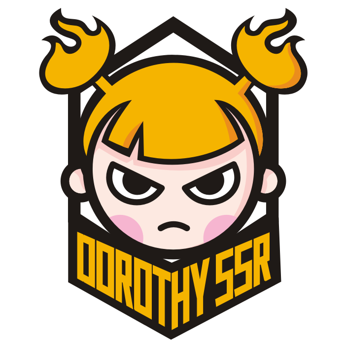
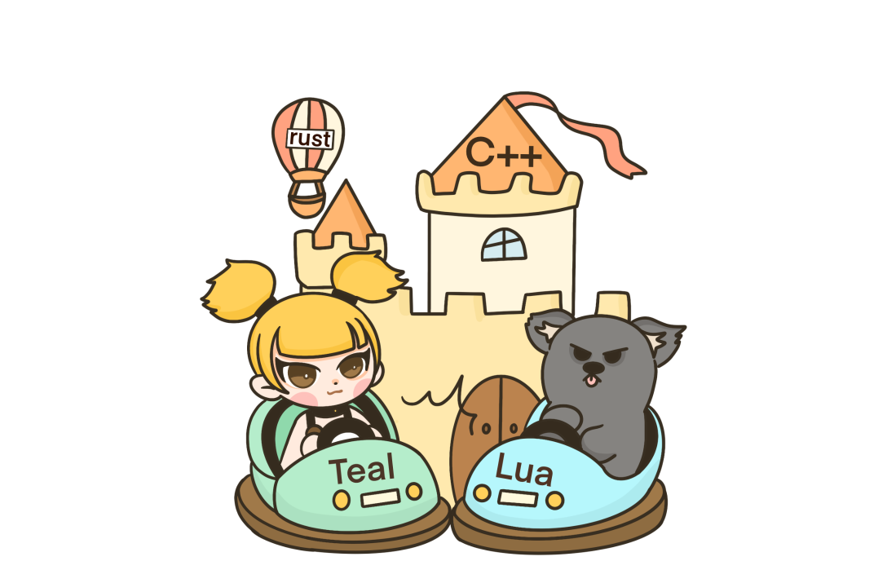
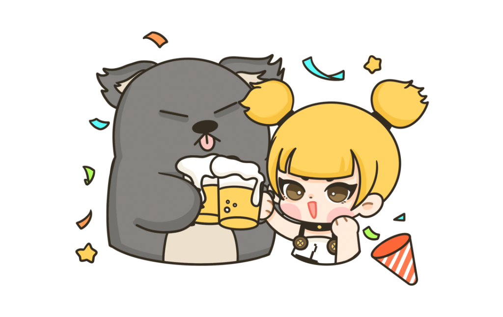
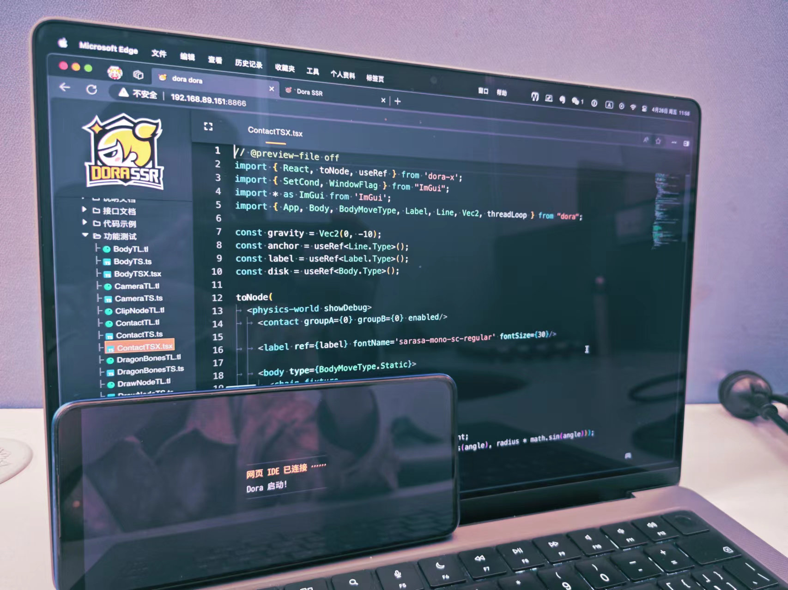
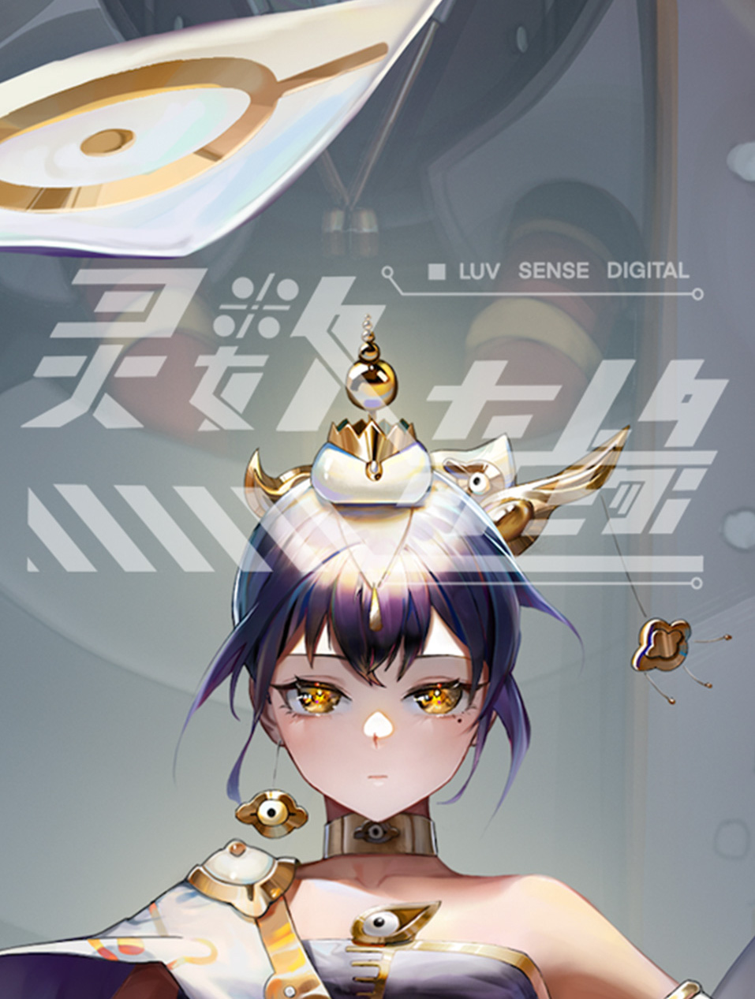

<p align="center">
  
</p>

# Dora SSR (多萝珍奇引擎)

#### English | [中文](README.zh-CN.md)

       
     

----

Dora SSR is a game engine for rapid development of 2D games on various devices. It has a built-in easy-to-use development tool chain that supports direct game development on mobile phones, open source handhelds and other devices.

<div align='center'></div>

## Dora SSR Joins the Open Atom Foundation

We are delighted to announce that the Dora SSR project has officially become a donation and incubation preparatory project under the Open Atom Foundation. This new stage of development signifies our steadfast commitment to building a more open and collaborative gaming development environment.

### About the Open Atom Foundation

The Open Atom Foundation is a non-profit organization dedicated to supporting and promoting the development of open-source technologies. Within this foundation's community, Dora SSR will utilize broader resources and community support to propel the project's development and innovation. For more information, please visit the [foundation's official website](https://openatom.org/).

<div align='center'></div>

## Key Features

|Feature|Description|
|-|-|
|Cross-Platform|Supports native running on Linux, Android, Windows, iOS, and macOS.|
|Node Based|Manages game scenes based on tree node structure.|
|2D Platformer|Basic 2D platform game functions, including game logic and AI development framework.|
|ECS|Easy-to-use ECS module for efficient game entity management.|
|Multi-threaded|Asynchronous processing of file read and write, resource loading and other operations.|
|Lua|Upgraded Lua binding with support for inheriting and extending low-level C++ objects.|
|YueScript|Supports YueScript language, strong expressive and concise Lua dialect.|
|Teal|Supports for the Teal language, a statically typed dialect for Lua.|
|TypeScript|Supports TypeScript, a statically typed superset of JavaScript that adds powerful type checking.|
|TSX|Supports TSX, allows embedding XML/HTML-like text within scripts, used with TypeScript.|
|Rust|Supports the Rust language, running on the built-in WASM runtime with Rust bindings.|
|2D Animation|2D skeletal animations support with Spine2D, DragonBones and builtin system.|
|2D Physics|2D physics engine support with PlayRho.|
|Web IDE|Built-in out-of-the-box Web IDE, providing file management, code inspection, completion, highlighting and definition jump. <br><br><div align='center'></div>|
|Database|Supports asynchronous operation of SQLite for real-time query and managing large game configuration data.|
|Excel|Supports reading Excel spreadsheet data and synchronizing it to SQLite tables.|
|CSS Layout|Provides the function of adaptive Flex layout for game scenes through CSS.|
|Effect System|Support the functions of [Effekseer](https://effekseer.github.io/en) game effects system.|
|Tilemap|Supports the [Tiled Map Editor](http://www.mapeditor.org) TMX map file parsing and rendering.|
|Yarn Spinner|Supports the Yarn Spinner language, making it easy to write complex game story systems.|
|ML|Built-in machine learning algorithm framework for innovative gameplay.|
|Vector Graphics|Provides vector graphics rendering API, which can directly render SVG format files without CSS.|
|ImGui|Built-in ImGui, easy to create debugging tools and UI interface.|
|Audio|Supports FLAC, OGG, MP3 and WAV multi-format audio playback.|
|True Type|Supports True Type font rendering and basic typesetting.|
|L·S·D|Provides open art resources and game IPs that can be used to create your own games - ["Luv Sense Digital"](https://luv-sense-digital.readthedocs.io).<br><br><div align='center'></div>|

<br>

## Example Projects

- [Sample Project - Loli War](Assets/Script/Game/Loli%20War)

<div align='center'></div>

<br>

- [Sample Project - Zombie Escape](Assets/Script/Game/Zombie%20Escape)

<div align='center'></div>

<br>

- [Example Project - Dismentalism](Assets/Script/Game/Dismantlism)

<div align='center'></div>

<br>

- [Example Project - Luv Sense Digital](https://github.com/IppClub/LSD)

<div align='center'></div>

<br>

## Installation

- Quick start
	- Android
		- 1. Download and install the [APK](https://github.com/ippclub/Dora-SSR/releases/latest) package on the running terminal for games.
		- 2. Run the software, and access the server address displayed by the software through the browser of a PC (tablet or other development device) on the LAN.
		- 3. Start game development.
	- Windows, macOS
		- 1. Download and run the [software](https://github.com/ippclub/Dora-SSR/releases/latest).
			- For Windows users, ensure that you have the X86 Visual C++ Redistributable for Visual Studio 2022 (the MSVC runtime package vc_redist.x86) installed to run the application. You can download it from the [Microsoft website](https://learn.microsoft.com/en-us/cpp/windows/latest-supported-vc-redist?view=msvc-170).
			- Get software on macOS with Homebrew using
				```sh
				brew tap ippclub/dora-ssr
				brew install --cask dora-ssr
				```

		- 2. Run the software and access the server address displayed by the software through a browser.
		- 3. Start game development.
	- Linux
		- 1. Installation.
			- Ubuntu Jammy
				```sh
				sudo add-apt-repository ppa:ippclub/dora-ssr
				sudo apt update
				sudo apt install dora-ssr
				```
			- Debian Bookworm
				```sh
				sudo apt-key adv --keyserver hkp://keyserver.ubuntu.com:80 --recv-keys 9C7705BF
				sudo add-apt-repository -S "deb https://ppa.launchpadcontent.net/ippclub/dora-ssr/ubuntu jammy main"
				sudo apt update
				sudo apt install dora-ssr
				```
	- 2. Run the software and access the server address displayed by the software through a browser.
	- 3. Start game development.

- Engine project development

For the installation and configuration of Dora SSR project development, see [Official Documents](https://dora-ssr.net/docs/tutorial/dev-configuration) for details.

<br>

## Quick Start

1. Step One: Create a new project
	- In the browser, open the right-click menu of the game resource tree on the left side of the Dora Dora editor.
	- Click on the menu item `New` and choose to create a new folder.
2. Step Two: Write game code
	- Create a new game entry code file of Lua (YueScript, Teal, TypeScript or TSX) under the project folder, named `init`.
	- Write Hello World code:

- **Lua**

```lua
local _ENV = Dora

local sprite = Sprite("Image/logo.png")
sprite:schedule(once(function()
  for i = 3, 1, -1 do
    print(i)
    sleep(1)
  end
  print("Hello World")
  sprite:perform(Sequence(
    Scale(0.1, 1, 0.5),
    Scale(0.5, 0.5, 1, Ease.OutBack)
  ))
end))
```

- **Teal**

```lua
local sleep <const> = require("sleep")
local Ease <const> = require("Ease")
local Scale <const> = require("Scale")
local Sequence <const> = require("Sequence")
local once <const> = require("once")
local Sprite <const> = require("Sprite")

local sprite = Sprite("Image/logo.png")
if not sprite is nil then
  sprite:schedule(once(function()
    for i = 3, 1, -1 do
      print(i)
      sleep(1)
    end
    print("Hello World")
    sprite:perform(Sequence(
      Scale(0.1, 1, 0.5),
      Scale(0.5, 0.5, 1, Ease.OutBack)
    ))
  end))
end
```

- **YueScript**

	The story of YueScript, a niche language supported by Dora SSR, can be found [here](https://dora-ssr.net/blog/2024/4/17/a-moon-script-tale).

```moonscript
_ENV = Dora

with Sprite "Image/logo.png"
   \schedule once ->
     for i = 3, 1, -1
       print i
       sleep 1
     print "Hello World!"
     \perform Sequence(
       Scale 0.1, 1, 0.5
       Scale 0.5, 0.5, 1, Ease. OutBack
     )
```

- **TypeScript**

```typescript
import {Sprite, Ease, Scale, Sequence, once, sleep} from 'Dora';

const sprite = Sprite("Image/logo.png");
if (sprite) {
  sprite.schedule(once(() => {
    for (let i of $range(3, 1, -1)) {
      print(i);
      sleep(1);
    }
    print("Hello World");
    sprite.perform(Sequence(
      Scale(0.1, 1, 0.5),
      Scale(0.5, 0.5, 1, Ease.OutBack)
    ))
  }));
}
```

- **TSX**

	A much easier approach for building a game scene in Dora SSR. Take the tutorials [here](https://dora-ssr.net/blog/2024/4/25/tsx-dev-intro).

```tsx
import {React, toNode, useRef} from 'DoraX';
import {ActionDef, Ease, Sprite, once, sleep} from 'Dora';

const actionRef = useRef<ActionDef.Type>();
const spriteRef = useRef<Sprite.Type>();

const onUpdate = once(() => {
  for (let i of $range(3, 1, -1)) {
    print(i);
    sleep(1);
  }
  print("Hello World");
  if (actionRef.current && spriteRef.current) {
    spriteRef.current.perform(actionRef.current);
  }
});

toNode(
  <sprite
    ref={spriteRef}
    file='Image/logo.png'
    onUpdate={onUpdate}
  >
    <action ref={actionRef}>
      <sequence>
        <scale time={0.1} start={1} stop={0.5}/>
        <scale time={0.5} start={0.5} stop={1} easing={Ease.OutBack}/>
      </sequence>
    </action>
  </sprite>
);
```

- **Rust**

	You can write code in Rust, build it into WASM file named `init.wasm`, upload it to engine to run. View details [here](https://dora-ssr.net/blog/2024/4/15/rusty-game-dev).

```rust
use dora_ssr::*;

fn main () {
  let mut sprite = match Sprite::with_file("Image/logo.png") {
    Some(sprite) => sprite,
    None => return,
  };
  let mut sprite_clone = sprite.clone();
  sprite.schedule(once(move |mut co| async move {
    for i in (1..=3).rev() {
      p!("{}", i);
      sleep!(co, 1.0);
    }
    p!("Hello World");
    sprite_clone.perform_def(ActionDef::sequence(&vec![
      ActionDef::scale(0.1, 1.0, 0.5, EaseType::Linear),
      ActionDef::scale(0.5, 0.5, 1.0, EaseType::OutBack),
    ]));
  }));
}
```

3. Step Three: Run the game

	Click the `🎮` icon in the lower right corner of the editor, then click the menu item `Run`. Or press the key combination `Ctrl + r`.

4. Step Four: Publish the game
	- Open the right-click menu of the project folder just created through the game resource tree on the left side of the editor and click the `Download` option.
	- Wait for the browser to pop up a download prompt for the packaged project file.

For more detailed tutorials, please check [official documents](https://Dora-ssr.net/docs/tutorial/quick-start).

<br>

## Documentation

- [API Reference](https://Dora-ssr.net/docs/api/intro)
- [Tutorial](https://Dora-ssr.net/docs/tutorial/quick-start)

<br>

## Community

- [Discord](https://discord.gg/ZfNBSKXnf9)
- [QQ Group: 512620381](https://qm.qq.com/cgi-bin/qm/qr?k=7siAhjlLaSMGLHIbNctO-9AJQ0bn0G7i&jump_from=webapi&authKey=Kb6tXlvcJ2LgyTzHQzKwkMxdsQ7sjERXMJ3g10t6b+716pdKClnXqC9bAfrFUEWa)

<br>

## Contribute

Welcome to participate in the development and maintenance of Dora SSR. Please see [Contributing Guidelines](CONTRIBUTING.md) to learn how to submit Issues and Pull Requests.

<br>

## License

Dora SSR uses the [MIT License](LICENSE). The project was originally named Dorothy SSR and is currently undergoing a renaming process.

### Notice

Please note that Dora SSR integrates the Spine Runtime library, which is a **commercial software**. The use of Spine Runtime in your projects requires a valid commercial license from Esoteric Software. For more details on obtaining the license, please visit the [official Spine website](http://esotericsoftware.com/).

Make sure to comply with all licensing requirements when using Spine Runtime in your projects.

Alternatively, you can use the integrated open-source DragonBones system as an animation system replacement. If you only need to create simpler animations, you may also explore the Model animation module provided by Dora SSR to see if it meets your needs.