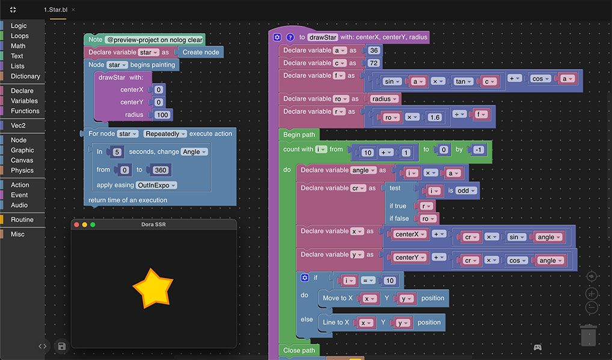
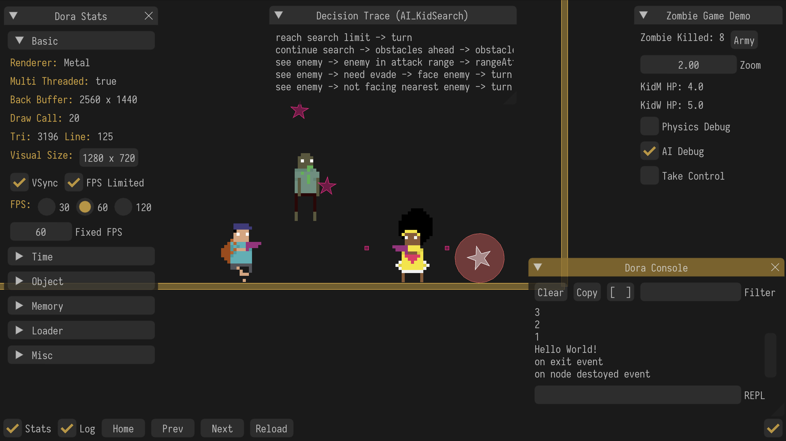
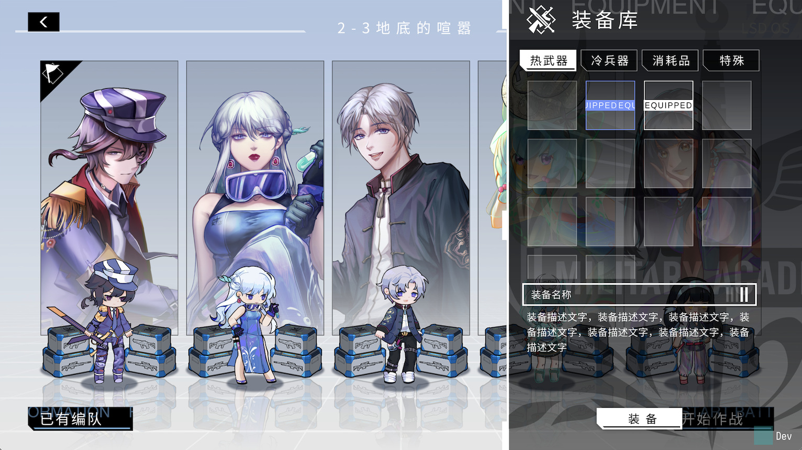

# Dora SSR (多萝珍奇引擎)

<table align="center" width="100%">
<tr>
<td width="20%" valign="middle" align="center">

<br/>
<sub>Web IDE · Coding Agent</sub><br/>
<sub>Target-device live game engine</sub>
</td>
<td width="80%" valign="middle" align="center">

</td>
</tr>
</table>


#### English | [中文](README.zh-CN.md)

[![IppClub](https://img.shields.io/badge/IppClub-Certified-11A7E2?logo=data%3Aimage%2Fsvg%2Bxml%3Bcharset%3Dutf-8%3Bbase64%2CPHN2ZyB2aWV3Qm94PSIwIDAgMjg4IDI3NCIgeG1sbnM9Imh0dHA6Ly93d3cudzMub3JnLzIwMDAvc3ZnIiB4bWw6c3BhY2U9InByZXNlcnZlIiBzdHlsZT0iZmlsbC1ydWxlOmV2ZW5vZGQ7Y2xpcC1ydWxlOmV2ZW5vZGQ7c3Ryb2tlLWxpbmVqb2luOnJvdW5kO3N0cm9rZS1taXRlcmxpbWl0OjIiPjxwYXRoIGQ9Im0xNDYgMzEgNzIgNTVWMzFoLTcyWiIgc3R5bGU9ImZpbGw6I2Y2YTgwNjtmaWxsLXJ1bGU6bm9uemVybyIvPjxwYXRoIGQ9Im0xNjkgODYtMjMtNTUgNzIgNTVoLTQ5WiIgc3R5bGU9ImZpbGw6I2VmN2EwMDtmaWxsLXJ1bGU6bm9uemVybyIvPjxwYXRoIGQ9Ik0yNiAzMXY1NWg4MEw4MSAzMUgyNloiIHN0eWxlPSJmaWxsOiMwN2ExN2M7ZmlsbC1ydWxlOm5vbnplcm8iLz48cGF0aCBkPSJNMTA4IDkydjExMmwzMS00OC0zMS02NFoiIHN0eWxlPSJmaWxsOiNkZTAwNWQ7ZmlsbC1ydWxlOm5vbnplcm8iLz48cGF0aCBkPSJNMCAyNzR2LTUyaDk3bC0zMyA1MkgwWiIgc3R5bGU9ImZpbGw6I2Y2YTgwNjtmaWxsLXJ1bGU6bm9uemVybyIvPjxwYXRoIGQ9Im03NyAyNzQgNjctMTA3djEwN0g3N1oiIHN0eWxlPSJmaWxsOiNkZjI0MzM7ZmlsbC1ydWxlOm5vbnplcm8iLz48cGF0aCBkPSJNMTUyIDI3NGgyOWwtMjktNTN2NTNaIiBzdHlsZT0iZmlsbDojMzM0ODVkO2ZpbGwtcnVsZTpub256ZXJvIi8%2BPHBhdGggZD0iTTE5MSAyNzRoNzl2LTUySDE2N2wyNCA1MloiIHN0eWxlPSJmaWxsOiM0ZTI3NWE7ZmlsbC1ydWxlOm5vbnplcm8iLz48cGF0aCBkPSJNMjg4IDEwMGgtMTdWODVoLTEzdjE1aC0xN3YxM2gxN3YxNmgxM3YtMTZoMTd2LTEzWiIgc3R5bGU9ImZpbGw6I2M1MTgxZjtmaWxsLXJ1bGU6bm9uemVybyIvPjxwYXRoIGQ9Im0yNiA4NiA1Ni01NUgyNnY1NVoiIHN0eWxlPSJmaWxsOiMzMzQ4NWQ7ZmlsbC1ydWxlOm5vbnplcm8iLz48cGF0aCBkPSJNOTMgMzFoNDJsLTMwIDI5LTEyLTI5WiIgc3R5bGU9ImZpbGw6IzExYTdlMjtmaWxsLXJ1bGU6bm9uemVybyIvPjxwYXRoIGQ9Ik0xNTggMTc2Vjg2bC0zNCAxNCAzNCA3NloiIHN0eWxlPSJmaWxsOiMwMDU5OGU7ZmlsbC1ydWxlOm5vbnplcm8iLz48cGF0aCBkPSJtMTA2IDU5IDQxLTEtMTItMjgtMjkgMjlaIiBzdHlsZT0iZmlsbDojMDU3Y2I3O2ZpbGwtcnVsZTpub256ZXJvIi8%2BPHBhdGggZD0ibTEyNCAxMDAgMjItNDEgMTIgMjctMzQgMTRaIiBzdHlsZT0iZmlsbDojNGUyNzVhO2ZpbGwtcnVsZTpub256ZXJvIi8%2BPHBhdGggZD0ibTEwNiA2MCA0MS0xLTIzIDQxLTE4LTQwWiIgc3R5bGU9ImZpbGw6IzdiMTI4NTtmaWxsLXJ1bGU6bm9uemVybyIvPjxwYXRoIGQ9Im0xMDggMjA0IDMxLTQ4aC0zMXY0OFoiIHN0eWxlPSJmaWxsOiNiYTAwNzc7ZmlsbC1ydWxlOm5vbnplcm8iLz48cGF0aCBkPSJtNjUgMjc0IDMzLTUySDBsNjUgNTJaIiBzdHlsZT0iZmlsbDojZWY3YTAwO2ZpbGwtcnVsZTpub256ZXJvIi8%2BPHBhdGggZD0iTTc3IDI3NGg2N2wtNDAtNDUtMjcgNDVaIiBzdHlsZT0iZmlsbDojYTgxZTI0O2ZpbGwtcnVsZTpub256ZXJvIi8%2BPHBhdGggZD0iTTE2NyAyMjJoNThsLTM0IDUyLTI0LTUyWiIgc3R5bGU9ImZpbGw6IzExYTdlMjtmaWxsLXJ1bGU6bm9uemVybyIvPjxwYXRoIGQ9Im0yNzAgMjc0LTQ0LTUyLTM1IDUyaDc5WiIgc3R5bGU9ImZpbGw6IzA1N2NiNztmaWxsLXJ1bGU6bm9uemVybyIvPjxwYXRoIGQ9Ik0yNzUgNTVoLTU3VjBoMjV2MzFoMzJ2MjRaIiBzdHlsZT0iZmlsbDojZGUwMDVkO2ZpbGwtcnVsZTpub256ZXJvIi8%2BPHBhdGggZD0iTTE4NSAzMWg1N3Y1NWgtMjVWNTVoLTMyVjMxWiIgc3R5bGU9ImZpbGw6I2M1MTgxZjtmaWxsLXJ1bGU6bm9uemVybyIvPjwvc3ZnPg%3D%3D&labelColor=fff)](https://ippclub.org) [](https://openatom.org/project/RJHufNnSKtDZ) [](https://deepwiki.com/IppClub/Dora-SSR) [](https://qm.qq.com/q/VnzYhvCDgy) [](https://discord.gg/ZfNBSKXnf9)

Dora SSR is a cross-platform game engine for building games directly on the device that runs them. Keep the engine on a phone, handheld, desktop, or another target device; then use its built-in Web IDE from a browser to code, inspect, run, and iterate against the real runtime.

<br/>

## Start Here

- [Quick Start](https://dora-ssr.net/docs/tutorial/quick-start)
- [Feature Examples](https://github.com/IppClub/Dora-Example/tree/master/Example)
- [Complete Demo Projects](https://github.com/IppClub/Dora-Demo)
- [Latest Releases](https://github.com/ippclub/Dora-SSR/releases/latest)

## Tech Overview

|Area|Contents|
|-|-|
|Development Flow|Target-device engine + `Web IDE` + `Coding Agent` for a connected edit, run, inspect, and iterate loop|
|Language Ecosystem|`Lua` / `TypeScript` / `TSX` / `Teal` / `YueScript` / `Wa` / `Rust` / `C#`|
|Runtime|2D and 3D scenes, physics, animation, audio, video, UI, and asynchronous asset workflows|
|Target Platforms|`Android` / `Windows` / `Linux` / `macOS` / `iOS` / [HarmonyOS](https://github.com/IppClub/ohos_dora_ssr)|

<div align='center'>


</div>

<div align='center'></div>

## Key Features

### Developer Experience

- Web IDE: a browser-based workspace with project files, typed code editing, completion, diagnostics, and jump-to-definition—connected directly to the running engine.
- Coding Agent: the built-in [coding agent](Assets/Script/Lib/Agent/CodingAgent.ts) brings LLM-assisted development into the engine with project skills, persistent memory, API lookup, safe edits, build checks, runtime validation, and sub-agent delegation.
- Live device workflow: keep the engine on the target phone, handheld, or desktop and iterate in a browser against the real runtime, not a detached preview.

<div align='center'></div>

### Languages and Extensibility

- Lua: upgraded bindings that can inherit from and extend low-level C++ objects.
- TypeScript / TSX: typed game code and declarative scenes or responsive UI with supported ReactJS-style APIs, compiled with [TSTL](https://typescripttolua.github.io).
- Teal / YueScript: Lua-friendly language choices for teams with different coding styles.
- Wa / Rust / C#: extend or integrate the engine through its WASM runtime and native dynamic-library interfaces.
- Blockly: Scratch-like visual scripting for teaching, prototypes, and beginner-friendly onboarding.

<div align='center'></div>

### Runtime and Presentation

- Cross-platform runtime: runs natively on `Android`, `Windows`, `Linux`, `iOS`, `macOS`, and `HarmonyOS`.
- Scene system: tree-based 2D and 3D scenes, an approachable [ECS](https://dora-ssr.net/docs/tutorial/using-ecs) module, cameras, materials, lighting, models, animation, and 3D physics.
- 2D production: supports Spine2D, DragonBones, built-in skeletal animation, [PlayRho](https://github.com/louis-langholtz/PlayRho) physics, tile maps, particles, and retro TIC-80 content.
- Media and graphics: asynchronous asset loading, H.264 playback, multi-format audio with spatial effects, runtime shader compilation, Effekseer, NanoVG, ImGui, and TrueType rendering.
- Game patterns: includes reusable logic and AI support for [2D platformer](https://dora-ssr.net/docs/example/Platformer%20Tutorial/start) development.

### Content and Tooling

- Data and configuration: asynchronous [SQLite](https://www.sqlite.org) access plus Excel-to-database workflows.
- Built-in tools: animation, particle, physics, visual-script, Yarn, Spine, tile-map, Git, profiler, and TIC-80 editors keep common game-production tasks in the Web IDE.
- Scene and narrative: CSS Flex layout, Tiled TMX maps, [Yarn Spinner](https://www.yarnspinner.dev) story scripting, and responsive TSX UI.
- Creative extensions: a machine-learning gameplay framework, open art resources, and the ["Luv Sense Digital"](https://luv-sense-digital.readthedocs.io) IP.

<div align='center'></div>

<br>

## Start Building

- Feature examples: use [Dora-Example](https://github.com/IppClub/Dora-Example/tree/master/Example) to learn individual APIs and engine features.
- Full projects: use [Dora-Demo](https://github.com/IppClub/Dora-Demo) to see how real projects organize assets, scripts, and gameplay logic.

### Featured Projects

- [Sample Project - Loli War](https://github.com/IppClub/Dora-Demo/tree/main/Loli%20War)

<div align='center'></div>

<br>

- [Sample Project - Zombie Escape](https://github.com/IppClub/Dora-Demo/tree/main/Zombie%20Escape)

<div align='center'></div>

<br>

- [Example Project - Dismentalism](https://github.com/IppClub/Dora-Demo/tree/main/Dismantlism)

<div align='center'></div>

<br>

- [Example Project - Luv Sense Digital](https://github.com/IppClub/LSD)

<div align='center'></div>

<br>

## Installation

### Android

- Get: install the [APK](https://github.com/ippclub/Dora-SSR/releases/latest) on the target device.
- Run: launch the app and open the displayed address from a browser on a PC, tablet, or another device on the same LAN.
- Start: enter the Web IDE and begin development.

### Windows

- Dependency: install the X86 Visual C++ Redistributable for Visual Studio 2022 from the [Microsoft website](https://learn.microsoft.com/en-us/cpp/windows/latest-supported-vc-redist?view=msvc-170).
- Get: download and extract the [release](https://github.com/ippclub/Dora-SSR/releases/latest).
- Run: launch the app and open the displayed address in a browser.
- Start: enter the Web IDE and begin development.

### macOS

- Get: download and extract the [release](https://github.com/ippclub/Dora-SSR/releases/latest), or install with [Homebrew](https://brew.sh):
	```sh
	brew install --cask ippclub/tap/dora-ssr
	```
- Run: launch the app and open the displayed address in a browser.
- Start: enter the Web IDE and begin development.

### Linux

- Get: install from the matching package source.
	- Ubuntu Jammy
	```sh
	sudo add-apt-repository ppa:ippclub/dora-ssr
	sudo apt update
	sudo apt install dora-ssr
	```
	- Debian Bookworm
	```sh
	sudo apt-key adv --keyserver hkp://keyserver.ubuntu.com:80 --recv-keys 9C7705BF
	sudo add-apt-repository -S "deb https://ppa.launchpadcontent.net/ippclub/dora-ssr/ubuntu jammy main"
	sudo apt update
	sudo apt install dora-ssr
	```
- Run: launch the app and open the displayed address in a browser.
- Start: enter the Web IDE and begin development.

### Linux Package Source

- Ubuntu Jammy:
	```sh
	sudo add-apt-repository ppa:ippclub/dora-ssr
	sudo apt update
	sudo apt install dora-ssr
	```
- Debian Bookworm:
	```sh
	sudo apt-key adv --keyserver hkp://keyserver.ubuntu.com:80 --recv-keys 9C7705BF
	sudo add-apt-repository -S "deb https://ppa.launchpadcontent.net/ippclub/dora-ssr/ubuntu jammy main"
	sudo apt update
	sudo apt install dora-ssr
	```

### Build Game Engine

- For building Dora SSR from source, see the [official guide](https://dora-ssr.net/docs/tutorial/dev-configuration).

<br>

## Quick Start

- Step One: Create a new project
	- In the browser, open the right-click menu of the `Workspace` on the left side of the Dora Dora editor.
	- Click on the menu item `New` and choose to create a new folder.
- Step Two: Write game code
	- Create a new game entry code file of Lua (YueScript, Teal, TypeScript or TSX) under the project folder, named `init`.
	- Write Hello World code:

- **Lua**

```lua
local _ENV = Dora

local sprite = Sprite("Image/logo.png")
sprite:once(function()
  for i = 3, 1, -1 do
    print(i)
    sleep(1)
  end
  print("Hello World")
  sprite:perform(Sequence(
    Scale(0.1, 1, 0.5),
    Scale(0.5, 0.5, 1, Ease.OutBack)
  ))
end)
```

- **Teal**

```lua
local sleep <const> = require("sleep")
local Ease <const> = require("Ease")
local Scale <const> = require("Scale")
local Sequence <const> = require("Sequence")
local Sprite <const> = require("Sprite")

local sprite = Sprite("Image/logo.png")
if not sprite is nil then
  sprite:once(function()
    for i = 3, 1, -1 do
      print(i)
      sleep(1)
    end
    print("Hello World")
    sprite:perform(Sequence(
      Scale(0.1, 1, 0.5),
      Scale(0.5, 0.5, 1, Ease.OutBack)
    ))
  end)
end
```

- **YueScript**

	The story of YueScript, a niche language supported by Dora SSR, can be found [here](https://dora-ssr.net/blog/2024/4/17/a-moon-script-tale).

```moonscript
_ENV = Dora

with Sprite "Image/logo.png"
   \once ->
     for i = 3, 1, -1
       print i
       sleep 1
     print "Hello World!"
     \perform Sequence(
       Scale 0.1, 1, 0.5
       Scale 0.5, 0.5, 1, Ease.OutBack
     )
```

- **TypeScript**

```typescript
import { Sprite, Ease, Scale, Sequence, sleep } from 'Dora';

const sprite = Sprite("Image/logo.png");
if (sprite) {
  sprite.once(() => {
    for (let i of $range(3, 1, -1)) {
      print(i);
      sleep(1);
    }
    print("Hello World");
    sprite.perform(Sequence(
      Scale(0.1, 1, 0.5),
      Scale(0.5, 0.5, 1, Ease.OutBack)
    ))
  });
}
```

- **TSX**

	A much easier approach for building a game scene in Dora SSR. Use `toNode()` for one-shot scene construction, or `createRoot()` with `signal()` when a TSX tree should update by diffing changed data. Take the tutorials [here](https://dora-ssr.net/blog/2024/4/25/tsx-dev-intro).

```tsx
import { React, toNode } from 'DoraX';
import { Ease } from 'Dora';

toNode(
  <sprite file='Image/logo.png'>
    <sequence>
      <event name="Count" param="3"/>
      <delay time={1}/>
      <event name="Count" param="2"/>
      <delay time={1}/>
      <event name="Count" param="1"/>
      <delay time={1}/>
      <scale time={0.1} start={1} stop={0.5}/>
      <scale time={0.5} start={0.5} stop={1} easing={Ease.OutBack}/>
    </sequence>
  </sprite>
)?.slot("Count", (_, param) => print(param));
```

```tsx
import { React, createRoot, signal } from 'DoraX';
import { Director } from 'Dora';

const count = signal(0);
const root = createRoot(Director.entry);

root.render(() => (
  <label fontName="sarasa-mono-sc-regular" fontSize={30}>
    Count: {count.value}
  </label>
));

count.value += 1;
```

- **Wa**

	You can use Wa as a scripting language that runs on the built-in WASM runtime with hot reloading dev experience.

```go
import "dora"

func init {
  sprite := dora.NewSpriteWithFile("Image/logo.png")
  sprite.RunActionDef(
    dora.ActionDefSequence(&[]dora.ActionDef{
      dora.ActionDefEvent("Count", "3"),
      dora.ActionDefDelay(1),
      dora.ActionDefEvent("Count", "2"),
      dora.ActionDefDelay(1),
      dora.ActionDefEvent("Count", "1"),
      dora.ActionDefDelay(1),
      dora.ActionDefScale(0.1, 1, 0.5, dora.EaseLinear),
      dora.ActionDefScale(0.5, 0.5, 1, dora.EaseOutBack),
    }),
    false,
  )
  sprite.Slot("Count", func(stack: dora.CallStack) {
    stack.Pop()
    param, _ := stack.PopStr()
    dora.Println(param)
  })
}
```

- **Rust**

	You can write code in Rust, build it into WASM file named `init.wasm`, upload it to engine to run. View details [here](https://dora-ssr.net/blog/2024/4/15/rusty-game-dev).

```rust
use dora_ssr::*;

fn main () {
  let mut sprite = match Sprite::with_file("Image/logo.png") {
    Some(sprite) => sprite,
    None => return,
  };
  let mut sprite_clone = sprite.clone();
  sprite.schedule(once(move |mut co| async move {
    for i in (1..=3).rev() {
      p!("{}", i);
      sleep!(co, 1.0);
    }
    p!("Hello World");
    sprite_clone.perform_def(ActionDef::sequence(&vec![
      ActionDef::scale(0.1, 1.0, 0.5, EaseType::Linear),
      ActionDef::scale(0.5, 0.5, 1.0, EaseType::OutBack),
    ]));
  }));
}
```

- Step Three: Run the game

	Click the `🎮` icon in the lower right corner of the editor, then click the menu item `Run`. Or press the key combination `Ctrl + r`.

- Step Four: Publish the game
	- Open the right-click menu of the project folder just created through the game resource tree on the left side of the editor and click the `Download` option.
	- Wait for the browser to pop up a download prompt for the packaged project file.

For more detailed tutorials, please check [official documents](https://Dora-ssr.net/docs/tutorial/quick-start).

<br>

## Documentation

- [API Reference](https://Dora-ssr.net/docs/api/intro)
- [Tutorial](https://Dora-ssr.net/docs/tutorial/quick-start)

<br>

## Community

- [Discord](https://discord.gg/ZfNBSKXnf9)
- [QQ Group: 512620381](https://qm.qq.com/cgi-bin/qm/qr?k=7siAhjlLaSMGLHIbNctO-9AJQ0bn0G7i&jump_from=webapi&authKey=Kb6tXlvcJ2LgyTzHQzKwkMxdsQ7sjERXMJ3g10t6b+716pdKClnXqC9bAfrFUEWa)

<br>

## Contribute

Welcome to participate in the development and maintenance of Dora SSR. Please see [Contributing Guidelines](CONTRIBUTING.md) to learn how to submit Issues and Pull Requests.

<br>

## Dora SSR Joins the Open Atom Foundation

We are delighted to announce that the Dora SSR project has officially become a donation and incubation project under the Open Atom Foundation. This new stage of development signifies our steadfast commitment to building a more open and collaborative gaming development environment.

### About the Open Atom Foundation

The Open Atom Foundation is a non-profit organization dedicated to supporting and promoting the development of open-source technologies. Within this foundation's community, Dora SSR will utilize broader resources and community support to propel the project's development and innovation. For more information, please visit the [foundation's official website](https://openatom.org/).

<div align='center'></div>

<br>

## License

Dora SSR uses the [MIT License](LICENSE).

> [!NOTE]
> Please note that Dora SSR integrates the Spine Runtime library, which is a **commercial software**. The use of Spine Runtime in your projects requires a valid commercial license from Esoteric Software. For more details on obtaining the license, please visit the [official Spine website](http://esotericsoftware.com/).<br>
> Make sure to comply with all licensing requirements when using Spine Runtime in your projects. Alternatively, you can use the integrated open-source **DragonBones** system as an animation system replacement. If you only need to create simpler animations, you may also explore the Model animation module provided by Dora SSR to see if it meets your needs.
