# Dora SSR (多萝珍奇引擎)

<table align="center" width="100%">
<tr>
<td width="20%" valign="middle" align="center">
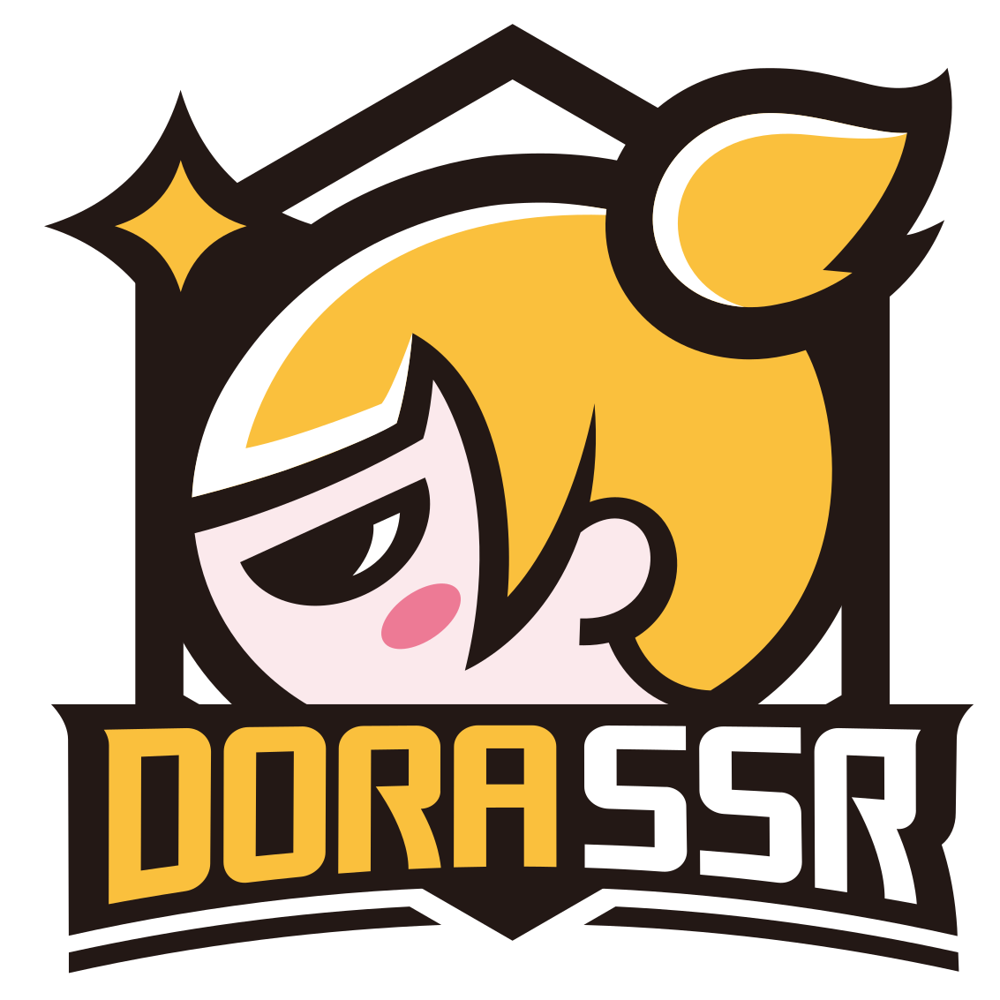
<br/>
<sub>Web IDE · Coding Agent</sub><br/>
<sub>Target-device live game engine</sub>
</td>
<td width="80%" valign="middle" align="center">
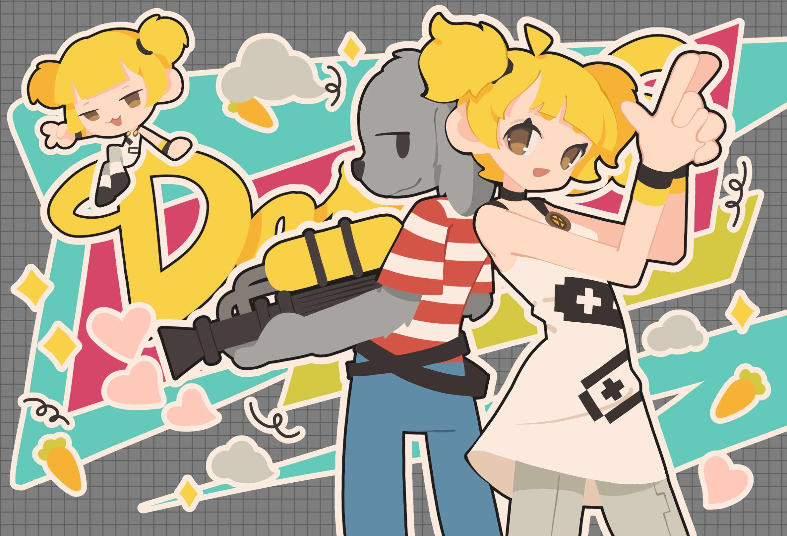
</td>
</tr>
</table>

#### English | [中文](README.zh-CN.md)

[](https://github.com/IppClub/Dora-SSR/releases/latest)
[](https://discord.gg/ZfNBSKXnf9)
[](https://qm.qq.com/q/VnzYhvCDgy)
[](https://deepwiki.com/IppClub/Dora-SSR)
[](https://openatom.org/project/RJHufNnSKtDZ)

Dora SSR is a cross-platform game engine that lives on the device your game runs on — a phone, a handheld, or a desktop. Its built-in Web IDE opens in any browser on the same network, so you code, inspect, and iterate against the real runtime instead of a detached preview, with an AI coding agent built in. The engine runs natively on `Android`, `iOS`, `Windows`, `macOS`, `Linux`, and [HarmonyOS](https://github.com/IppClub/ohos_dora_ssr).

<div align='center'>



</div>

<div align='center'>

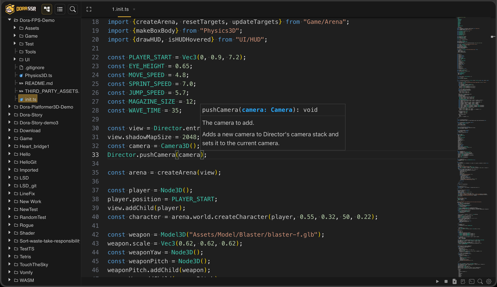

<sub>The Web IDE in a browser, editing code that runs on the device in real time.</sub>

</div>

## Why Dora SSR

- **Develop against the real runtime.** The engine runs on the target device and the browser is just a window onto it. What you edit is what runs — no emulator, no export step, no detached preview.
- **A complete toolchain in the browser.** The Web IDE covers project files, typed editing, completion, diagnostics, and jump-to-definition, plus built-in editors for animation, particles, physics, story scripts, Git, and more.
- **An AI agent built into the engine.** The [Coding Agent](Assets/Script/Lib/Agent) brings LLM-assisted development into the Web IDE — with project skills, persistent memory, API lookup, safe edits, build checks, runtime validation, and sub-agent delegation.

<div align='center'>

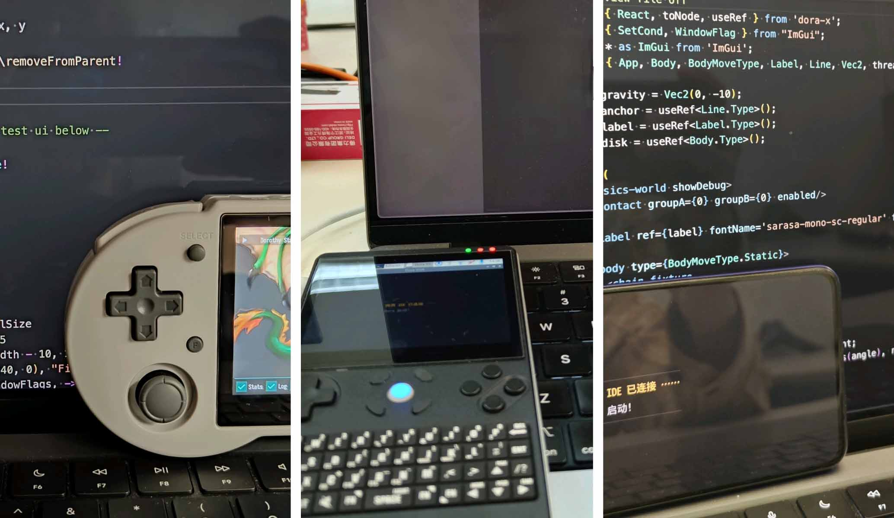

<sub>The engine on the device, the IDE wherever you are.</sub>

</div>

### Built-in Coding Agent

Ask it to analyze a project, look up APIs, make safe edits, and validate the result at runtime. The agent works inside the engine, with persistent memory, project skills, and sub-agent delegation.

<div align='center'>

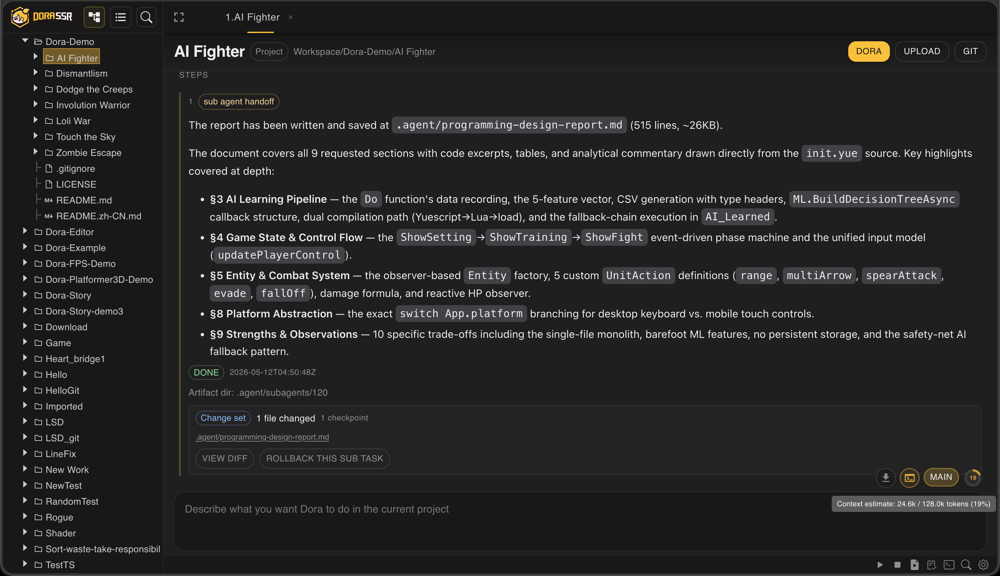

</div>

## Built-in Editors

Common game-production tasks stay inside the Web IDE:

<table>
<tr>
<td width='50%' align='center' valign='top'>
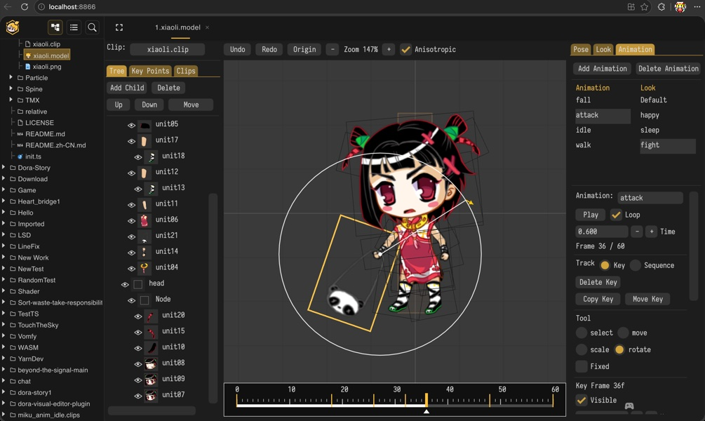
<sub><b>Animation editor</b> — skeletal animation timelines</sub>
</td>
<td width='50%' align='center' valign='top'>
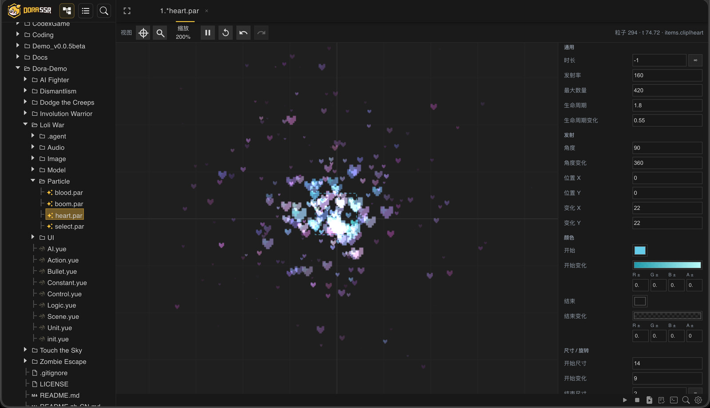
<sub><b>Particle editor</b> — effects with live preview</sub>
</td>
</tr>
<tr>
<td width='50%' align='center' valign='top'>
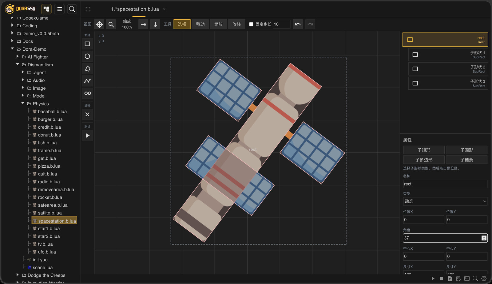
<sub><b>Physics editor</b> — shaping bodies and fixtures</sub>
</td>
<td width='50%' align='center' valign='top'>
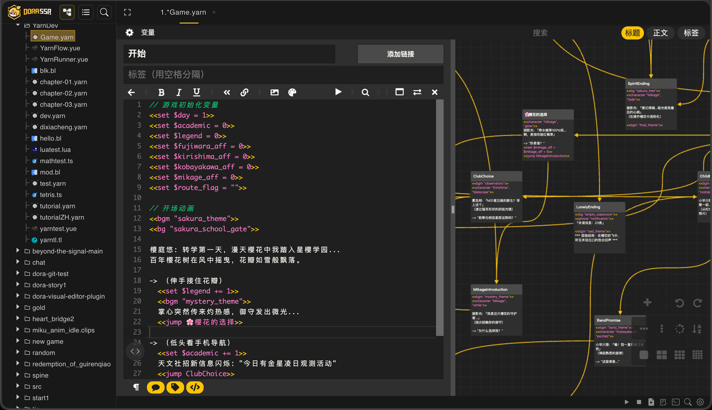
<sub><b>Yarn editor</b> — story scripts and node graphs</sub>
</td>
</tr>
<tr>
<td width='50%' align='center' valign='top'>
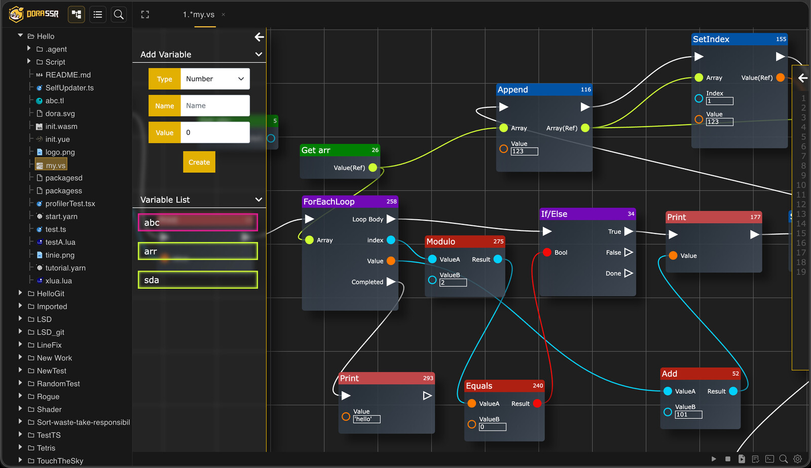
<sub><b>Visual script editor</b> — logic as connected nodes</sub>
</td>
<td width='50%' align='center' valign='top'>
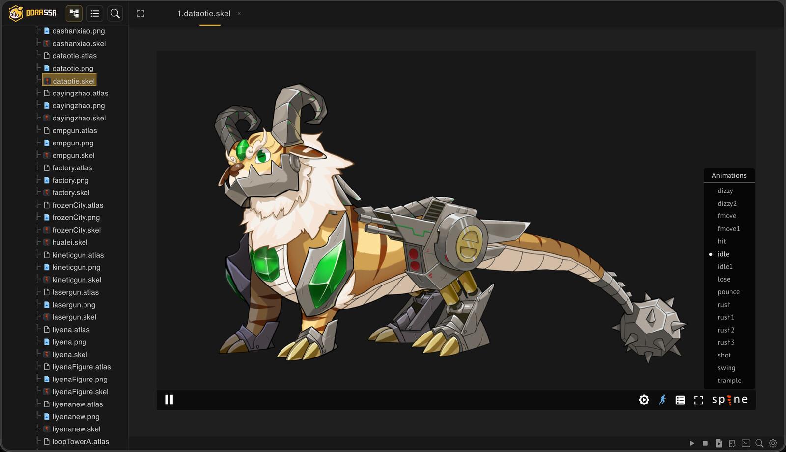
<sub><b>Spine preview</b> — inspecting skeletal animation data</sub>
</td>
</tr>
<tr>
<td width='50%' align='center' valign='top'>
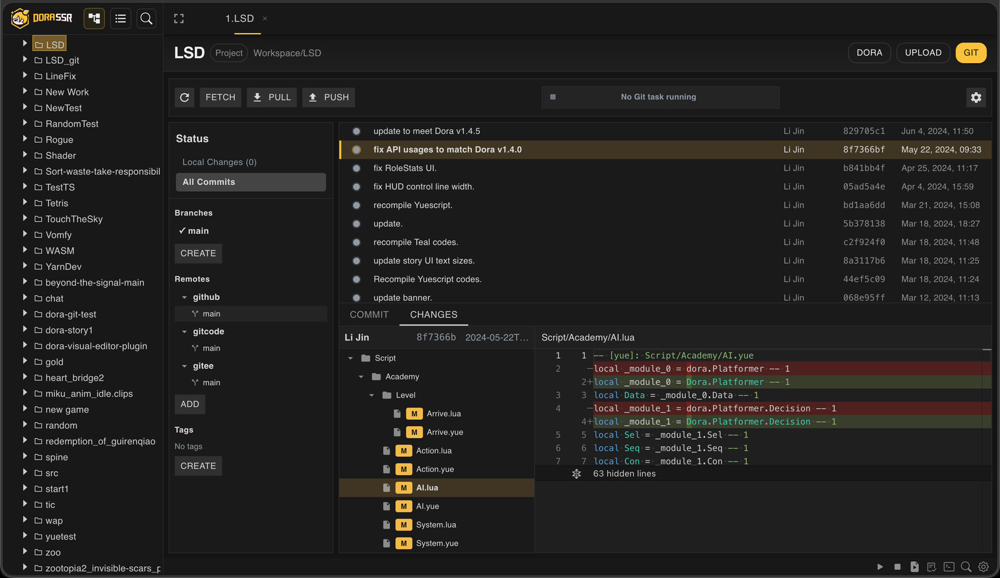
<sub><b>Git client</b> — history, remotes, and changes</sub>
</td>
<td width='50%' align='center' valign='top'>
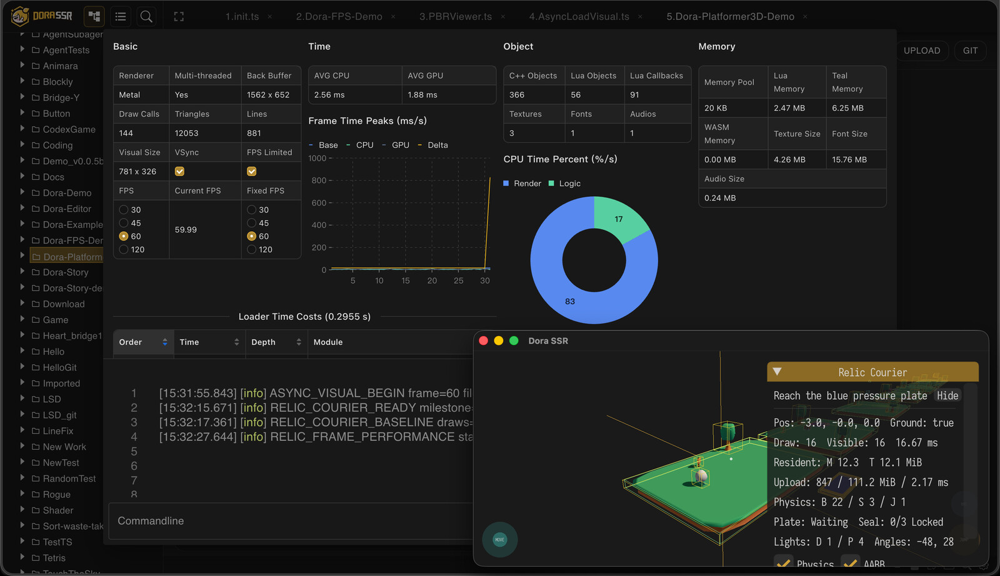
<sub><b>Profiler</b> — runtime performance and debugging</sub>
</td>
</tr>
</table>

Also built in: a TIC-80 editor, tile-map support, an Excel-to-database workflow, and Blockly for Scratch-style visual scripting.

## Runtime Capabilities

- **Scenes & 3D** — tree-based 2D and 3D scenes, an approachable [ECS](https://dora-ssr.net/docs/tutorial/using-ecs) module, cameras, materials, lighting, models, animation, and 3D physics.
- **2D production** — Spine2D, DragonBones, built-in skeletal animation, [PlayRho](https://github.com/louis-langholtz/PlayRho) physics, tile maps, particles, and retro TIC-80 content.
- **Graphics & media** — asynchronous asset loading, Ogg/Theora video, multi-format spatial audio, runtime shader compilation, Effekseer, NanoVG, ImGui, and TrueType rendering.
- **UI & narrative** — CSS Flex layout, responsive TSX interfaces, and [Yarn Spinner](https://www.yarnspinner.dev) story scripting.
- **Data** — asynchronous [SQLite](https://www.sqlite.org) access plus Excel-to-database workflows.
- **Game patterns** — reusable logic and AI support for [2D platformers](https://dora-ssr.net/docs/example/Platformer%20Tutorial/start), and a machine-learning gameplay framework.

<div align='center'>

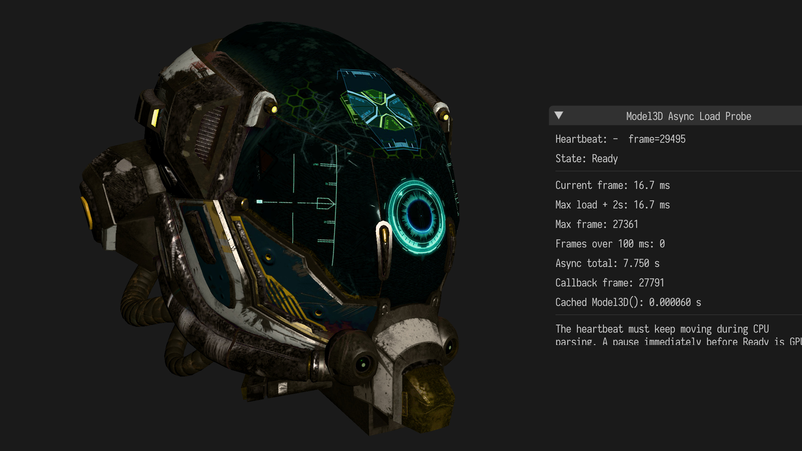

</div>

## Languages

Write game code in the language your team already knows — they all drive the same engine APIs:


Prefer blocks over text? Blockly provides Scratch-style visual scripting for teaching and prototyping.

<div align='center'>

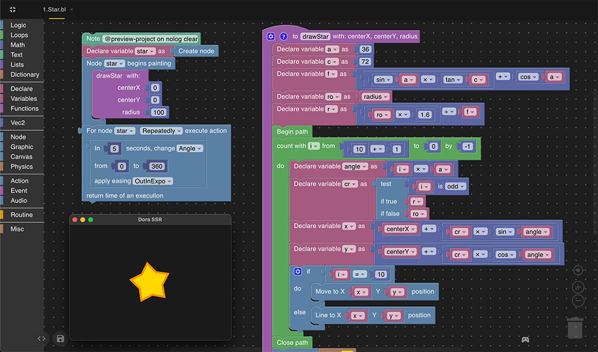

</div>

A taste of TSX — declarative scenes with React-style APIs, compiled with [TSTL](https://typescripttolua.github.io):

```tsx
import { React, toNode } from 'DoraX';
import { Ease } from 'Dora';

toNode(
  <sprite file='Image/logo.png'>
    <sequence>
      <event name="Count" param="3"/>
      <delay time={1}/>
      <event name="Count" param="2"/>
      <delay time={1}/>
      <event name="Count" param="1"/>
      <delay time={1}/>
      <scale time={0.1} start={1} stop={0.5}/>
      <scale time={0.5} start={0.5} stop={1} easing={Ease.OutBack}/>
    </sequence>
  </sprite>
)?.slot("Count", (_, param) => print(param));
```

<div align='center'>

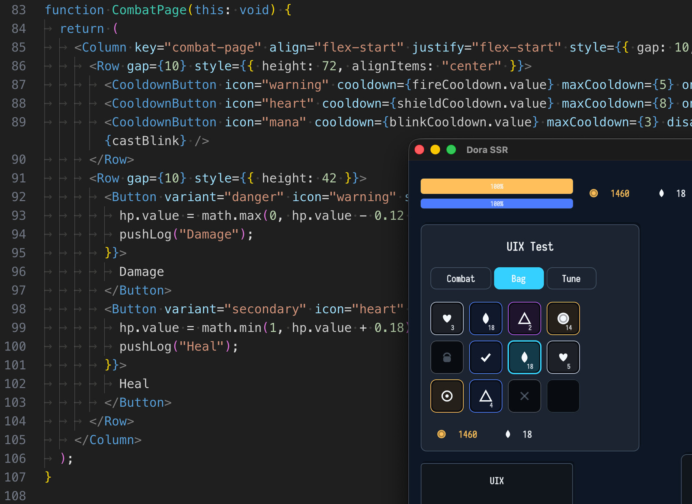

<sub>TSX code and the responsive UI it renders, live in the runtime.</sub>

</div>

<details>
<summary><b>Hello World in every supported language</b></summary>

<br/>

**Lua**

```lua
local _ENV = Dora

local sprite = Sprite("Image/logo.png")
sprite:once(function()
  for i = 3, 1, -1 do
    print(i)
    sleep(1)
  end
  print("Hello World")
  sprite:perform(Sequence(
    Scale(0.1, 1, 0.5),
    Scale(0.5, 0.5, 1, Ease.OutBack)
  ))
end)
```

**Teal**

```lua
local sleep <const> = require("sleep")
local Ease <const> = require("Ease")
local Scale <const> = require("Scale")
local Sequence <const> = require("Sequence")
local Sprite <const> = require("Sprite")

local sprite = Sprite("Image/logo.png")
if not sprite is nil then
  sprite:once(function()
    for i = 3, 1, -1 do
      print(i)
      sleep(1)
    end
    print("Hello World")
    sprite:perform(Sequence(
      Scale(0.1, 1, 0.5),
      Scale(0.5, 0.5, 1, Ease.OutBack)
    ))
  end)
end
```

**YueScript** — the story of this niche language supported by Dora SSR can be found [here](https://dora-ssr.net/blog/2024/4/17/a-moon-script-tale).

```moonscript
_ENV = Dora

with Sprite "Image/logo.png"
   \once ->
     for i = 3, 1, -1
       print i
       sleep 1
     print "Hello World!"
     \perform Sequence(
       Scale 0.1, 1, 0.5
       Scale 0.5, 0.5, 1, Ease.OutBack
     )
```

**TypeScript**

```typescript
import { Sprite, Ease, Scale, Sequence, sleep } from 'Dora';

const sprite = Sprite("Image/logo.png");
if (sprite) {
  sprite.once(() => {
    for (let i of $range(3, 1, -1)) {
      print(i);
      sleep(1);
    }
    print("Hello World");
    sprite.perform(Sequence(
      Scale(0.1, 1, 0.5),
      Scale(0.5, 0.5, 1, Ease.OutBack)
    ))
  });
}
```

**TSX, reactive style** — use `toNode()` for one-shot scene construction, or `createRoot()` with `signal()` when the TSX tree should update by diffing changed data. Take the tutorials [here](https://dora-ssr.net/blog/2024/4/25/tsx-dev-intro).

```tsx
import { React, createRoot, signal } from 'DoraX';
import { Director } from 'Dora';

const count = signal(0);
const root = createRoot(Director.entry);

root.render(() => (
  <label fontName="sarasa-mono-sc-regular" fontSize={30}>
    Count: {count.value}
  </label>
));

count.value += 1;
```

**Wa** — runs as a scripting language on the built-in WASM runtime, with hot-reloading dev experience.

```go
import "dora"

func init {
  sprite := dora.NewSpriteWithFile("Image/logo.png")
  sprite.RunActionDef(
    dora.ActionDefSequence(&[]dora.ActionDef{
      dora.ActionDefEvent("Count", "3"),
      dora.ActionDefDelay(1),
      dora.ActionDefEvent("Count", "2"),
      dora.ActionDefDelay(1),
      dora.ActionDefEvent("Count", "1"),
      dora.ActionDefDelay(1),
      dora.ActionDefScale(0.1, 1, 0.5, dora.EaseLinear),
      dora.ActionDefScale(0.5, 0.5, 1, dora.EaseOutBack),
    }),
    false,
  )
  sprite.Slot("Count", func(stack: dora.CallStack) {
    stack.Pop()
    param, _ := stack.PopStr()
    dora.Println(param)
  })
}
```

**Rust** — build your code into a WASM file named `init.wasm` and upload it to the engine to run. Details [here](https://dora-ssr.net/blog/2024/4/15/rusty-game-dev).

```rust
use dora_ssr::*;

fn main () {
  let mut sprite = match Sprite::with_file("Image/logo.png") {
    Some(sprite) => sprite,
    None => return,
  };
  let mut sprite_clone = sprite.clone();
  sprite.schedule(once(move |mut co| async move {
    for i in (1..=3).rev() {
      p!("{}", i);
      sleep!(co, 1.0);
    }
    p!("Hello World");
    sprite_clone.perform_def(ActionDef::sequence(&vec![
      ActionDef::scale(0.1, 1.0, 0.5, EaseType::Linear),
      ActionDef::scale(0.5, 0.5, 1.0, EaseType::OutBack),
    ]));
  }));
}
```

</details>

## Games Built with Dora

<table>
<tr>
<td width='50%' align='center' valign='top'>
<a href="https://github.com/IppClub/Dora-Demo/tree/main/Loli%20War"><b>Loli War</b></a>
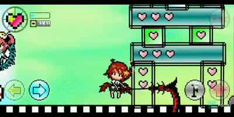
</td>
<td width='50%' align='center' valign='top'>
<a href="https://github.com/IppClub/Dora-Demo/tree/main/Zombie%20Escape"><b>Zombie Escape</b></a>
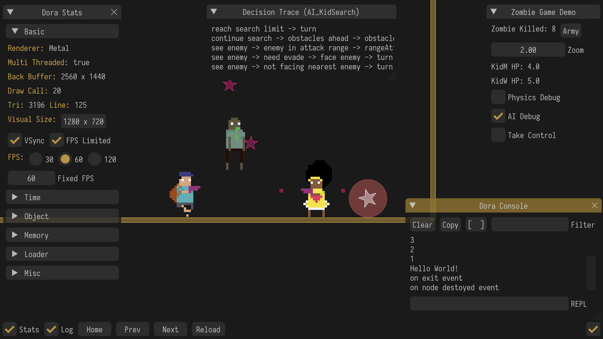
</td>
</tr>
<tr>
<td width='50%' align='center' valign='top'>
<a href="https://github.com/IppClub/Dora-Demo/tree/main/Dismantlism"><b>Dismantlism</b></a>
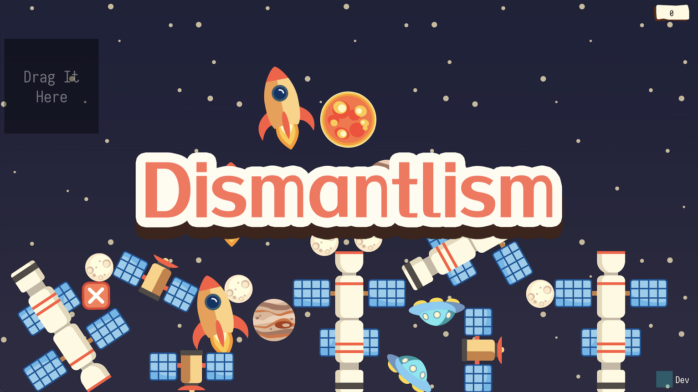
</td>
<td width='50%' align='center' valign='top'>
<a href="https://github.com/IppClub/LSD"><b>Luv Sense Digital</b></a>
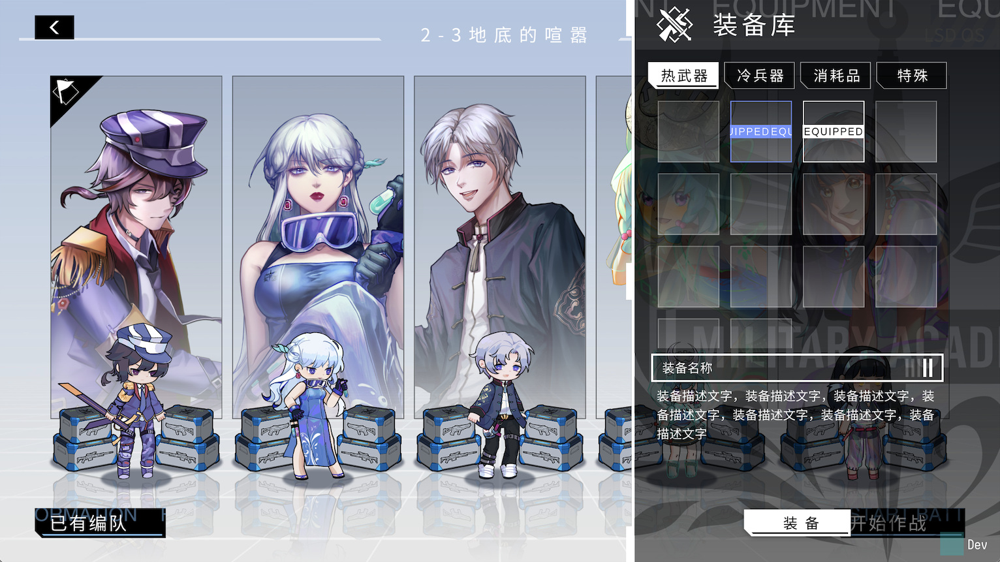
</td>
</tr>
</table>

- Learn individual APIs and engine features with [Dora-Example](https://github.com/IppClub/Dora-Example/tree/master/Example).
- See how real projects organize assets, scripts, and gameplay with [Dora-Demo](https://github.com/IppClub/Dora-Demo).

## Installation

### Android

1. Install the [APK](https://github.com/IppClub/Dora-SSR/releases/latest) on the target device.
2. Launch the app — it displays an address to open from a browser on any device on the same network.
3. Open the address in a browser, and the Web IDE is ready.

### Windows

> [!IMPORTANT]
> Install the x86 [Visual C++ Redistributable for Visual Studio 2022](https://learn.microsoft.com/en-us/cpp/windows/latest-supported-vc-redist?view=msvc-170) first.

Download and extract the [release](https://github.com/IppClub/Dora-SSR/releases/latest), launch the app, and open the displayed address in a browser.

### macOS

Download and extract the [release](https://github.com/IppClub/Dora-SSR/releases/latest), or install with [Homebrew](https://brew.sh):

```sh
brew install --cask ippclub/tap/dora-ssr
```

Launch the app and open the displayed address in a browser.

### Linux

**Ubuntu Jammy**

```sh
sudo add-apt-repository ppa:ippclub/dora-ssr
sudo apt update
sudo apt install dora-ssr
```

**Debian Bookworm**

```sh
sudo apt-key adv --keyserver hkp://keyserver.ubuntu.com:80 --recv-keys 9C7705BF
sudo add-apt-repository -S "deb https://ppa.launchpadcontent.net/ippclub/dora-ssr/ubuntu jammy main"
sudo apt update
sudo apt install dora-ssr
```

Launch the app and open the displayed address in a browser.

### Build from Source

See the [official guide](https://dora-ssr.net/docs/tutorial/dev-configuration).

<div align='center'>


</div>

### From Install to First Game

1. In the Web IDE, right-click `Workspace` in the left panel and create a new folder for your project.
2. Add an entry file named `init` — Lua, YueScript, Teal, TypeScript, or TSX (see [Languages](#languages)).
3. Press `Ctrl + R`, or click the `🎮` icon in the lower-right corner and choose `Run` — the game runs on the device.
4. Right-click the project folder and choose `Download` to export the packaged project.

> [!TIP]
> The [Quick Start tutorial](https://dora-ssr.net/docs/tutorial/quick-start) walks through all of this in detail.

## Documentation & Community

- **Learn** — [Quick Start](https://dora-ssr.net/docs/tutorial/quick-start) · [API Reference](https://dora-ssr.net/docs/api/intro) · [Ask DeepWiki](https://deepwiki.com/IppClub/Dora-SSR)
- **Community** — [Discord](https://discord.gg/ZfNBSKXnf9) · [QQ Group 512620381](https://qm.qq.com/q/VnzYhvCDgy)
- **Examples** — [Dora-Example](https://github.com/IppClub/Dora-Example) · [Dora-Demo](https://github.com/IppClub/Dora-Demo)

Dora SSR is developed by [IppClub](https://ippclub.org) — come build with us!

## Contribute

Issues and pull requests are welcome! Please read the [Contributing Guidelines](CONTRIBUTING.md) first.

## Open Atom Foundation

Dora SSR is a donation and incubation project of the [Open Atom Foundation](https://openatom.org/project/RJHufNnSKtDZ), a non-profit foundation supporting open-source technologies. We are committed to building a more open and collaborative game-development environment.

<div align='center'>


</div>

## License

Dora SSR is released under the [MIT License](LICENSE.txt).

> [!NOTE]
> Please note that Dora SSR integrates the Spine Runtime library, which is a **commercial software**. The use of Spine Runtime in your projects requires a valid commercial license from Esoteric Software. For more details on obtaining the license, please visit the [official Spine website](http://esotericsoftware.com/).<br>
> Make sure to comply with all licensing requirements when using Spine Runtime in your projects. Alternatively, you can use the integrated open-source **DragonBones** system as an animation system replacement. If you only need to create simpler animations, you may also explore the Model animation module provided by Dora SSR to see if it meets your needs.
