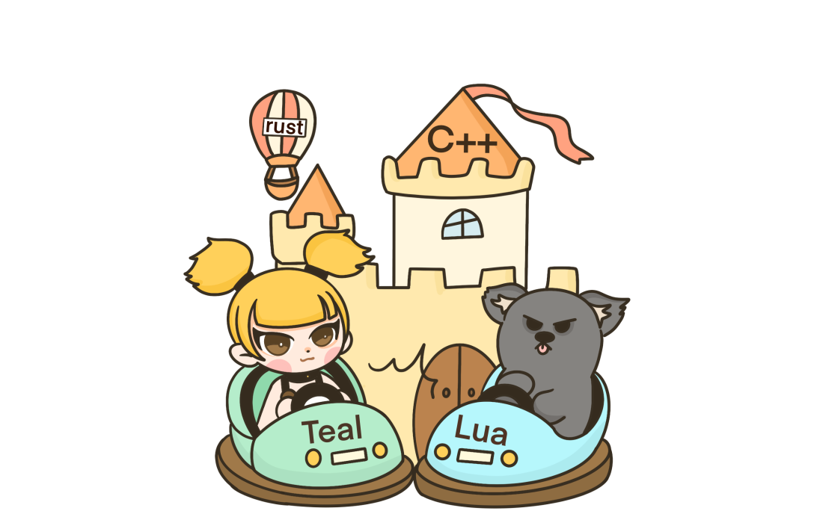
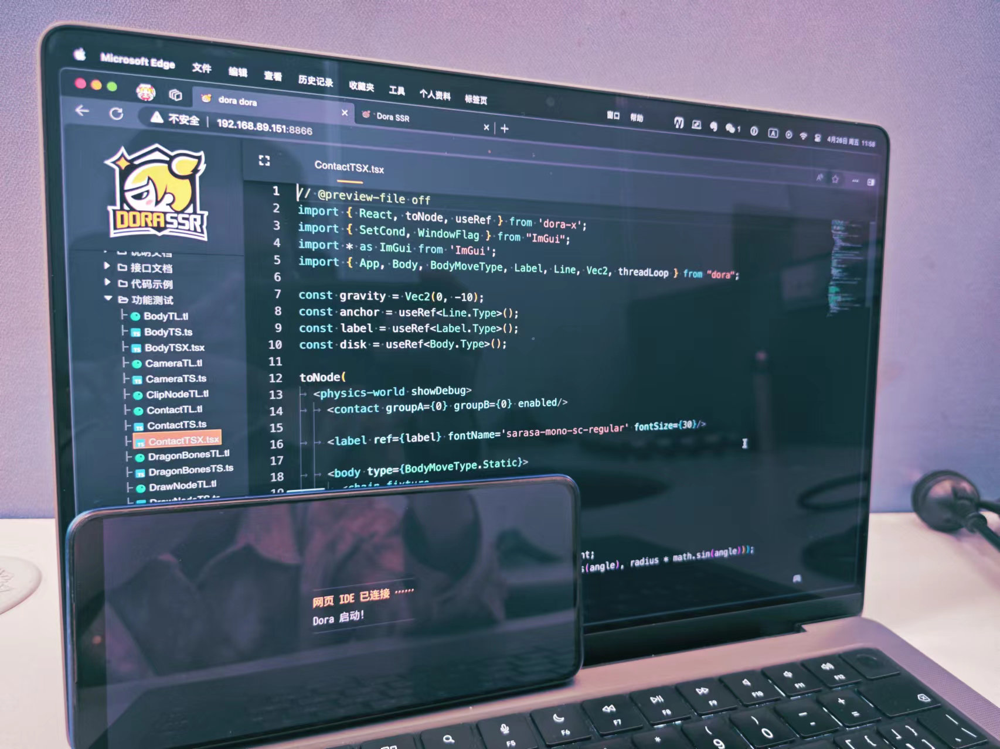
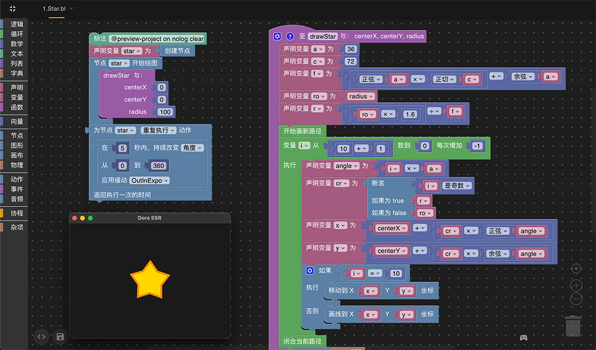
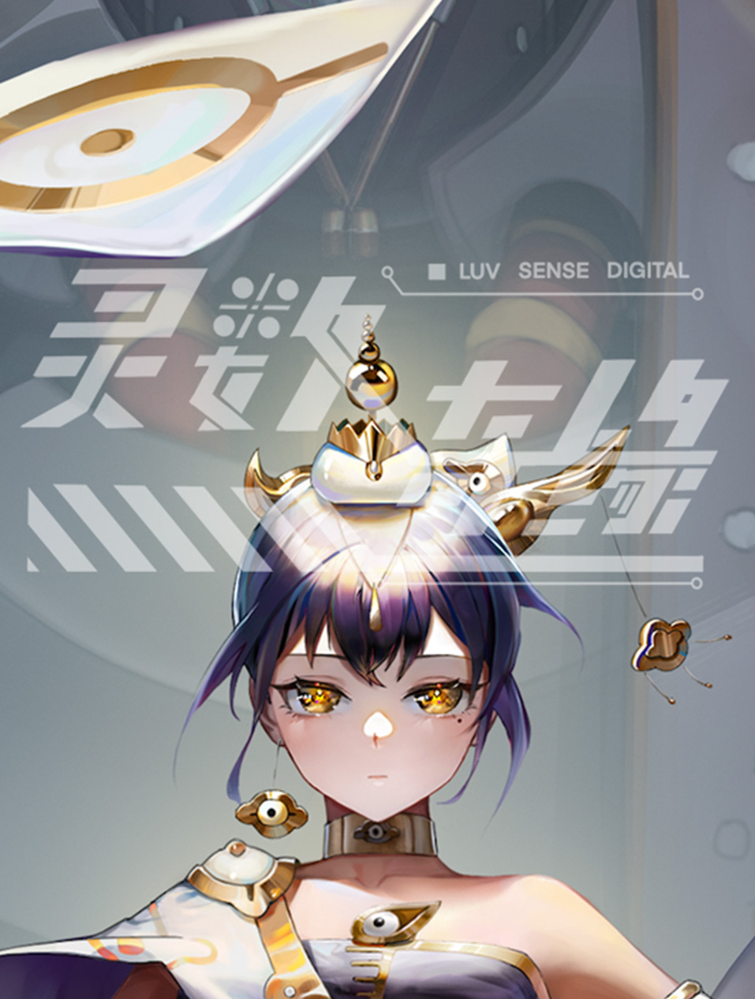
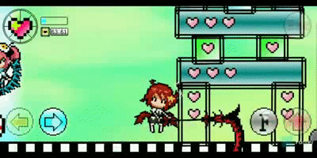
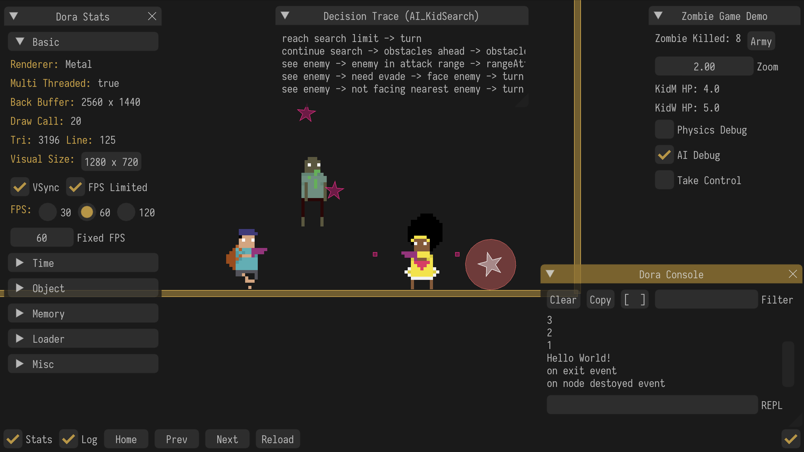
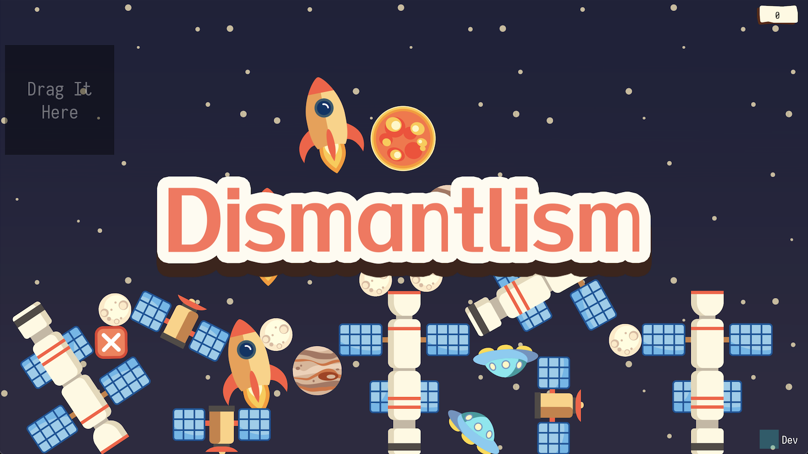
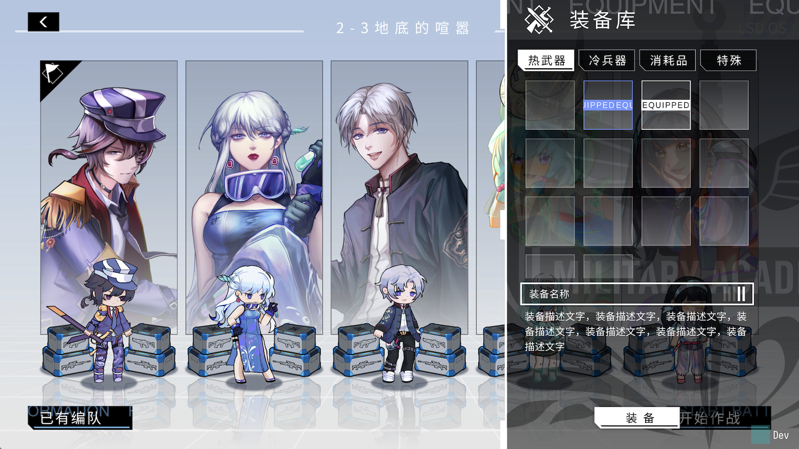

# 多萝珍奇引擎（Dora SSR）

<table align="center" width="100%">
<tr>
<td width="240" valign="middle" align="center">

<br/>
<sub>Web IDE · Coding Agent</sub><br/>
<sub>真机开发引擎</sub>
</td>
<td valign="middle" align="center">

</td>
</tr>
</table>


#### [English](README.md)  | 中文

[![IppClub](https://img.shields.io/badge/I%2B%2B%E4%BF%B1%E4%B9%90%E9%83%A8-%E8%AE%A4%E8%AF%81-11A7E2?logo=data%3Aimage%2Fsvg%2Bxml%3Bcharset%3Dutf-8%3Bbase64%2CPHN2ZyB2aWV3Qm94PSIwIDAgMjg4IDI3NCIgeG1sbnM9Imh0dHA6Ly93d3cudzMub3JnLzIwMDAvc3ZnIiB4bWw6c3BhY2U9InByZXNlcnZlIiBzdHlsZT0iZmlsbC1ydWxlOmV2ZW5vZGQ7Y2xpcC1ydWxlOmV2ZW5vZGQ7c3Ryb2tlLWxpbmVqb2luOnJvdW5kO3N0cm9rZS1taXRlcmxpbWl0OjIiPjxwYXRoIGQ9Im0xNDYgMzEgNzIgNTVWMzFoLTcyWiIgc3R5bGU9ImZpbGw6I2Y2YTgwNjtmaWxsLXJ1bGU6bm9uemVybyIvPjxwYXRoIGQ9Im0xNjkgODYtMjMtNTUgNzIgNTVoLTQ5WiIgc3R5bGU9ImZpbGw6I2VmN2EwMDtmaWxsLXJ1bGU6bm9uemVybyIvPjxwYXRoIGQ9Ik0yNiAzMXY1NWg4MEw4MSAzMUgyNloiIHN0eWxlPSJmaWxsOiMwN2ExN2M7ZmlsbC1ydWxlOm5vbnplcm8iLz48cGF0aCBkPSJNMTA4IDkydjExMmwzMS00OC0zMS02NFoiIHN0eWxlPSJmaWxsOiNkZTAwNWQ7ZmlsbC1ydWxlOm5vbnplcm8iLz48cGF0aCBkPSJNMCAyNzR2LTUyaDk3bC0zMyA1MkgwWiIgc3R5bGU9ImZpbGw6I2Y2YTgwNjtmaWxsLXJ1bGU6bm9uemVybyIvPjxwYXRoIGQ9Im03NyAyNzQgNjctMTA3djEwN0g3N1oiIHN0eWxlPSJmaWxsOiNkZjI0MzM7ZmlsbC1ydWxlOm5vbnplcm8iLz48cGF0aCBkPSJNMTUyIDI3NGgyOWwtMjktNTN2NTNaIiBzdHlsZT0iZmlsbDojMzM0ODVkO2ZpbGwtcnVsZTpub256ZXJvIi8%2BPHBhdGggZD0iTTE5MSAyNzRoNzl2LTUySDE2N2wyNCA1MloiIHN0eWxlPSJmaWxsOiM0ZTI3NWE7ZmlsbC1ydWxlOm5vbnplcm8iLz48cGF0aCBkPSJNMjg4IDEwMGgtMTdWODVoLTEzdjE1aC0xN3YxM2gxN3YxNmgxM3YtMTZoMTd2LTEzWiIgc3R5bGU9ImZpbGw6I2M1MTgxZjtmaWxsLXJ1bGU6bm9uemVybyIvPjxwYXRoIGQ9Im0yNiA4NiA1Ni01NUgyNnY1NVoiIHN0eWxlPSJmaWxsOiMzMzQ4NWQ7ZmlsbC1ydWxlOm5vbnplcm8iLz48cGF0aCBkPSJNOTMgMzFoNDJsLTMwIDI5LTEyLTI5WiIgc3R5bGU9ImZpbGw6IzExYTdlMjtmaWxsLXJ1bGU6bm9uemVybyIvPjxwYXRoIGQ9Ik0xNTggMTc2Vjg2bC0zNCAxNCAzNCA3NloiIHN0eWxlPSJmaWxsOiMwMDU5OGU7ZmlsbC1ydWxlOm5vbnplcm8iLz48cGF0aCBkPSJtMTA2IDU5IDQxLTEtMTItMjgtMjkgMjlaIiBzdHlsZT0iZmlsbDojMDU3Y2I3O2ZpbGwtcnVsZTpub256ZXJvIi8%2BPHBhdGggZD0ibTEyNCAxMDAgMjItNDEgMTIgMjctMzQgMTRaIiBzdHlsZT0iZmlsbDojNGUyNzVhO2ZpbGwtcnVsZTpub256ZXJvIi8%2BPHBhdGggZD0ibTEwNiA2MCA0MS0xLTIzIDQxLTE4LTQwWiIgc3R5bGU9ImZpbGw6IzdiMTI4NTtmaWxsLXJ1bGU6bm9uemVybyIvPjxwYXRoIGQ9Im0xMDggMjA0IDMxLTQ4aC0zMXY0OFoiIHN0eWxlPSJmaWxsOiNiYTAwNzc7ZmlsbC1ydWxlOm5vbnplcm8iLz48cGF0aCBkPSJtNjUgMjc0IDMzLTUySDBsNjUgNTJaIiBzdHlsZT0iZmlsbDojZWY3YTAwO2ZpbGwtcnVsZTpub256ZXJvIi8%2BPHBhdGggZD0iTTc3IDI3NGg2N2wtNDAtNDUtMjcgNDVaIiBzdHlsZT0iZmlsbDojYTgxZTI0O2ZpbGwtcnVsZTpub256ZXJvIi8%2BPHBhdGggZD0iTTE2NyAyMjJoNThsLTM0IDUyLTI0LTUyWiIgc3R5bGU9ImZpbGw6IzExYTdlMjtmaWxsLXJ1bGU6bm9uemVybyIvPjxwYXRoIGQ9Im0yNzAgMjc0LTQ0LTUyLTM1IDUyaDc5WiIgc3R5bGU9ImZpbGw6IzA1N2NiNztmaWxsLXJ1bGU6bm9uemVybyIvPjxwYXRoIGQ9Ik0yNzUgNTVoLTU3VjBoMjV2MzFoMzJ2MjRaIiBzdHlsZT0iZmlsbDojZGUwMDVkO2ZpbGwtcnVsZTpub256ZXJvIi8%2BPHBhdGggZD0iTTE4NSAzMWg1N3Y1NWgtMjVWNTVoLTMyVjMxWiIgc3R5bGU9ImZpbGw6I2M1MTgxZjtmaWxsLXJ1bGU6bm9uemVybyIvPjwvc3ZnPg%3D%3D&labelColor=fff)](https://ippclub.org) [](https://openatom.org/project/RJHufNnSKtDZ) [](https://deepwiki.com/IppClub/Dora-SSR) [](https://qm.qq.com/q/VnzYhvCDgy) [](https://discord.gg/ZfNBSKXnf9)

&emsp;&emsp;Dora SSR 是一个用于多种设备上快速开发游戏的游戏引擎。它内置易用的 Web IDE 开发工具链，支持在手机、开源掌机等设备上直接进行游戏开发。

<br/>

## 快速入口

- [快速体验](https://dora-ssr.net/zh-Hans/docs/tutorial/quick-start)
- [功能示例代码](https://github.com/IppClub/Dora-Example/tree/master/Example)
- [完整项目示例](https://github.com/IppClub/Dora-Demo)
- [最新发布下载](https://github.com/ippclub/Dora-SSR/releases/latest)

## 技术概览

|方向|内容|
|-|-|
|开发方式|`Web IDE` + `Coding Agent` + 在目标设备运行、通过浏览器接入的实时开发流程|
|语言生态|`Lua` / `TypeScript` / `TSX` / `Teal` / `YueScript` / `Wa` / `Rust` / `C#`|
|运行平台|`Android` / `Windows` / `Linux` / `macOS` / `iOS` / [鸿蒙](https://github.com/IppClub/ohos_dora_ssr/blob/main/README.zh-CN.md)|

<div align='center'><sub>跨平台持续集成状态</sub></div>


<div align='center'></div>

## 主要特点

### 开发体验

- Web IDE：内置开箱即用的网页开发环境，提供文件管理、代码检查、补全、高亮与定义跳转。
- Coding Agent：内置跨平台 coding agent 助手，可围绕项目目录执行代码分析、搜索、编辑、修复与总结。
- 真机实时开发：支持在手机、掌机等目标设备上运行引擎，并通过浏览器接入 Web IDE 进行实时开发与调试。

<div align='center'></div>

### 语言与扩展

- Lua：升级的 Lua 绑定，支持继承和扩展底层 C++ 对象。
- TypeScript / TSX：支持静态类型脚本开发与声明式场景构建。
- Teal / YueScript：兼容 Lua 生态的不同风格语言选择。
- Wa / Rust：支持通过内置 WASM 运行时扩展引擎能力。
- C#：支持通过动态库方式调用引擎进行原生开发。
- Blockly：支持类似 Scratch 的可视化编程，适合教学与初学者入门。

<div align='center'></div>

### 运行与表现

- 跨平台支持：原生运行于 `Android`、`Windows`、`Linux`、`iOS`、`macOS` 与 `鸿蒙`。
- 场景系统：基于树形节点结构管理游戏对象，并提供易用的 [ECS](https://dora-ssr.net/zh-Hans/docs/tutorial/using-ecs) 模块。
- 异步处理：支持文件读写、资源加载等异步任务。
- 2D 动画与物理：支持 Spine2D、DragonBones、内置骨骼动画与 [PlayRho](https://github.com/louis-langholtz/PlayRho) 2D 物理。
- 视频与音频：支持 H.264 视频播放，以及多格式音频播放、3D 空间音效、距离衰减与多普勒效果。
- 图形能力：支持 Effekseer 特效、NanoVG 矢量图形、ImGui 调试界面与 True Type 字体渲染。
- 游戏类型支持：提供 [2D 平台游戏](https://dora-ssr.net/zh-Hans/docs/example/Platformer%20Tutorial/start) 的基本逻辑与 AI 开发框架。

### 内容与工具链

- 数据与配置：支持异步操作 [SQLite](https://www.sqlite.org) 与 Excel 数据同步。
- 场景与叙事：支持 CSS Flex 布局、Tiled TMX 地图与 [Yarn Spinner](https://www.yarnspinner.dev) 故事系统。
- 创作扩展：内置机器学习玩法框架，并提供开放美术素材与游戏 IP —— [《灵数奇缘》](https://luv-sense-digital.readthedocs.io)。

<div align='center'></div>

<br>

## 从这里开始

- 功能示例：参考 [Dora-Example](https://github.com/IppClub/Dora-Example/tree/master/Example) 了解各项 API 与引擎能力的最小用法。
- 完整项目：参考 [Dora-Demo](https://github.com/IppClub/Dora-Demo) 了解如何组织资源、脚本与游戏逻辑。

### 精选示例项目

- [示例项目 - Loli War](https://github.com/IppClub/Dora-Demo/tree/main/Loli%20War)

<div align='center'></div>

<br>

- [示例项目 - Zombie Escape](https://github.com/IppClub/Dora-Demo/tree/main/Zombie%20Escape)

<div align='center'></div>

<br>

- [示例项目 - Dismentalism](https://github.com/IppClub/Dora-Demo/tree/main/Dismantlism)

<div align='center'></div>

<br>

- [示例项目 - Luv Sense Digital](https://github.com/IppClub/LSD)

<div align='center'></div>

<br>


## 安装配置

### Android

- 获取：在目标设备上下载并安装 [APK](https://github.com/ippclub/Dora-SSR/releases/latest) 包。
- 运行：启动软件，并通过局域网内 PC、平板或其他开发设备上的浏览器访问软件显示的地址。
- 开始：进入 Web IDE 开始游戏开发。

### Windows

- 依赖：先安装 Visual Studio 2022 的 X86 Visual C++ 可再发行组件包，可从[微软网站](https://learn.microsoft.com/zh-cn/cpp/windows/latest-supported-vc-redist?view=msvc-170)下载。
- 获取：下载并解压[软件](https://github.com/ippclub/Dora-SSR/releases/latest)。
- 运行：启动软件，并通过浏览器访问软件显示的地址。
- 开始：进入 Web IDE 开始游戏开发。

### macOS

- 获取：下载并解压[软件](https://github.com/ippclub/Dora-SSR/releases/latest)，或通过 [Homebrew](https://brew.sh) 安装：
	```sh
	brew install --cask ippclub/tap/dora-ssr
	```
- 运行：启动软件，并通过浏览器访问软件显示的地址。
- 开始：进入 Web IDE 开始游戏开发。

### Linux

- 获取：按系统版本安装软件。
	- Ubuntu Jammy
	```sh
	sudo add-apt-repository ppa:ippclub/dora-ssr
	sudo apt update
	sudo apt install dora-ssr
	```
	- Debian Bookworm
	```sh
	sudo apt-key adv --keyserver hkp://keyserver.ubuntu.com:80 --recv-keys 9C7705BF
	sudo add-apt-repository -S "deb https://ppa.launchpadcontent.net/ippclub/dora-ssr/ubuntu jammy main"
	sudo apt update
	sudo apt install dora-ssr
	```
- 运行：启动软件，并通过浏览器访问软件显示的地址。
- 开始：进入 Web IDE 开始游戏开发。

### Linux 软件源

- Ubuntu Jammy：
	```sh
	sudo add-apt-repository ppa:ippclub/dora-ssr
	sudo apt update
	sudo apt install dora-ssr
	```
- Debian Bookworm：
	```sh
	sudo apt-key adv --keyserver hkp://keyserver.ubuntu.com:80 --recv-keys 9C7705BF
	sudo add-apt-repository -S "deb https://ppa.launchpadcontent.net/ippclub/dora-ssr/ubuntu jammy main"
	sudo apt update
	sudo apt install dora-ssr
	```

### 编译构建引擎

- 需要自行编译 Dora SSR 项目时，详见[官方文档](https://dora-ssr.net/zh-Hans/docs/tutorial/dev-configuration)。

<br>

## 快速上手

- 第一步：创建一个新项目
	- 在浏览器中，打开 Dora Dora 编辑器左侧 `工作空间` 的右键菜单。
	- 点击菜单项 `新建`，选择新建文件夹。

- 第二步：编写游戏代码
	- 在项目文件夹下新建游戏入口代码文件，选择 Lua  (YueScript, Teal, TypeScript 或 TSX) 语言命名为 `init`。
	- 编写 Hello World 代码：

- **Lua**

```lua
local _ENV = Dora

local sprite = Sprite("Image/logo.png")
sprite:once(function()
  for i = 3, 1, -1 do
    print(i)
    sleep(1)
  end
  print("Hello World")
  sprite:perform(Sequence(
    Scale(0.1, 1, 0.5),
    Scale(0.5, 0.5, 1, Ease.OutBack)
  ))
end)
```

- **Teal**

```lua
local sleep <const> = require("sleep")
local Ease <const> = require("Ease")
local Scale <const> = require("Scale")
local Sequence <const> = require("Sequence")
local Sprite <const> = require("Sprite")

local sprite = Sprite("Image/logo.png")
if not sprite is nil then
  sprite:once(function()
    for i = 3, 1, -1 do
      print(i)
      sleep(1)
    end
    print("Hello World")
    sprite:perform(Sequence(
      Scale(0.1, 1, 0.5),
      Scale(0.5, 0.5, 1, Ease.OutBack)
    ))
  end)
end
```

- **YueScript**

&emsp;&emsp;有关 Dora SSR 所支持的 YueScript 这门小众语言的故事在[这里](https://dora-ssr.net/zh-Hans/blog/2024/4/17/a-moon-script-tale)。
```moonscript
_ENV = Dora

with Sprite "Image/logo.png"
   \once ->
     for i = 3, 1, -1
       print i
       sleep 1
     print "Hello World!"
     \perform Sequence(
       Scale 0.1, 1, 0.5
       Scale 0.5, 0.5, 1, Ease.OutBack
     )
```

- **TypeScript**

```typescript
import { Sprite, Ease, Scale, Sequence, sleep } from 'Dora';

const sprite = Sprite("Image/logo.png");
if (sprite) {
  sprite.once(() => {
    for (let i of $range(3, 1, -1)) {
      print(i);
      sleep(1);
    }
    print("Hello World");
    sprite.perform(Sequence(
      Scale(0.1, 1, 0.5),
      Scale(0.5, 0.5, 1, Ease.OutBack)
    ))
  });
}
```

- **TSX**

&emsp;&emsp;使用 TSX 语言来创建 Dora SSR 的游戏场景是一个比较容易上手的选择。新手教程可以参见[这里](https://dora-ssr.net/zh-Hans/blog/2024/4/25/tsx-dev-intro)。

```tsx
import { React, toNode } from 'DoraX';
import { Ease } from 'Dora';

toNode(
  <sprite file='Image/logo.png'>
    <sequence>
      <event name="Count" param="3"/>
      <delay time={1}/>
      <event name="Count" param="2"/>
      <delay time={1}/>
      <event name="Count" param="1"/>
      <delay time={1}/>
      <scale time={0.1} start={1} stop={0.5}/>
      <scale time={0.5} start={0.5} stop={1} easing={Ease.OutBack}/>
    </sequence>
  </sprite>
)?.slot("Count", (_, param) => print(param));
```

- **Wa**

&emsp;&emsp;你可以使用 Wa 作为一门脚本语言，运行在 Dora SSR 内置的 WASM 运行时上，并获得热重载的开发体验。

```go
import "dora"

func init {
  sprite := dora.NewSpriteWithFile("Image/logo.png")
  sprite.RunActionDef(
    dora.ActionDefSequence(&[]dora.ActionDef{
      dora.ActionDefEvent("Count", "3"),
      dora.ActionDefDelay(1),
      dora.ActionDefEvent("Count", "2"),
      dora.ActionDefDelay(1),
      dora.ActionDefEvent("Count", "1"),
      dora.ActionDefDelay(1),
      dora.ActionDefScale(0.1, 1, 0.5, dora.EaseLinear),
      dora.ActionDefScale(0.5, 0.5, 1, dora.EaseOutBack),
    }),
    false,
  )
  sprite.Slot("Count", func(stack: dora.CallStack) {
    stack.Pop()
    param, _ := stack.PopStr()
    dora.Println(param)
  })
}
```

- **Rust**

&emsp;&emsp;Dora SSR 也支持使用 Rust 语言来编写游戏代码，编译为 WASM 文件，命名为 `init.wasm` 再上传到引擎中加载运行。详情见[这里](https://dora-ssr.net/zh-Hans/blog/2024/4/15/rusty-game-dev)。

```rust
use dora_ssr::*;

fn main () {
  let mut sprite = match Sprite::with_file("Image/logo.png") {
    Some(sprite) => sprite,
    None => return,
  };
  let mut sprite_clone = sprite.clone();
  sprite.schedule(once(move |mut co| async move {
    for i in (1..=3).rev() {
      p!("{}", i);
      sleep!(co, 1.0);
    }
    p!("Hello World");
    sprite_clone.perform_def(ActionDef::sequence(&vec![
      ActionDef::scale(0.1, 1.0, 0.5, EaseType::Linear),
      ActionDef::scale(0.5, 0.5, 1.0, EaseType::OutBack),
    ]));
  }));
}
```

- 第三步：运行游戏

&emsp;&emsp;点击编辑器右下角 `🎮` 图标，然后点击菜单项 `运行`。或者按下组合键 `Ctrl + r`。

- 第四步：发布游戏
	- 通过编辑器左侧游戏资源树，打开刚才新建的项目文件夹的右键菜单，点击 `下载` 选项。
	- 等待浏览器弹出已打包项目文件的下载提示。

&emsp;&emsp;更详细的教程，请查看[官方文档](https://dora-ssr.net/zh-Hans/docs/tutorial/quick-start)。

<br>

## 文档

- [API参考](https://dora-ssr.net/zh-Hans/docs/api/intro)
- [教程](https://dora-ssr.net/zh-Hans/docs/tutorial/quick-start)

<br>

## 社区

- [QQ群：512620381](https://qm.qq.com/cgi-bin/qm/qr?k=7siAhjlLaSMGLHIbNctO-9AJQ0bn0G7i&jump_from=webapi&authKey=Kb6tXlvcJ2LgyTzHQzKwkMxdsQ7sjERXMJ3g10t6b+716pdKClnXqC9bAfrFUEWa)
- [Discord](https://discord.gg/ZfNBSKXnf9)

<br>

## 贡献

&emsp;&emsp;欢迎参与 Dora SSR 的开发和维护。请查看[贡献指南](CONTRIBUTING.zh-CN.md)了解如何提交 Issue 和 Pull Request。

<br>

## Dora SSR 项目现已加入开放原子开源基金会

&emsp;&emsp;我们很高兴地宣布，Dora SSR 项目现已成为开放原子开源基金会的捐赠和孵化期项目。这一新的发展阶段标志着我们致力于建设一个更开放、更协作的游戏开发环境的坚定承诺。

### 关于开放原子开源基金会

&emsp;&emsp;开放原子开源基金会（Open Atom Foundation）是一个非盈利组织，旨在支持和推广开源技术的发展。在该基金会的大家庭中，Dora SSR 会利用更广泛的资源和社区支持，以推动项目的发展和创新。更多信息请查看[基金会官网](https://openatom.org/)。

<div align='center'></div>

<br>

## 许可证

&emsp;&emsp;Dora SSR 使用 [MIT 许可证](LICENSE)。

> [!NOTE]
> 请注意，Dora SSR 集成了 Spine 运行时库，这是一个**商业软件**。在你的项目中使用 Spine 运行时需要获取 Esoteric Software 提供有效的商业许可证。有关获取许可证的更多详细信息，请访问  [Spine 官方网站](http://esotericsoftware.com/)。<br>
> 请确保遵守所有许可要求，再在项目中使用 Spine 运行时。或者可以使用同样集成的开源的 **DragonBones** 系统作为动画系统的替代方案。如果你只需要创建比较简单的动画，也可以使用 Dora SSR 提供的 Model 动画模块看是否能满足需要。
