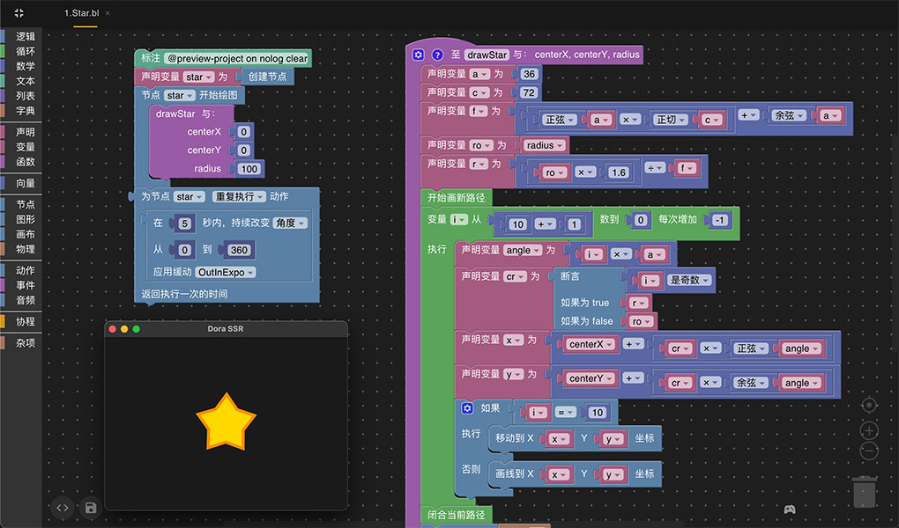

# 多萝珍奇引擎（Dora SSR）

<table align="center" width="100%">
<tr>
<td width="20%" valign="middle" align="center">

<br/>
<sub>Web IDE · Coding Agent</sub><br/>
<sub>真机开发游戏引擎</sub>
</td>
<td width="80%" valign="middle" align="center">

</td>
</tr>
</table>

#### [English](README.md) | 中文

[](https://github.com/IppClub/Dora-SSR/releases/latest)
[](https://discord.gg/ZfNBSKXnf9)
[](https://qm.qq.com/q/VnzYhvCDgy)
[](https://deepwiki.com/IppClub/Dora-SSR)
[](https://openatom.org/project/RJHufNnSKtDZ)

Dora SSR 是一款跨平台游戏引擎，直接运行在游戏的目标设备上——手机、掌机或桌面电脑。通过同一网络内任意浏览器打开内置的 Web IDE，即可针对真实运行时编写、检查与迭代代码，而不是脱离设备的预览；引擎还内置了 AI 编程智能体。支持原生运行于 `Android`、`iOS`、`Windows`、`macOS`、`Linux` 与 [鸿蒙](https://github.com/IppClub/ohos_dora_ssr/blob/main/README.zh-CN.md)。

<div align='center'>



</div>

<div align='center'>


<sub>浏览器中的 Web IDE，实时编辑运行在设备上的代码。</sub>

</div>

## 为什么选择 Dora SSR

- **针对真实运行时开发。** 引擎运行在目标设备上，浏览器只是一扇窗。所改即所运行——没有模拟器、没有导出步骤、也没有脱离设备的预览。
- **浏览器里的完整工具链。** Web IDE 提供项目文件、类型化编辑、补全、诊断与定义跳转，并内置动画、粒子、物理、剧本、Git 等常用编辑器。
- **内置 AI 编程智能体。** [编程智能体](Assets/Script/Lib/Agent) 将 LLM 辅助开发带入 Web IDE——支持项目技能、持久记忆、API 查询、安全编辑、构建检查、运行时验证与子智能体派发。

<div align='center'>


<sub>引擎在设备上，开发随时随地。</sub>

</div>

### 内置编程智能体

你可以让它分析项目、查询 API、安全地修改代码并验证运行结果。智能体在引擎内部工作，具备持久记忆、项目技能与子智能体派发能力。

<div align='center'>


</div>

## 内置编辑器

常见的游戏制作任务都在 Web IDE 内完成：

<table>
<tr>
<td width='50%' align='center' valign='top'>

<sub><b>动画编辑器</b> —— 骨骼动画时间线</sub>
</td>
<td width='50%' align='center' valign='top'>

<sub><b>粒子编辑器</b> —— 实时预览特效</sub>
</td>
</tr>
<tr>
<td width='50%' align='center' valign='top'>

<sub><b>物理编辑器</b> —— 编辑碰撞体</sub>
</td>
<td width='50%' align='center' valign='top'>

<sub><b>Yarn 编辑器</b> —— 剧本与节点图</sub>
</td>
</tr>
<tr>
<td width='50%' align='center' valign='top'>

<sub><b>可视化脚本编辑器</b> —— 用节点搭建逻辑</sub>
</td>
<td width='50%' align='center' valign='top'>

<sub><b>Spine 预览</b> —— 检查骨骼动画数据</sub>
</td>
</tr>
<tr>
<td width='50%' align='center' valign='top'>

<sub><b>Git 客户端</b> —— 提交历史与变更</sub>
</td>
<td width='50%' align='center' valign='top'>

<sub><b>性能分析器</b> —— 运行时调试与剖析</sub>
</td>
</tr>
</table>

此外还内置：TIC-80 编辑器、瓦片地图支持、Excel 到数据库的工作流，以及 Scratch 风格的 Blockly 可视化编程。

## 运行时能力

- **场景与 3D** —— 树形 2D / 3D 场景、易用的 [ECS](https://dora-ssr.net/zh-Hans/docs/tutorial/using-ecs) 模块、相机、材质、光照、模型、动画与 3D 物理。
- **2D 制作** —— Spine2D、DragonBones、内置骨骼动画、[PlayRho](https://github.com/louis-langholtz/PlayRho) 物理、瓦片地图、粒子与复古 TIC-80 内容。
- **图形与媒体** —— 异步资源加载、Ogg/Theora 视频、多格式空间音效、运行时 shader 编译、Effekseer、NanoVG、ImGui 与 TrueType 字体渲染。
- **UI 与叙事** —— CSS Flex 布局、响应式 TSX 界面与 [Yarn Spinner](https://www.yarnspinner.dev) 故事系统。
- **数据** —— 异步访问 [SQLite](https://www.sqlite.org)，并提供 Excel 到数据库的工作流。
- **游戏模式** —— [2D 平台游戏](https://dora-ssr.net/zh-Hans/docs/example/Platformer%20Tutorial/start)的可复用逻辑与 AI 框架，以及机器学习玩法框架。

<div align='center'>


</div>

## 开发语言

用团队熟悉的语言编写游戏代码——它们调用的是同一套引擎 API：


更习惯积木块而不是代码？Blockly 提供 Scratch 风格的可视化编程，适合教学与原型开发。

<div align='center'>



</div>

TSX 尝鲜——使用 React 风格 API 声明式地搭建场景，由 [TSTL](https://typescripttolua.github.io) 编译：

```tsx
import { React, toNode } from 'DoraX';
import { Ease } from 'Dora';

toNode(
  <sprite file='Image/logo.png'>
    <sequence>
      <event name="Count" param="3"/>
      <delay time={1}/>
      <event name="Count" param="2"/>
      <delay time={1}/>
      <event name="Count" param="1"/>
      <delay time={1}/>
      <scale time={0.1} start={1} stop={0.5}/>
      <scale time={0.5} start={0.5} stop={1} easing={Ease.OutBack}/>
    </sequence>
  </sprite>
)?.slot("Count", (_, param) => print(param));
```

<div align='center'>


<sub>TSX 代码与其渲染出的响应式界面，实时运行在原生运行时中。</sub>

</div>

<details>
<summary><b>全部支持语言的 Hello World</b></summary>

<br/>

**Lua**

```lua
local _ENV = Dora

local sprite = Sprite("Image/logo.png")
sprite:once(function()
  for i = 3, 1, -1 do
    print(i)
    sleep(1)
  end
  print("Hello World")
  sprite:perform(Sequence(
    Scale(0.1, 1, 0.5),
    Scale(0.5, 0.5, 1, Ease.OutBack)
  ))
end)
```

**Teal**

```lua
local sleep <const> = require("sleep")
local Ease <const> = require("Ease")
local Scale <const> = require("Scale")
local Sequence <const> = require("Sequence")
local Sprite <const> = require("Sprite")

local sprite = Sprite("Image/logo.png")
if not sprite is nil then
  sprite:once(function()
    for i = 3, 1, -1 do
      print(i)
      sleep(1)
    end
    print("Hello World")
    sprite:perform(Sequence(
      Scale(0.1, 1, 0.5),
      Scale(0.5, 0.5, 1, Ease.OutBack)
    ))
  end)
end
```

**YueScript** —— 有关 Dora SSR 所支持的这门小众语言的故事在[这里](https://dora-ssr.net/zh-Hans/blog/2024/4/17/a-moon-script-tale)。

```moonscript
_ENV = Dora

with Sprite "Image/logo.png"
   \once ->
     for i = 3, 1, -1
       print i
       sleep 1
     print "Hello World!"
     \perform Sequence(
       Scale 0.1, 1, 0.5
       Scale 0.5, 0.5, 1, Ease.OutBack
     )
```

**TypeScript**

```typescript
import { Sprite, Ease, Scale, Sequence, sleep } from 'Dora';

const sprite = Sprite("Image/logo.png");
if (sprite) {
  sprite.once(() => {
    for (let i of $range(3, 1, -1)) {
      print(i);
      sleep(1);
    }
    print("Hello World");
    sprite.perform(Sequence(
      Scale(0.1, 1, 0.5),
      Scale(0.5, 0.5, 1, Ease.OutBack)
    ))
  });
}
```

**TSX 响应式风格** —— `toNode()` 适合一次性的静态场景构建；需要根据数据变化更新 TSX 树时，可以使用 `createRoot()` 配合 `signal()` 进行 diff 渲染。新手教程参见[这里](https://dora-ssr.net/zh-Hans/blog/2024/4/25/tsx-dev-intro)。

```tsx
import { React, createRoot, signal } from 'DoraX';
import { Director } from 'Dora';

const count = signal(0);
const root = createRoot(Director.entry);

root.render(() => (
  <label fontName="sarasa-mono-sc-regular" fontSize={30}>
    Count: {count.value}
  </label>
));

count.value += 1;
```

**Wa** —— 作为脚本语言运行在 Dora SSR 内置的 WASM 运行时上，并获得热重载的开发体验。

```go
import "dora"

func init {
  sprite := dora.NewSpriteWithFile("Image/logo.png")
  sprite.RunActionDef(
    dora.ActionDefSequence(&[]dora.ActionDef{
      dora.ActionDefEvent("Count", "3"),
      dora.ActionDefDelay(1),
      dora.ActionDefEvent("Count", "2"),
      dora.ActionDefDelay(1),
      dora.ActionDefEvent("Count", "1"),
      dora.ActionDefDelay(1),
      dora.ActionDefScale(0.1, 1, 0.5, dora.EaseLinear),
      dora.ActionDefScale(0.5, 0.5, 1, dora.EaseOutBack),
    }),
    false,
  )
  sprite.Slot("Count", func(stack: dora.CallStack) {
    stack.Pop()
    param, _ := stack.PopStr()
    dora.Println(param)
  })
}
```

**Rust** —— 编写 Rust 代码并构建为名为 `init.wasm` 的 WASM 文件，上传到引擎中加载运行。详情见[这里](https://dora-ssr.net/zh-Hans/blog/2024/4/15/rusty-game-dev)。

```rust
use dora_ssr::*;

fn main () {
  let mut sprite = match Sprite::with_file("Image/logo.png") {
    Some(sprite) => sprite,
    None => return,
  };
  let mut sprite_clone = sprite.clone();
  sprite.schedule(once(move |mut co| async move {
    for i in (1..=3).rev() {
      p!("{}", i);
      sleep!(co, 1.0);
    }
    p!("Hello World");
    sprite_clone.perform_def(ActionDef::sequence(&vec![
      ActionDef::scale(0.1, 1.0, 0.5, EaseType::Linear),
      ActionDef::scale(0.5, 0.5, 1.0, EaseType::OutBack),
    ]));
  }));
}
```

</details>

## 使用 Dora SSR 制作的游戏

<table>
<tr>
<td width='50%' align='center' valign='top'>
<a href="https://github.com/IppClub/Dora-Demo/tree/main/Loli%20War"><b>Loli War</b></a>

</td>
<td width='50%' align='center' valign='top'>
<a href="https://github.com/IppClub/Dora-Demo/tree/main/Zombie%20Escape"><b>Zombie Escape</b></a>

</td>
</tr>
<tr>
<td width='50%' align='center' valign='top'>
<a href="https://github.com/IppClub/Dora-Demo/tree/main/Dismantlism"><b>Dismantlism</b></a>

</td>
<td width='50%' align='center' valign='top'>
<a href="https://github.com/IppClub/LSD"><b>Luv Sense Digital</b></a>

</td>
</tr>
</table>

- 参考 [Dora-Example](https://github.com/IppClub/Dora-Example/tree/master/Example) 了解各项 API 与引擎能力的最小用法。
- 参考 [Dora-Demo](https://github.com/IppClub/Dora-Demo) 了解完整项目如何组织资源、脚本与游戏逻辑。

## 安装

### Android

1. 在目标设备上下载并安装 [APK](https://github.com/IppClub/Dora-SSR/releases/latest)。
2. 启动软件，它会显示一个地址，供同一网络内其他设备的浏览器访问。
3. 在浏览器中打开该地址，即可进入 Web IDE。

### Windows

> [!IMPORTANT]
> 请先安装 Visual Studio 2022 的 X86 [Visual C++ 可再发行组件包](https://learn.microsoft.com/zh-cn/cpp/windows/latest-supported-vc-redist?view=msvc-170)。

下载并解压[软件](https://github.com/IppClub/Dora-SSR/releases/latest)，启动后通过浏览器访问显示的地址。

### macOS

下载并解压[软件](https://github.com/IppClub/Dora-SSR/releases/latest)，或通过 [Homebrew](https://brew.sh) 安装：

```sh
brew install --cask ippclub/tap/dora-ssr
```

启动软件，并通过浏览器访问显示的地址。

### Linux

**Ubuntu Jammy**

```sh
sudo add-apt-repository ppa:ippclub/dora-ssr
sudo apt update
sudo apt install dora-ssr
```

**Debian Bookworm**

```sh
sudo apt-key adv --keyserver hkp://keyserver.ubuntu.com:80 --recv-keys 9C7705BF
sudo add-apt-repository -S "deb https://ppa.launchpadcontent.net/ippclub/dora-ssr/ubuntu jammy main"
sudo apt update
sudo apt install dora-ssr
```

启动软件，并通过浏览器访问显示的地址。

### 编译构建引擎

详见[官方文档](https://dora-ssr.net/zh-Hans/docs/tutorial/dev-configuration)。

<div align='center'>


</div>

### 从安装到第一个游戏

1. 在 Web IDE 左侧的 `工作空间` 上打开右键菜单，新建一个文件夹作为项目。
2. 在项目下新建入口文件，命名为 `init`，可选 Lua、YueScript、Teal、TypeScript 或 TSX（见「开发语言」）。
3. 按下 `Ctrl + R`，或点击编辑器右下角 `🎮` 图标并选择 `运行`，游戏即在设备上运行。
4. 右键项目文件夹并选择 `下载`，导出打包后的项目文件。

> [!TIP]
> [快速上手教程](https://dora-ssr.net/zh-Hans/docs/tutorial/quick-start)有更详细的图文说明。

## 文档与社区

- **学习** —— [快速上手](https://dora-ssr.net/zh-Hans/docs/tutorial/quick-start) · [API 参考](https://dora-ssr.net/zh-Hans/docs/api/intro) · [DeepWiki 问答](https://deepwiki.com/IppClub/Dora-SSR)
- **社区** —— [Discord](https://discord.gg/ZfNBSKXnf9) · [QQ 群 512620381](https://qm.qq.com/q/VnzYhvCDgy)
- **示例** —— [Dora-Example](https://github.com/IppClub/Dora-Example) · [Dora-Demo](https://github.com/IppClub/Dora-Demo)

Dora SSR 由 [I++ 俱乐部](https://ippclub.org)开发维护，欢迎加入我们！

## 参与贡献

欢迎参与 Dora SSR 的开发和维护！提交 Issue 和 Pull Request 前，请先阅读[贡献指南](CONTRIBUTING.zh-CN.md)。

## 开放原子开源基金会

Dora SSR 现为[开放原子开源基金会](https://openatom.org/project/RJHufNnSKtDZ)的捐赠与孵化期项目。我们将继续致力于建设一个更开放、更协作的游戏开发环境。

<div align='center'>


</div>

## 许可证

Dora SSR 使用 [MIT 许可证](LICENSE.txt)。

> [!NOTE]
> 请注意，Dora SSR 集成了 Spine 运行时库，这是一个**商业软件**。在你的项目中使用 Spine 运行时需要获取 Esoteric Software 提供的有效商业许可证。有关获取许可证的更多详细信息，请访问 [Spine 官方网站](http://esotericsoftware.com/)。<br>
> 请确保遵守所有许可要求，再在项目中使用 Spine 运行时。或者可以使用同样集成的开源 **DragonBones** 系统作为动画系统的替代方案。如果你只需要创建比较简单的动画，也可以使用 Dora SSR 提供的 Model 动画模块看是否能满足需要。
