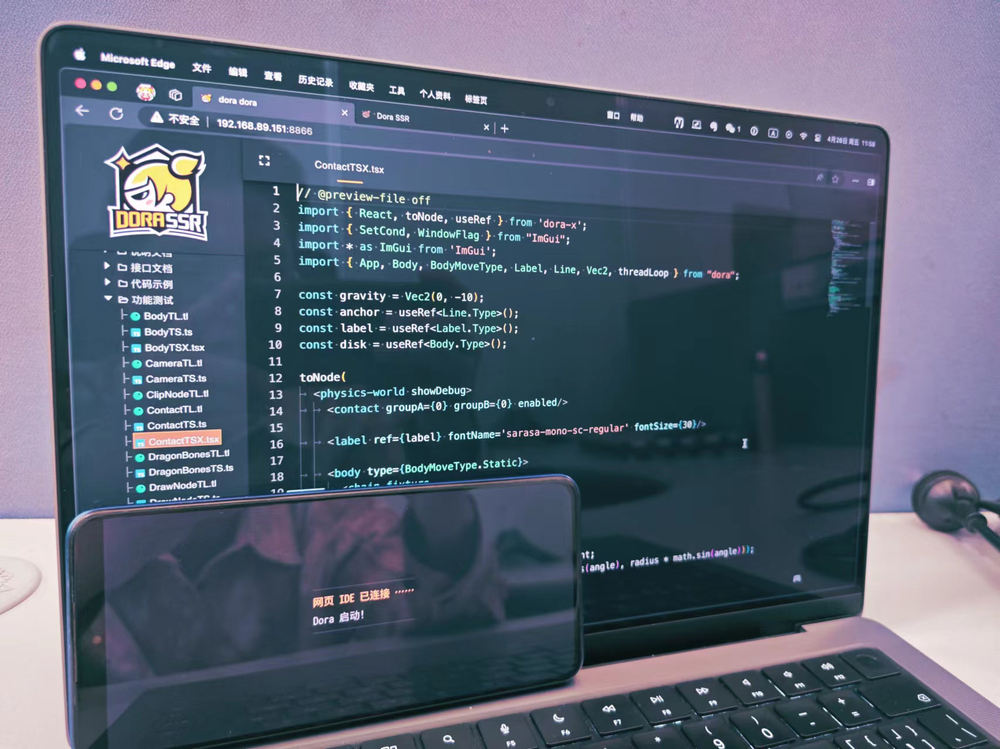

<p align="center">
  
</p>

# 多萝珍奇引擎（Dora SSR）

#### [English](README.md)  | 中文

       
     

----

&emsp;&emsp;Dora SSR 是一个用于多种设备上快速开发 2D 游戏的游戏引擎。它内置易用的开发工具链，支持在手机、开源掌机等设备上直接进行游戏开发。

<div align='center'></div>

## 目录

- [主要特点](#主要特点)
- [示例项目](#示例项目)
- [安装配置](#安装配置)
	- [Android](#android)
	- [Windows](#windows)
	- [macOS](#macos)
	- [Linux](#linux)
- [快速上手](#快速上手)
- [文档](#文档)
- [社区](#社区)
- [贡献](#贡献)
- [许可证](#许可证)

<br>

## 主要特点

|功能|描述|
|-|-|
|跨平台支持|支持在 Linux、Android、Windows、iOS 和 macOS 上本地运行。|
|树形节点|基于树形节点结构管理游戏场景。|
|2D 平台游戏| 基础的 2D 平台游戏功能，包括游戏逻辑和 AI 开发框架。|
|ECS|易用的 ECS 模块，便于游戏实体管理。|
|异步处理|异步处理的文件读写、资源加载等操作。|
|Lua|升级的 Lua 绑定，支持继承和扩展底层 C++ 对象。|
|YueScript|支持 YueScript 语言，强表达力且简洁的 Lua 方言。|
|Teal|支持 Teal 语言，编译到 Lua 的静态类型语言。|
|TypeScript|支持 TypeScript 语言，一门静态类型的 JavaScript 语言的超集，添加了强大的类型检查功能。|
|TSX|支持 TSX，允许在脚本中嵌入类似 XML/HTML 的文本，与 TypeScript 一起使用。|
|Rust|支持 Rust 语言，运行在内置的 WASM 绑定和 VM 上。|
|2D 骨骼动画|支持 2D 骨骼动画，包括：Spine2D、DragonBones 以及内置系统。|
|2D 物理引擎|支持 2D 物理引擎，使用：PlayRho。|
|Web IDE|内置开箱即用的 Web IDE，提供文件管理，代码检查、补全、高亮和定义跳转。 <br><br><div align='center'></div>|
|数据库|支持异步操作 SQLite，进行大量游戏配置数据的实时查询和写入。|
|Excel|支持 Excel 表格数据读取，支持同步到 SQLite 库表。|
|CSS 布局|提供游戏场景通过 CSS 进行自适应的 Flex 布局的功能。|
|特效系统|支持 [Effekseer](https://effekseer.github.io/en) 特效系统的功能。|
|瓦片地图|支持 [Tiled Map Editor](http://www.mapeditor.org) 制作的 TMX 地图文件的解析和渲染。|
|机器学习|内置用于创新游戏玩法的机器学习算法框架。|
|Yarn Spinner|支持 Yarn Spinner 语言，便于编写复杂的游戏故事系统。|
|矢量图形|提供矢量图形渲染 API，可直接渲染无 CSS 的 SVG 格式文件。|
|ImGui|内置 ImGui，便于创建调试工具和 UI 界面。|
|音频|支持 FLAC、OGG、MP3 和 WAV 多格式音频播放。|
|True Type| 支持 True Type 字体的渲染和基础排版。|
|L·S·D|提供可用于制作自己游戏的开放美术素材和游戏 IP —— [《灵数奇缘》](https://luv-sense-digital.readthedocs.io)。<br><br><div align='center'></div>|

<br>

## 示例项目

- [示例项目 - Loli War](Assets/Script/Game/Loli%20War)

<div align='center'></div>

<br>

- [示例项目 - Zombie Escape](Assets/Script/Game/Zombie%20Escape)

<div align='center'></div>

<br>

- [示例项目 - Dismentalism](Assets/Script/Game/Dismantlism)

<div align='center'></div>

<br>

- [示例项目 - Luv Sense Digital](https://github.com/IppClub/LSD)

<div align='center'></div>

<br>

## 安装配置

### Android

- 1、在游戏的运行终端下载并安装 [APK](https://github.com/ippclub/Dora-SSR/releases/latest) 包。
- 2、运行软件，通过局域网内的 PC（平板或其他开发设备）的浏览器访问软件显示的服务器地址。
- 3、开始游戏开发。

### Windows

- 1、请确保您已安装 Visual Studio 2022 的 X86 Visual C++ 可再发行组件包（包含 MSVC 编译的程序所需运行时的 vc_redist.x86 补丁），以运行此应用程序。您可以从[微软网站](https://learn.microsoft.com/zh-cn/cpp/windows/latest-supported-vc-redist?view=msvc-170)下载。
- 2、下载并解压[软件](https://github.com/ippclub/Dora-SSR/releases/latest)。
- 3、运行软件，通过浏览器访问软件显示的服务器地址。
- 4、开始游戏开发。

### macOS

- 1、下载并解压[软件](https://github.com/ippclub/Dora-SSR/releases/latest)。或者也可以通过 [Homebrew](https://brew.sh) 使用下面命令进行软件安装。
	```sh
	brew tap ippclub/dora-ssr
	brew install --cask dora-ssr
	```
- 2、运行软件，通过浏览器访问软件显示的服务器地址。
- 3、开始游戏开发。

### Linux

- 1、安装软件：
	- Ubuntu Jammy
	```sh
	sudo add-apt-repository ppa:ippclub/dora-ssr
	sudo apt update
	sudo apt install dora-ssr
	```
	- Debian Bookworm
	```sh
	sudo apt-key adv --keyserver hkp://keyserver.ubuntu.com:80 --recv-keys 9C7705BF
	sudo add-apt-repository -S "deb https://ppa.launchpadcontent.net/ippclub/dora-ssr/ubuntu jammy main"
	sudo apt update
	sudo apt install dora-ssr
	```
- 2、运行软件，通过浏览器访问软件显示的服务器地址。
- 3、开始游戏开发。

### 进行引擎的开发

&emsp;&emsp;进行 Dora SSR 项目开发的安装配置，详见[官方文档](https://dora-ssr.net/zh-Hans/docs/tutorial/dev-configuration)。

<br>

## 快速上手

- 第一步：创建一个新项目
	- 在浏览器中，打开 Dora Dora 编辑器左侧游戏资源树的右键菜单。
	- 点击菜单项 `新建`，选择新建文件夹。

- 第二步：编写游戏代码
	- 在项目文件夹下新建游戏入口代码文件，选择 Lua  (YueScript, Teal, TypeScript 或 TSX) 语言命名为 `init`。
	- 编写 Hello World 代码：

- **Lua**

```lua
local _ENV = Dora

local sprite = Sprite("Image/logo.png")
sprite:once(function()
  for i = 3, 1, -1 do
    print(i)
    sleep(1)
  end
  print("Hello World")
  sprite:perform(Sequence(
    Scale(0.1, 1, 0.5),
    Scale(0.5, 0.5, 1, Ease.OutBack)
  ))
end)
```

- **Teal**

```lua
local sleep <const> = require("sleep")
local Ease <const> = require("Ease")
local Scale <const> = require("Scale")
local Sequence <const> = require("Sequence")
local Sprite <const> = require("Sprite")

local sprite = Sprite("Image/logo.png")
if not sprite is nil then
  sprite:once(function()
    for i = 3, 1, -1 do
      print(i)
      sleep(1)
    end
    print("Hello World")
    sprite:perform(Sequence(
      Scale(0.1, 1, 0.5),
      Scale(0.5, 0.5, 1, Ease.OutBack)
    ))
  end)
end
```

- **Yuescript**

&emsp;&emsp;有关 Dora SSR 所支持的 Yuescript 这门小众语言的故事在[这里](https://dora-ssr.net/zh-Hans/blog/2024/4/17/a-moon-script-tale)。
```moonscript
_ENV = Dora

with Sprite "Image/logo.png"
   \once ->
     for i = 3, 1, -1
       print i
       sleep 1
     print "Hello World!"
     \perform Sequence(
       Scale 0.1, 1, 0.5
       Scale 0.5, 0.5, 1, Ease.OutBack
     )
```

- **TypeScript**

```typescript
import {Sprite, Ease, Scale, Sequence, sleep} from 'Dora';

const sprite = Sprite("Image/logo.png");
if (sprite) {
  sprite.once(() => {
    for (let i of $range(3, 1, -1)) {
      print(i);
      sleep(1);
    }
    print("Hello World");
    sprite.perform(Sequence(
      Scale(0.1, 1, 0.5),
      Scale(0.5, 0.5, 1, Ease.OutBack)
    ))
  });
}
```

- **TSX**

&emsp;&emsp;使用 TSX 语言来创建 Dora SSR 的游戏场景是一个比较容易上手的选择。新手教程可以参见[这里](https://dora-ssr.net/zh-Hans/blog/2024/4/25/tsx-dev-intro)。

```tsx
import {React, toNode, useRef} from 'DoraX';
import {ActionDef, Ease, Sprite, once, sleep} from 'Dora';

const actionRef = useRef<ActionDef.Type>();
const spriteRef = useRef<Sprite.Type>();

const onUpdate = once(() => {
  for (let i of $range(3, 1, -1)) {
    print(i);
    sleep(1);
  }
  print("Hello World");
  if (actionRef.current && spriteRef.current) {
    spriteRef.current.perform(actionRef.current);
  }
});

toNode(
  <sprite
    ref={spriteRef}
    file='Image/logo.png'
    onUpdate={onUpdate}
  >
    <action ref={actionRef}>
      <sequence>
        <scale time={0.1} start={1} stop={0.5}/>
        <scale time={0.5} start={0.5} stop={1} easing={Ease.OutBack}/>
      </sequence>
    </action>
  </sprite>
);
```

- **Rust**

&emsp;&emsp;Dora SSR 也支持使用 Rust 语言来编写游戏代码，编译为 WASM 文件，命名为 `init.wasm` 再上传到引擎中加载运行。详情见[这里](https://dora-ssr.net/zh-Hans/blog/2024/4/15/rusty-game-dev)。

```rust
use dora_ssr::*;

fn main () {
  let mut sprite = match Sprite::with_file("Image/logo.png") {
    Some(sprite) => sprite,
    None => return,
  };
  let mut sprite_clone = sprite.clone();
  sprite.schedule(once(move |mut co| async move {
    for i in (1..=3).rev() {
      p!("{}", i);
      sleep!(co, 1.0);
    }
    p!("Hello World");
    sprite_clone.perform_def(ActionDef::sequence(&vec![
      ActionDef::scale(0.1, 1.0, 0.5, EaseType::Linear),
      ActionDef::scale(0.5, 0.5, 1.0, EaseType::OutBack),
    ]));
  }));
}
```

- 第三步：运行游戏

&emsp;&emsp;点击编辑器右下角 `🎮` 图标，然后点击菜单项 `运行`。或者按下组合键 `Ctrl + r`。

- 第四步：发布游戏
	- 通过编辑器左侧游戏资源树，打开刚才新建的项目文件夹的右键菜单，点击 `下载` 选项。
	- 等待浏览器弹出已打包项目文件的下载提示。

&emsp;&emsp;更详细的教程，请查看[官方文档](https://dora-ssr.net/zh-Hans/docs/tutorial/quick-start)。

<br>

## 文档

- [API参考](https://dora-ssr.net/zh-Hans/docs/api/intro)
- [教程](https://dora-ssr.net/zh-Hans/docs/tutorial/quick-start)

<br>

## 社区

- [QQ群：512620381](https://qm.qq.com/cgi-bin/qm/qr?k=7siAhjlLaSMGLHIbNctO-9AJQ0bn0G7i&jump_from=webapi&authKey=Kb6tXlvcJ2LgyTzHQzKwkMxdsQ7sjERXMJ3g10t6b+716pdKClnXqC9bAfrFUEWa)
- [Discord](https://discord.gg/ZfNBSKXnf9)

<br>

## 贡献

&emsp;&emsp;欢迎参与 Dora SSR 的开发和维护。请查看[贡献指南](CONTRIBUTING.zh-CN.md)了解如何提交 Issue 和 Pull Request。

<br>

## Dora SSR 项目现已加入开放原子开源基金会

&emsp;&emsp;我们很高兴地宣布，Dora SSR 项目现已成为开放原子开源基金会的官方捐赠和孵化筹备期项目。这一新的发展阶段标志着我们致力于建设一个更开放、更协作的游戏开发环境的坚定承诺。

### 关于开放原子开源基金会

&emsp;&emsp;开放原子开源基金会（Open Atom Foundation）是一个非盈利组织，旨在支持和推广开源技术的发展。在该基金会的大家庭中，Dora SSR 会利用更广泛的资源和社区支持，以推动项目的发展和创新。更多信息请查看[基金会官网](https://openatom.org/)。

<div align='center'></div>

<br>

## 许可证

&emsp;&emsp;Dora SSR 使用 [MIT 许可证](LICENSE)。原为 Dorothy SSR 项目，项目名称现处于更名程序中。

### 特别提示

&emsp;&emsp;请注意，Dora SSR 集成了 Spine 运行时库，这是一个**商业软件**。在你的项目中使用 Spine 运行时需要获取 Esoteric Software 提供有效的商业许可证。有关获取许可证的更多详细信息，请访问  [Spine 官方网站](http://esotericsoftware.com/)。

&emsp;&emsp;请确保遵守所有许可要求，再在项目中使用 Spine 运行时。或者可以使用同样集成的开源的 DragonBones 系统作为动画系统的替代方案。如果你只需要创建比较简单的动画，也可以使用 Dora SSR 提供的 Model 动画模块看是否能满足需要。
