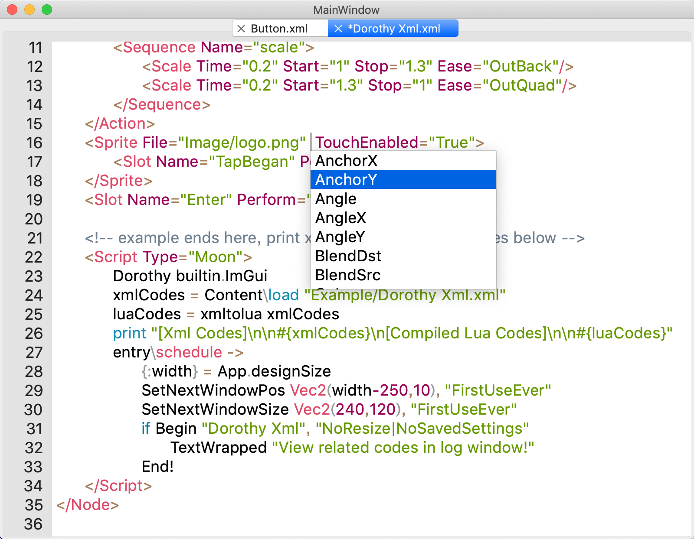

# Dorothy - XmlEditor

&emsp;&emsp;这是一个专门为Dorothy游戏框架开发的代码编辑器，支持Dorothy的专用的Xml语言混合Lua代码的格式编写游戏。编辑器使用Qt开发，目前支持的功能有语法高亮和Xml语言的API自动补全。语法高亮使用Qt的QSyntaxHighlighter模块，通过状态机+正则表达式实现，Xml的代码补全使用Yard文法分析库进行分析完成。

